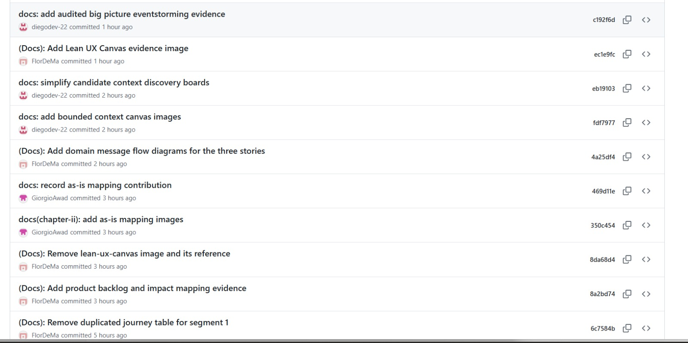
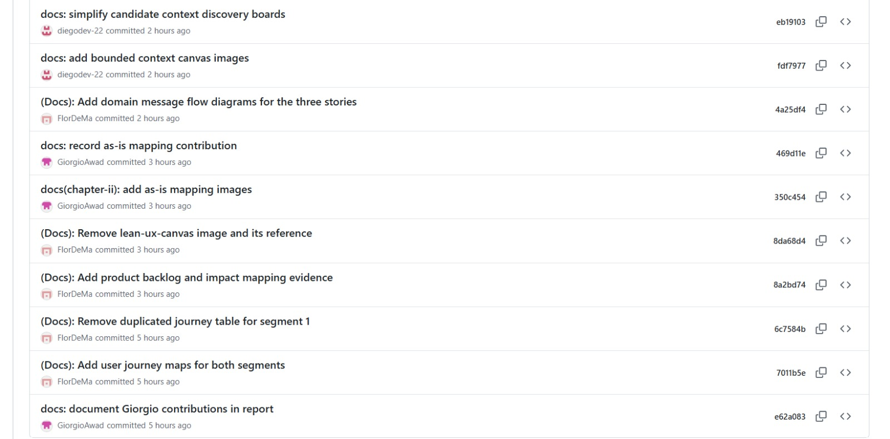

  

<h2 style="text-align: center">Universidad Peruana de Ciencias Aplicadas</h2>  
<h3 style="text-align: center"> Ingeniería de Software</h3>  

<strong>Fundamentos de Arquitectura de Software</strong> 
  

<strong>202620</strong> 
 

<strong>NRC:</strong> 8733
  

<strong>Profesor:</strong> Jorge Luis Delgado Vite

<h1 style="text-align: center">Informe de Trabajo Final</h1>

<strong>Nombre del Producto:</strong> SmartFarm

## Integrantes
<table style="width: 100%; border-collapse: collapse;">
  <thead>
    <tr>
      <th style="border: 1px solid #888; padding: 8px; background-color: #1e1e1e;">Código</th>
      <th style="border: 1px solid #888; padding: 8px; background-color: #1e1e1e;">AlUMNO</th>
    </tr>
  </thead>
  <tbody>
      <td style="border: 1px solid #888; padding: 8px;">U202417693</td>
      <td style="border: 1px solid #888; padding: 8px;">Alexander Auden Aliaga Ocampo</td>
    </tr>
    <tr>
      <td style="border: 1px solid #888; padding: 8px;">U202321510</td>
      <td style="border: 1px solid #888; padding: 8px;">Meza Jhimy Pool, Romero</td>
    </tr>
    <tr>
      <td style="border: 1px solid #888; padding: 8px;">U202412591</td>
      <td style="border: 1px solid #888; padding: 8px;">Diego Vicente Seminario Castillo</td>
    </tr>
  </tbody>
</table>

---

<strong>Septiembre - 2026</strong>

---

---

# Registro de Versiones del Informe
Esta sección resume las modificaciones relevantes realizadas al informe durante el ciclo de vida del proyecto. Cada línea corresponde a un único autor.

| Versión | Fecha | Autor | Descripción de modificación |
|---|---|---|---|
| 0.1.0 | 2026-09-07 | Romero Meza, Jhimy Pool | Versión inicial del informe. Creación de la carátula y de la estructura de archivos del repositorio. |
| 0.1.1 | 2026-09-09 | Romero Meza, Jhimy Pool | Adición de la sección de Needfinding con la primera aproximación a los User Personas. |
| 0.2.0 | 2026-09-12 | Contreras Leon, Flor de María | Revisión de los segmentos objetivo del Capítulo II y elaboración de la guía de entrevista para el Segmento 2. |
| 0.2.1 | 2026-09-12 | Avalos Cordova, Diego Andres | Corrección de la estructura de la tabla de perfiles del Capítulo I e incorporación de código y fotografía de integrante. |
| 0.2.2 | 2026-09-13 | Contreras Leon, Flor de María | Reelaboración del análisis competitivo como cuadro Markdown y actualización de los datos de los competidores. |
| 0.3.0 | 2026-09-13 | Avalos Cordova, Diego Andres | Primera versión del Capítulo III con User Stories e Impact Mapping. |
| 0.4.0 | 2026-09-14 | Contreras Leon, Flor de María | Registro de las entrevistas de ambos segmentos y análisis del Segmento 2 con gráficos. |
| 0.4.1 | 2026-09-15 | Avalos Cordova, Diego Andres | Alineación de la estructura del Capítulo IV con el esquema de diseño de software. |
| 0.5.0 | 2026-09-17 | Contreras Leon, Flor de María | Tercer registro de entrevista del Segmento 1 y consolidación del Capítulo II. |
| 0.6.0 | 2026-09-18 | Contreras Leon, Flor de María | Glosario de Ubiquitous Language organizado por Bounded Contexts y User Personas de ambos segmentos. |
| 0.7.0 | 2026-09-18 | Contreras Leon, Flor de María | Capítulo I alineado con el alcance de la investigación y con la plantilla de Lean UX. |
| 0.8.0 | 2026-09-18 | Contreras Leon, Flor de María | Capítulo II completado con User Task Matrix, User Journey Mapping As-Is, Empathy Mapping y Big Picture EventStorming. |
| 0.9.0 | 2026-09-18 | Contreras Leon, Flor de María | Capítulo III reescrito con once Epics, criterios de aceptación verificables, Impact Mapping y Product Backlog priorizado. |
| 0.9.1 | 2026-09-18 | Contreras Leon, Flor de María | Epic de control del abrevadero incorporada al Capítulo III. |
| 0.10.0 | 2026-09-18 | Contreras Leon, Flor de María | Capítulo IV elaborado con Design-Level EventStorming, Bounded Context Canvases, Context Mapping y diseño táctico de siete contextos acotados. |
| 0.10.1 | 2026-09-18 | Contreras Leon, Flor de María | Diagramas C4 exportados desde Structurizr y diagramas UML y de base de datos generados con PlantUML. |
| 0.11.0 | 2026-09-18 | Contreras Leon, Flor de María | Integración de las ramas de capítulo, sección de Bibliografía y completado del documento principal. |
| 0.11.1 | 2026-09-19 | Awad Vargas, Giorgio Marzouk | Elaboración de User Stories y Epics, preparación de la presentación del proyecto y seguimiento periódico de su avance. |
| 0.11.2 | 2026-09-19 | Awad Vargas, Giorgio Marzouk | Incorporación de los As-Is Maps de Cesar Flores y Leonardo Rosales en el Capítulo II, ubicados después de los User Journey Maps y con sus recursos gráficos organizados en el repositorio. |
| 0.11.3 | 2026-09-19 | Arrieta Quispe, Alison Jimena | Definición y consenso de la arquitectura general del proyecto como base para la elaboración del modelo C4, incluyendo la organización de los principales componentes, sistemas y relaciones de la solución. |
| 0.11.4 | 2026-09-19 | Arrieta Quispe, Alison Jimena | Elaboración y estructuración del Big Picture EventStorming del proyecto, organizando los Domain Events, su secuencia temporal, actores, sistemas externos, hotspots, oportunidades, eventos pivote y contextos emergentes. |
| 0.11.5 | 2026-09-19 | Arrieta Quispe, Alison Jimena | Participación en la definición y estructuración de las Epics del producto, así como en la elaboración de parte de las User Stories asociadas a las funcionalidades principales de la solución. |
| 0.11.6 | 2026-09-19 | Avalos Cordova, Diego Andres | Corrección de los enlaces de los eventos de actores y sistemas en la evidencia de People & External Systems del Capítulo II. |
| 0.11.7 | 2026-09-19 | Avalos Cordova, Diego Andres | Reubicación de la figura de Design-Level EventStorming después de su tabla correspondiente para mejorar la lectura del Capítulo IV. |
| 0.11.8 | 2026-09-19 | Sanchez Arenas, Manuel Angel | Incorporación de la información del perfil de Manuel Sanchez Arenas y de su participación en la sección Student Outcome. |
| 0.11.9 | 2026-09-19 | Contreras Leon, Flor de María | Actualización de los enlaces de los videos de entrevistas para utilizar los recursos publicados en SharePoint. |
| 0.11.10 | 2026-09-19 | Contreras Leon, Flor de María | Incorporación de enlaces a las fuentes de las evidencias utilizadas en los Capítulos II y IV. |
| 0.11.11 | 2026-09-19 | Avalos Cordova, Diego Andres | Incorporación de evidencias visuales del historial de commits de GitHub y actualización de las métricas de colaboración del informe. |
| 0.11.12 | 2026-09-19 | Avalos Cordova, Diego Andres | Depuración de notas internas y placeholders del informe para dejar únicamente el contenido académico de cada sección. |
| 0.12.0 | 2026-09-19 | Avalos Cordova, Diego Andres | Creación de la sección de Conclusiones y recomendaciones, pauta del Video About-the-Team, Bibliografía y Anexos. |
| 0.12.1 | 2026-09-19 | Avalos Cordova, Diego Andres | Integración del estado actualizado del informe, depuración de notas internas y reorganización de los Anexos para su exportación legible a PDF. |
| 0.12.2 | 2026-09-19 | Avalos Cordova, Diego Andres | Consolidación de las ramas de capítulos y conclusiones en `development`, verificación de referencias y preparación de la versión integrada para su promoción a `main`. |

# Project Report Collaboration Insights

**Repositorio del informe:** https://github.com/SmartFarm-8733/Report-SmartFarm

## Organización del trabajo

El informe se elabora de forma colaborativa en un repositorio público dentro de la organización de GitHub del equipo, aplicando GitFlow como flujo de control de versiones y Conventional Commits para los mensajes.

Se trabaja con una rama por capítulo, bajo la convención `feature/chapter-<número romano>`. Cada integrante desarrolla su capítulo en la rama correspondiente y, al alcanzar un estado consistente, la rama se integra en `development`. La rama `main` se reserva para las versiones que se exportan como entregable.

| Rama | Contenido |
|---|---|
| `main` | Versión publicada para cada entrega |
| `development` | Integración de los capítulos en curso |
| `feature/chapter-I` a `feature/chapter-V` | Desarrollo de cada capítulo |

## Actividad registrada a la fecha

| Métrica | Valor |
|---|---|
| Commits de contenido | 111 |
| Merges de integración | 17 |
| Commits totales del historial | 128 |
| Ramas activas | 7 |
| Periodo de trabajo | 7 al 19 de septiembre de 2026 |
| Artefactos versionados | 5 capítulos, 114 imágenes y 17 archivos fuente de diagramas |

## Evidencias de commits en GitHub

Las siguientes capturas documentan el historial visible de commits de la rama `feature/chapter-II` durante la consolidación del informe. En ellas se observan aportes de Diego Andres Avalos Cordova, Flor de María Contreras Leon, Giorgio Awad, Alison Arrieta y Manuel Angel Sanchez, además de la integración de ramas mediante GitFlow. La evidencia se mantiene alineada con las versiones 0.11.6 a 0.11.10 del Registro de Versiones.

*Figura. Historial de commits de `feature/chapter-II` durante la consolidación del informe (captura 1).*

*Figura. Historial de commits de `feature/chapter-II` durante la consolidación del informe (captura 2).*

*Figura. Historial de commits de `feature/chapter-II` durante la consolidación del informe (captura 3).*

## Interpretación de la actividad colaborativa

El historial de commits evidencia una elaboración distribuida del informe entre las ramas de capítulo. Las capturas muestran aportes de Diego Andres Avalos Cordova, Flor de María Contreras Leon, Giorgio Awad, Alison Arrieta y Manuel Angel Sanchez, junto con integraciones realizadas mediante GitFlow. El Registro de Versiones resume las modificaciones relevantes y mantiene la trazabilidad entre cada aporte, el autor y la sección actualizada.

La organización del informe por ramas de capítulo permite distribuir responsabilidades, integrar los aportes mediante GitFlow y conservar la trazabilidad de las modificaciones en el Registro de Versiones. La colaboración se evidencia en los commits de contenido, las integraciones entre ramas y la actualización progresiva de los artefactos del informe.
---

# Tabla de Contenidos

- [Registro de Versiones del Informe](#registro-de-versiones-del-informe)
- [Project Report Collaboration Insights](#project-report-collaboration-insights)
- [Student Outcome](#student-outcome)
- [Capítulo I: Introducción](chapter01.md#capitulo-i-introduccion)
  - [1.1. Startup Profile](chapter01.md#11-startup-profile)
    - [1.1.1. Descripción de la Startup](chapter01.md#111-descripcion-de-la-startup)
    - [1.1.2. Perfiles de integrantes del equipo](chapter01.md#112-perfiles-de-integrantes-del-equipo)
  - [1.2. Solution Profile](chapter01.md#12-solution-profile)
    - [1.2.1. Antecedentes y problemática](chapter01.md#121-antecedentes-y-problematica)
    - [1.2.2. Lean UX Process.](chapter01.md#122-lean-ux-process)
      - [1.2.2.1. Lean UX Problem Statements.](chapter01.md#1221-lean-ux-problem-statements)
      - [1.2.2.2. Lean UX Assumptions.](chapter01.md#1222-lean-ux-assumptions)
      - [1.2.2.3. Lean UX Hypothesis Statements.](chapter01.md#1223-lean-ux-hypothesis-statements)
      - [1.2.2.4. Lean UX Canvas.](chapter01.md#1224-lean-ux-canvas)
  - [1.3. Segmentos objetivo.](chapter01.md#13-segmentos-objetivo)
- [Capítulo II: Requirements Elicitation & Analysis](chapter02.md#capitulo-ii-requirements-elicitation-analysis)
  - [2.1. Competidores.](chapter02.md#21-competidores)
    - [2.1.1. Análisis competitivo.](chapter02.md#211-analisis-competitivo)
    - [2.1.2. Estrategias y tácticas frente a competidores.](chapter02.md#212-estrategias-y-tacticas-frente-a-competidores)
      - [Estrategia 1: Reducción de Barreras Económicas y Tecnológicas de Infraestructura](chapter02.md#estrategia-1-reduccion-de-barreras-economicas-y-tecnologicas-de-infraestructura)
      - [Estrategia 2: Optimización Energética de los Dispositivos Físicos](chapter02.md#estrategia-2-optimizacion-energetica-de-los-dispositivos-fisicos)
      - [Estrategia 3: Flexibilidad de Suscripción y Monetización Adaptativa](chapter02.md#estrategia-3-flexibilidad-de-suscripcion-y-monetizacion-adaptativa)
      - [Estrategia 4: Integración del Ecosistema de Salud mediante API RESTful de Desarrollo Interno](chapter02.md#estrategia-4-integracion-del-ecosistema-de-salud-mediante-api-restful-de-desarrollo-interno)
  - [2.2. Entrevistas.](chapter02.md#22-entrevistas)
    - [2.2.1. Diseño de entrevistas.](chapter02.md#221-diseno-de-entrevistas)
      - [BLOQUE 1: Datos Demográficos y de Perfil (Información Complementaria)](chapter02.md#bloque-1-datos-demograficos-y-de-perfil-informacion-complementaria)
      - [BLOQUE 2: Comportamiento, Infraestructura y Frustraciones](chapter02.md#bloque-2-comportamiento-infraestructura-y-frustraciones)
      - [BLOQUE 3: Validación de la Propuesta de Software (ICHU)](chapter02.md#bloque-3-validacion-de-la-propuesta-de-software-ichu)
      - [BLOQUE 4: Captura de Funcionalidades](chapter02.md#bloque-4-captura-de-funcionalidades)
      - [BLOQUE 1: Sobre Él/Ella y su Ecosistema de Trabajo (Rompehielos y Perfil)](chapter02.md#bloque-1-sobre-elella-y-su-ecosistema-de-trabajo-rompehielos-y-perfil)
      - [BLOQUE 2: Casos Clínicos y Captura de Parámetros Biométricos (El Algoritmo)](chapter02.md#bloque-2-casos-clinicos-y-captura-de-parametros-biometricos-el-algoritmo)
      - [BLOQUE 3: Captura de Funcionalidades para el Software (La Interfaz)](chapter02.md#bloque-3-captura-de-funcionalidades-para-el-software-la-interfaz)
    - [2.2.2. Registro de entrevistas.](chapter02.md#222-registro-de-entrevistas)
      - [Segmento 1: Medianos y Grandes Ganaderos](chapter02.md#segmento-1-medianos-y-grandes-ganaderos)
      - [Segmento 2: Zootecnistas y Médicos Veterinarios](chapter02.md#segmento-2-zootecnistas-y-medicos-veterinarios)
    - [2.2.3. Análisis de entrevistas.](chapter02.md#223-analisis-de-entrevistas)
      - [Análisis de entrevistas del Segmento 1: Medianos y Grandes Ganaderos](chapter02.md#analisis-de-entrevistas-del-segmento-1-medianos-y-grandes-ganaderos)
      - [Análisis de entrevistas del Segmento 2: Zootecnistas y Médicos Veterinarios](chapter02.md#analisis-de-entrevistas-del-segmento-2-zootecnistas-y-medicos-veterinarios)
  - [2.3. Needfinding.](chapter02.md#23-needfinding)
    - [2.3.1. User Personas.](chapter02.md#231-user-personas)
    - [2.3.2. User Task Matrix.](chapter02.md#232-user-task-matrix)
    - [2.3.3. User Journey Mapping.](chapter02.md#233-user-journey-mapping)
    - [2.3.4. Empathy Mapping.](chapter02.md#234-empathy-mapping)
  - [2.4. Big Picture EventStorming.](chapter02.md#24-big-picture-eventstorming)
  - [2.5. Ubiquitous Language.](chapter02.md#25-ubiquitous-language)
    - [Términos transversales del dominio](chapter02.md#terminos-transversales-del-dominio)
    - [Identity & Access Management](chapter02.md#identity-access-management)
    - [Profiles](chapter02.md#profiles)
    - [Cattle Information](chapter02.md#cattle-information)
    - [IoT Assets](chapter02.md#iot-assets)
    - [Operations & Monitoring](chapter02.md#operations-monitoring)
    - [Planning](chapter02.md#planning)
    - [Dashboard & Analytics](chapter02.md#dashboard-analytics)
    - [Subscription Plans](chapter02.md#subscription-plans)
- [Capítulo III: Requirements Specification](chapter03.md#capitulo-iii-requirements-specification)
  - [3.1. User Stories](chapter03.md#31-user-stories)
  - [3.2. Impact Mapping](chapter03.md#32-impact-mapping)
    - [Primer segmento objetivo](chapter03.md#primer-segmento-objetivo)
    - [Segundo segmento objetivo](chapter03.md#segundo-segmento-objetivo)
  - [3.3. Product Backlog](chapter03.md#33-product-backlog)
- [Capítulo IV: Solution Software Design](chapter04.md#capitulo-iv-solution-software-design)
  - [4.1. Strategic-Level Domain-Driven Design](chapter04.md#41-strategic-level-domain-driven-design)
    - [4.1.1. Design-Level EventStorming](chapter04.md#411-design-level-eventstorming)
      - [4.1.1.1. Candidate Context Discovery](chapter04.md#4111-candidate-context-discovery)
      - [4.1.1.2. Domain Message Flows Modeling](chapter04.md#4112-domain-message-flows-modeling)
      - [4.1.1.3. Bounded Context Canvases](chapter04.md#4113-bounded-context-canvases)
    - [4.1.2. Context Mapping](chapter04.md#412-context-mapping)
    - [4.1.3. Software Architecture](chapter04.md#413-software-architecture)
      - [4.1.3.1. Software Architecture System Landscape Diagram](chapter04.md#4131-software-architecture-system-landscape-diagram)
      - [4.1.3.2. Software Architecture Context Level Diagram](chapter04.md#4132-software-architecture-context-level-diagram)
      - [4.1.3.3. Software Architecture Container Level Diagram](chapter04.md#4133-software-architecture-container-level-diagram)
      - [4.1.3.4. Software Architecture Deployment Diagrams](chapter04.md#4134-software-architecture-deployment-diagrams)
  - [4.2. Tactical-Level Domain-Driven Design](chapter04.md#42-tactical-level-domain-driven-design)
    - [4.2.1. Bounded Context: Operations & Monitoring](chapter04.md#421-bounded-context-operations-monitoring)
      - [4.2.1.1. Domain Layer](chapter04.md#4211-domain-layer)
      - [4.2.1.2. Interface Layer](chapter04.md#4212-interface-layer)
      - [4.2.1.3. Application Layer](chapter04.md#4213-application-layer)
      - [4.2.1.4. Infrastructure Layer](chapter04.md#4214-infrastructure-layer)
      - [4.2.1.5. Bounded Context Software Architecture Component Level Diagrams](chapter04.md#4215-bounded-context-software-architecture-component-level-diagrams)
      - [4.2.1.6. Bounded Context Software Architecture Code Level Diagrams](chapter04.md#4216-bounded-context-software-architecture-code-level-diagrams)
    - [4.2.2. Bounded Context: Cattle Information](chapter04.md#422-bounded-context-cattle-information)
      - [4.2.2.1. Domain Layer](chapter04.md#4221-domain-layer)
      - [4.2.2.2. Interface Layer](chapter04.md#4222-interface-layer)
      - [4.2.2.3. Application Layer](chapter04.md#4223-application-layer)
      - [4.2.2.4. Infrastructure Layer](chapter04.md#4224-infrastructure-layer)
      - [4.2.2.5. Bounded Context Software Architecture Component Level Diagrams](chapter04.md#4225-bounded-context-software-architecture-component-level-diagrams)
      - [4.2.2.6. Bounded Context Software Architecture Code Level Diagrams](chapter04.md#4226-bounded-context-software-architecture-code-level-diagrams)
    - [4.2.3. Bounded Context: IoT Assets](chapter04.md#423-bounded-context-iot-assets)
      - [4.2.3.1. Domain Layer](chapter04.md#4231-domain-layer)
      - [4.2.3.2. Interface Layer](chapter04.md#4232-interface-layer)
      - [4.2.3.3. Application Layer](chapter04.md#4233-application-layer)
      - [4.2.3.4. Infrastructure Layer](chapter04.md#4234-infrastructure-layer)
      - [4.2.3.5. Bounded Context Software Architecture Component Level Diagrams](chapter04.md#4235-bounded-context-software-architecture-component-level-diagrams)
      - [4.2.3.6. Bounded Context Software Architecture Code Level Diagrams](chapter04.md#4236-bounded-context-software-architecture-code-level-diagrams)
    - [4.2.4. Bounded Context: Planning](chapter04.md#424-bounded-context-planning)
      - [4.2.4.1. Domain Layer](chapter04.md#4241-domain-layer)
      - [4.2.4.2. Interface Layer](chapter04.md#4242-interface-layer)
      - [4.2.4.3. Application Layer](chapter04.md#4243-application-layer)
      - [4.2.4.4. Infrastructure Layer](chapter04.md#4244-infrastructure-layer)
      - [4.2.4.5. Bounded Context Software Architecture Component Level Diagrams](chapter04.md#4245-bounded-context-software-architecture-component-level-diagrams)
      - [4.2.4.6. Bounded Context Software Architecture Code Level Diagrams](chapter04.md#4246-bounded-context-software-architecture-code-level-diagrams)
    - [4.2.5. Bounded Context: Dashboard & Analytics](chapter04.md#425-bounded-context-dashboard-analytics)
      - [4.2.5.1. Domain Layer](chapter04.md#4251-domain-layer)
      - [4.2.5.2. Interface Layer](chapter04.md#4252-interface-layer)
      - [4.2.5.3. Application Layer](chapter04.md#4253-application-layer)
      - [4.2.5.4. Infrastructure Layer](chapter04.md#4254-infrastructure-layer)
      - [4.2.5.5. Bounded Context Software Architecture Component Level Diagrams](chapter04.md#4255-bounded-context-software-architecture-component-level-diagrams)
      - [4.2.5.6. Bounded Context Software Architecture Code Level Diagrams](chapter04.md#4256-bounded-context-software-architecture-code-level-diagrams)
    - [4.2.6. Bounded Context: Identity & Access Management](chapter04.md#426-bounded-context-identity-access-management)
      - [4.2.6.1. Domain Layer](chapter04.md#4261-domain-layer)
      - [4.2.6.2. Interface Layer](chapter04.md#4262-interface-layer)
      - [4.2.6.3. Application Layer](chapter04.md#4263-application-layer)
      - [4.2.6.4. Infrastructure Layer](chapter04.md#4264-infrastructure-layer)
      - [4.2.6.5. Bounded Context Software Architecture Component Level Diagrams](chapter04.md#4265-bounded-context-software-architecture-component-level-diagrams)
      - [4.2.6.6. Bounded Context Software Architecture Code Level Diagrams](chapter04.md#4266-bounded-context-software-architecture-code-level-diagrams)
    - [4.2.7. Bounded Context: Subscription Plans](chapter04.md#427-bounded-context-subscription-plans)
      - [4.2.7.1. Domain Layer](chapter04.md#4271-domain-layer)
      - [4.2.7.2. Interface Layer](chapter04.md#4272-interface-layer)
      - [4.2.7.3. Application Layer](chapter04.md#4273-application-layer)
      - [4.2.7.4. Infrastructure Layer](chapter04.md#4274-infrastructure-layer)
      - [4.2.7.5. Bounded Context Software Architecture Component Level Diagrams](chapter04.md#4275-bounded-context-software-architecture-component-level-diagrams)
      - [4.2.7.6. Bounded Context Software Architecture Code Level Diagrams](chapter04.md#4276-bounded-context-software-architecture-code-level-diagrams)
  - [4.3. Síntesis del diseño](chapter04.md#43-sintesis-del-diseno)
- [Conclusiones](conclusions.md#conclusiones)
  - [Conclusiones y recomendaciones](conclusions.md#conclusiones-y-recomendaciones)
  - [Video About-the-Team](conclusions.md#video-about-the-team)
- [Bibliografía](conclusions.md#bibliografía)
- [Anexos](conclusions.md#anexos)

---

# Student Outcome ABET

El curso contribuye al cumplimiento del *Student Outcome ABET*:

**ABET - EAC - Student Outcome 7: Aprendizaje continuo y autónomo**

**Criterio:** capacidad de adquirir y aplicar nuevos conocimientos según sea necesario, utilizando estrategias de aprendizaje apropiadas.

En el siguiente cuadro se describen las acciones y conclusiones del equipo durante el **TB1**, que sustentan el logro del Student Outcome.

| Criterio específico | Acciones realizadas - TB1 | Conclusiones |
|---|---|---|
| *Actualiza conceptos y conocimientos necesarios para su desarrollo profesional y, en especial, para su proyecto en soluciones de software.* | **Alexander Auden Aliaga Ocampo**  Investigó y aplicó conceptos de *Requirements Elicitation*, *Needfinding*, User Personas, User Task Matrix y técnicas de entrevistas para estructurar los requisitos de SmartFarm.  **Jhimy Pool Romero Meza**  Profundizó en Lean UX, Scenario Mapping y diseño centrado en el usuario para relacionar los problemas del sector ganadero con funcionalidades de la solución.  **Diego Vicente Seminario Castillo**  Actualizó conocimientos sobre IoT aplicado al monitoreo ganadero, telemetría, alertas y trazabilidad para sustentar la propuesta tecnológica de SmartFarm. | Durante el TB1, el equipo incorporó y aplicó conocimientos de investigación de usuarios, Lean UX e IoT para definir una solución coherente con las necesidades de propietarios, operarios de campo y veterinarios. |
| *Reconoce la necesidad del aprendizaje permanente para el desempeño profesional y el desarrollo de proyectos en soluciones de software.* | **Alexander Auden Aliaga Ocampo**  Contrastó la propuesta con competidores y registró hallazgos de entrevistas para identificar mejoras y requisitos pendientes.  **Jhimy Pool Romero Meza**  Participó en la revisión y refinamiento de los artefactos de análisis, identificando la importancia de validar continuamente las decisiones de diseño.  **Diego Vicente Seminario Castillo**  Analizó los cambios tecnológicos y operativos que afectan a la ganadería inteligente para reconocer nuevas necesidades de aprendizaje en el proyecto. | El equipo reconoce que el proyecto requiere aprendizaje continuo: los requisitos, la conectividad rural y las tecnologías IoT deben revisarse y validarse de forma iterativa antes de cada avance. |

# Capítulos del informe

| Capítulo | Archivo |
|---|---|
| I. Introducción | [chapter01.md](chapter01.md) |
| II. Requirements Elicitation & Analysis | [chapter02.md](chapter02.md) |
| III. Requirements Specification | [chapter03.md](chapter03.md) |
| IV. Solution Software Design | [chapter04.md](chapter04.md) |
| V. Solution UI/UX Design | [chapter05.md](chapter05.md) |
| Conclusiones, bibliografía y anexos | [conclusions.md](conclusions.md) |

---

# Bibliografía

La bibliografía consolidada del informe se encuentra en [conclusions.md#bibliografía](conclusions.md#bibliografía).
