

  

<h2 style="text-align: center">Universidad Peruana de Ciencias Aplicadas</h2>  
<h3 style="text-align: center"> Ingeniería de Software</h3>  

<strong>Fundamentos de Arquitectura de Software</strong> 
  

<strong>202620</strong> 
 

<strong>NRC:</strong> 8733
  

<strong>Profesor:</strong> Jorge Luis Delgado Vite

<h1 style="text-align: center">Informe de Trabajo Final</h1>

<strong>Nombre del Producto:</strong> SmartFarm

## Integrantes
<table style="width: 100%; border-collapse: collapse;">
  <thead>
    <tr>
      <th style="border: 1px solid #888; padding: 8px; background-color: #1e1e1e;">Código</th>
      <th style="border: 1px solid #888; padding: 8px; background-color: #1e1e1e;">AlUMNO</th>
    </tr>
  </thead>
  <tbody>
      <td style="border: 1px solid #888; padding: 8px;">U202417693</td>
      <td style="border: 1px solid #888; padding: 8px;">Alexander Auden Aliaga Ocampo</td>
    </tr>
    <tr>
      <td style="border: 1px solid #888; padding: 8px;">U202321510</td>
      <td style="border: 1px solid #888; padding: 8px;">Meza Jhimy Pool, Romero</td>
    </tr>
    <tr>
      <td style="border: 1px solid #888; padding: 8px;">U202412591</td>
      <td style="border: 1px solid #888; padding: 8px;">Diego Vicente Seminario Castillo</td>
    </tr>
  </tbody>
</table>

---

<strong>Septiembre - 2026</strong>

---

---

# Registro de Versiones del Informe
Esta sección resume las modificaciones relevantes realizadas al informe durante el ciclo de vida del proyecto. Cada línea corresponde a un único autor.

| Versión | Fecha | Autor | Descripción de modificación |
|---|---|---|---|
| 0.1.0 | 2026-09-07 | Romero Meza, Jhimy Pool | Versión inicial del informe. Creación de la carátula y de la estructura de archivos del repositorio. |
| 0.1.1 | 2026-09-09 | Romero Meza, Jhimy Pool | Adición de la sección de Needfinding con la primera aproximación a los User Personas. |
| 0.2.0 | 2026-09-12 | Contreras Leon, Flor de María | Revisión de los segmentos objetivo del Capítulo II y elaboración de la guía de entrevista para el Segmento 2. |
| 0.2.1 | 2026-09-12 | Avalos Cordova, Diego Andres | Corrección de la estructura de la tabla de perfiles del Capítulo I e incorporación de código y fotografía de integrante. |
| 0.2.2 | 2026-09-13 | Contreras Leon, Flor de María | Reelaboración del análisis competitivo como cuadro Markdown y actualización de los datos de los competidores. |
| 0.3.0 | 2026-09-13 | Avalos Cordova, Diego Andres | Primera versión del Capítulo III con User Stories e Impact Mapping. |
| 0.4.0 | 2026-09-14 | Contreras Leon, Flor de María | Registro de las entrevistas de ambos segmentos y análisis del Segmento 2 con gráficos. |
| 0.4.1 | 2026-09-15 | Avalos Cordova, Diego Andres | Alineación de la estructura del Capítulo IV con el esquema de diseño de software. |
| 0.5.0 | 2026-09-17 | Contreras Leon, Flor de María | Tercer registro de entrevista del Segmento 1 y consolidación del Capítulo II. |
| 0.6.0 | 2026-09-18 | Contreras Leon, Flor de María | Glosario de Ubiquitous Language organizado por Bounded Contexts y User Personas de ambos segmentos. |
| 0.7.0 | 2026-09-18 | Contreras Leon, Flor de María | Capítulo I alineado con el alcance de la investigación y con la plantilla de Lean UX. |
| 0.8.0 | 2026-09-18 | Contreras Leon, Flor de María | Capítulo II completado con User Task Matrix, User Journey Mapping As-Is, Empathy Mapping y Big Picture EventStorming. |
| 0.9.0 | 2026-09-18 | Contreras Leon, Flor de María | Capítulo III reescrito con once Epics, criterios de aceptación verificables, Impact Mapping y Product Backlog priorizado. |
| 0.9.1 | 2026-09-18 | Contreras Leon, Flor de María | Epic de control del abrevadero incorporada al Capítulo III. |
| 0.10.0 | 2026-09-18 | Contreras Leon, Flor de María | Capítulo IV elaborado con Design-Level EventStorming, Bounded Context Canvases, Context Mapping y diseño táctico de siete contextos acotados. |
| 0.10.1 | 2026-09-18 | Contreras Leon, Flor de María | Diagramas C4 exportados desde Structurizr y diagramas UML y de base de datos generados con PlantUML. |
| 0.11.0 | 2026-09-18 | Contreras Leon, Flor de María | Integración de las ramas de capítulo, sección de Bibliografía y completado del documento principal. |
| 0.11.1 | 2026-09-19 | Awad Vargas, Giorgio Marzouk | Elaboración de User Stories y Epics, preparación de la presentación del proyecto y seguimiento periódico de su avance. |
| 0.11.2 | 2026-09-19 | Awad Vargas, Giorgio Marzouk | Incorporación de los As-Is Maps de Cesar Flores y Leonardo Rosales en el Capítulo II, ubicados después de los User Journey Maps y con sus recursos gráficos organizados en el repositorio. |
| 0.11.3 | 2026-09-19 | Arrieta Quispe, Alison Jimena | Definición y consenso de la arquitectura general del proyecto como base para la elaboración del modelo C4, incluyendo la organización de los principales componentes, sistemas y relaciones de la solución. |
| 0.11.4 | 2026-09-19 | Arrieta Quispe, Alison Jimena | Elaboración y estructuración del Big Picture EventStorming del proyecto, organizando los Domain Events, su secuencia temporal, actores, sistemas externos, hotspots, oportunidades, eventos pivote y contextos emergentes. |
| 0.11.5 | 2026-09-19 | Arrieta Quispe, Alison Jimena | Participación en la definición y estructuración de las Epics del producto, así como en la elaboración de parte de las User Stories asociadas a las funcionalidades principales de la solución. |
| 0.11.6 | 2026-09-19 | Avalos Cordova, Diego Andres | Corrección de los enlaces de los eventos de actores y sistemas en la evidencia de People & External Systems del Capítulo II. |
| 0.11.7 | 2026-09-19 | Avalos Cordova, Diego Andres | Reubicación de la figura de Design-Level EventStorming después de su tabla correspondiente para mejorar la lectura del Capítulo IV. |
| 0.11.8 | 2026-09-19 | Sanchez Arenas, Manuel Angel | Incorporación de la información del perfil de Manuel Sanchez Arenas y de su participación en la sección Student Outcome. |
| 0.11.9 | 2026-09-19 | Contreras Leon, Flor de María | Actualización de los enlaces de los videos de entrevistas para utilizar los recursos publicados en SharePoint. |
| 0.11.10 | 2026-09-19 | Contreras Leon, Flor de María | Incorporación de enlaces a las fuentes de las evidencias utilizadas en los Capítulos II y IV. |
| 0.11.11 | 2026-09-19 | Avalos Cordova, Diego Andres | Incorporación de evidencias visuales del historial de commits de GitHub y actualización de las métricas de colaboración del informe. |
| 0.11.12 | 2026-09-19 | Avalos Cordova, Diego Andres | Depuración de notas internas y placeholders del informe para dejar únicamente el contenido académico de cada sección. |
| 0.12.0 | 2026-09-19 | Avalos Cordova, Diego Andres | Creación de la sección de Conclusiones y recomendaciones, pauta del Video About-the-Team, Bibliografía y Anexos. |
| 0.12.1 | 2026-09-19 | Avalos Cordova, Diego Andres | Integración del estado actualizado del informe, depuración de notas internas y reorganización de los Anexos para su exportación legible a PDF. |
| 0.12.2 | 2026-09-19 | Avalos Cordova, Diego Andres | Consolidación de las ramas de capítulos y conclusiones en `development`, verificación de referencias y preparación de la versión integrada para su promoción a `main`. |

# Project Report Collaboration Insights

**Repositorio del informe:** https://github.com/SmartFarm-8733/Report-SmartFarm

## Organización del trabajo

El informe se elabora de forma colaborativa en un repositorio público dentro de la organización de GitHub del equipo, aplicando GitFlow como flujo de control de versiones y Conventional Commits para los mensajes.

Se trabaja con una rama por capítulo, bajo la convención `feature/chapter-<número romano>`. Cada integrante desarrolla su capítulo en la rama correspondiente y, al alcanzar un estado consistente, la rama se integra en `development`. La rama `main` se reserva para las versiones que se exportan como entregable.

| Rama | Contenido |
|---|---|
| `main` | Versión publicada para cada entrega |
| `development` | Integración de los capítulos en curso |
| `feature/chapter-I` a `feature/chapter-V` | Desarrollo de cada capítulo |

## Actividad registrada a la fecha

| Métrica | Valor |
|---|---|
| Commits de contenido | 111 |
| Merges de integración | 17 |
| Commits totales del historial | 128 |
| Ramas activas | 7 |
| Periodo de trabajo | 7 al 19 de septiembre de 2026 |
| Artefactos versionados | 5 capítulos, 114 imágenes y 17 archivos fuente de diagramas |

## Evidencias de commits en GitHub

Las siguientes capturas documentan el historial visible de commits de la rama `feature/chapter-II` durante la consolidación del informe. En ellas se observan aportes de Diego Andres Avalos Cordova, Flor de María Contreras Leon, Giorgio Awad, Alison Arrieta y Manuel Angel Sanchez, además de la integración de ramas mediante GitFlow. La evidencia se mantiene alineada con las versiones 0.11.6 a 0.11.10 del Registro de Versiones.

*Figura. Historial de commits de `feature/chapter-II` durante la consolidación del informe (captura 1).*

*Figura. Historial de commits de `feature/chapter-II` durante la consolidación del informe (captura 2).*

*Figura. Historial de commits de `feature/chapter-II` durante la consolidación del informe (captura 3).*

## Interpretación de la actividad colaborativa

El historial de commits evidencia una elaboración distribuida del informe entre las ramas de capítulo. Las capturas muestran aportes de Diego Andres Avalos Cordova, Flor de María Contreras Leon, Giorgio Awad, Alison Arrieta y Manuel Angel Sanchez, junto con integraciones realizadas mediante GitFlow. El Registro de Versiones resume las modificaciones relevantes y mantiene la trazabilidad entre cada aporte, el autor y la sección actualizada.

La organización del informe por ramas de capítulo permite distribuir responsabilidades, integrar los aportes mediante GitFlow y conservar la trazabilidad de las modificaciones en el Registro de Versiones. La colaboración se evidencia en los commits de contenido, las integraciones entre ramas y la actualización progresiva de los artefactos del informe.
---

# Tabla de Contenidos

- [Registro de Versiones del Informe](#registro-de-versiones-del-informe)
- [Project Report Collaboration Insights](#project-report-collaboration-insights)
- [Student Outcome](#student-outcome)
- [Capítulo I: Introducción](chapter01.md#capitulo-i-introduccion)
  - [1.1. Startup Profile](chapter01.md#11-startup-profile)
    - [1.1.1. Descripción de la Startup](chapter01.md#111-descripcion-de-la-startup)
    - [1.1.2. Perfiles de integrantes del equipo](chapter01.md#112-perfiles-de-integrantes-del-equipo)
  - [1.2. Solution Profile](chapter01.md#12-solution-profile)
    - [1.2.1. Antecedentes y problemática](chapter01.md#121-antecedentes-y-problematica)
    - [1.2.2. Lean UX Process.](chapter01.md#122-lean-ux-process)
      - [1.2.2.1. Lean UX Problem Statements.](chapter01.md#1221-lean-ux-problem-statements)
      - [1.2.2.2. Lean UX Assumptions.](chapter01.md#1222-lean-ux-assumptions)
      - [1.2.2.3. Lean UX Hypothesis Statements.](chapter01.md#1223-lean-ux-hypothesis-statements)
      - [1.2.2.4. Lean UX Canvas.](chapter01.md#1224-lean-ux-canvas)
  - [1.3. Segmentos objetivo.](chapter01.md#13-segmentos-objetivo)
- [Capítulo II: Requirements Elicitation & Analysis](chapter02.md#capitulo-ii-requirements-elicitation-analysis)
  - [2.1. Competidores.](chapter02.md#21-competidores)
    - [2.1.1. Análisis competitivo.](chapter02.md#211-analisis-competitivo)
    - [2.1.2. Estrategias y tácticas frente a competidores.](chapter02.md#212-estrategias-y-tacticas-frente-a-competidores)
      - [Estrategia 1: Reducción de Barreras Económicas y Tecnológicas de Infraestructura](chapter02.md#estrategia-1-reduccion-de-barreras-economicas-y-tecnologicas-de-infraestructura)
      - [Estrategia 2: Optimización Energética de los Dispositivos Físicos](chapter02.md#estrategia-2-optimizacion-energetica-de-los-dispositivos-fisicos)
      - [Estrategia 3: Flexibilidad de Suscripción y Monetización Adaptativa](chapter02.md#estrategia-3-flexibilidad-de-suscripcion-y-monetizacion-adaptativa)
      - [Estrategia 4: Integración del Ecosistema de Salud mediante API RESTful de Desarrollo Interno](chapter02.md#estrategia-4-integracion-del-ecosistema-de-salud-mediante-api-restful-de-desarrollo-interno)
  - [2.2. Entrevistas.](chapter02.md#22-entrevistas)
    - [2.2.1. Diseño de entrevistas.](chapter02.md#221-diseno-de-entrevistas)
      - [BLOQUE 1: Datos Demográficos y de Perfil (Información Complementaria)](chapter02.md#bloque-1-datos-demograficos-y-de-perfil-informacion-complementaria)
      - [BLOQUE 2: Comportamiento, Infraestructura y Frustraciones](chapter02.md#bloque-2-comportamiento-infraestructura-y-frustraciones)
      - [BLOQUE 3: Validación de la Propuesta de Software (ICHU)](chapter02.md#bloque-3-validacion-de-la-propuesta-de-software-ichu)
      - [BLOQUE 4: Captura de Funcionalidades](chapter02.md#bloque-4-captura-de-funcionalidades)
      - [BLOQUE 1: Sobre Él/Ella y su Ecosistema de Trabajo (Rompehielos y Perfil)](chapter02.md#bloque-1-sobre-elella-y-su-ecosistema-de-trabajo-rompehielos-y-perfil)
      - [BLOQUE 2: Casos Clínicos y Captura de Parámetros Biométricos (El Algoritmo)](chapter02.md#bloque-2-casos-clinicos-y-captura-de-parametros-biometricos-el-algoritmo)
      - [BLOQUE 3: Captura de Funcionalidades para el Software (La Interfaz)](chapter02.md#bloque-3-captura-de-funcionalidades-para-el-software-la-interfaz)
    - [2.2.2. Registro de entrevistas.](chapter02.md#222-registro-de-entrevistas)
      - [Segmento 1: Medianos y Grandes Ganaderos](chapter02.md#segmento-1-medianos-y-grandes-ganaderos)
      - [Segmento 2: Zootecnistas y Médicos Veterinarios](chapter02.md#segmento-2-zootecnistas-y-medicos-veterinarios)
    - [2.2.3. Análisis de entrevistas.](chapter02.md#223-analisis-de-entrevistas)
      - [Análisis de entrevistas del Segmento 1: Medianos y Grandes Ganaderos](chapter02.md#analisis-de-entrevistas-del-segmento-1-medianos-y-grandes-ganaderos)
      - [Análisis de entrevistas del Segmento 2: Zootecnistas y Médicos Veterinarios](chapter02.md#analisis-de-entrevistas-del-segmento-2-zootecnistas-y-medicos-veterinarios)
  - [2.3. Needfinding.](chapter02.md#23-needfinding)
    - [2.3.1. User Personas.](chapter02.md#231-user-personas)
    - [2.3.2. User Task Matrix.](chapter02.md#232-user-task-matrix)
    - [2.3.3. User Journey Mapping.](chapter02.md#233-user-journey-mapping)
    - [2.3.4. Empathy Mapping.](chapter02.md#234-empathy-mapping)
  - [2.4. Big Picture EventStorming.](chapter02.md#24-big-picture-eventstorming)
  - [2.5. Ubiquitous Language.](chapter02.md#25-ubiquitous-language)
    - [Términos transversales del dominio](chapter02.md#terminos-transversales-del-dominio)
    - [Identity & Access Management](chapter02.md#identity-access-management)
    - [Profiles](chapter02.md#profiles)
    - [Cattle Information](chapter02.md#cattle-information)
    - [IoT Assets](chapter02.md#iot-assets)
    - [Operations & Monitoring](chapter02.md#operations-monitoring)
    - [Planning](chapter02.md#planning)
    - [Dashboard & Analytics](chapter02.md#dashboard-analytics)
    - [Subscription Plans](chapter02.md#subscription-plans)
- [Capítulo III: Requirements Specification](chapter03.md#capitulo-iii-requirements-specification)
  - [3.1. User Stories](chapter03.md#31-user-stories)
  - [3.2. Impact Mapping](chapter03.md#32-impact-mapping)
    - [Primer segmento objetivo](chapter03.md#primer-segmento-objetivo)
    - [Segundo segmento objetivo](chapter03.md#segundo-segmento-objetivo)
  - [3.3. Product Backlog](chapter03.md#33-product-backlog)
- [Capítulo IV: Solution Software Design](chapter04.md#capitulo-iv-solution-software-design)
  - [4.1. Strategic-Level Domain-Driven Design](chapter04.md#41-strategic-level-domain-driven-design)
    - [4.1.1. Design-Level EventStorming](chapter04.md#411-design-level-eventstorming)
      - [4.1.1.1. Candidate Context Discovery](chapter04.md#4111-candidate-context-discovery)
      - [4.1.1.2. Domain Message Flows Modeling](chapter04.md#4112-domain-message-flows-modeling)
      - [4.1.1.3. Bounded Context Canvases](chapter04.md#4113-bounded-context-canvases)
    - [4.1.2. Context Mapping](chapter04.md#412-context-mapping)
    - [4.1.3. Software Architecture](chapter04.md#413-software-architecture)
      - [4.1.3.1. Software Architecture System Landscape Diagram](chapter04.md#4131-software-architecture-system-landscape-diagram)
      - [4.1.3.2. Software Architecture Context Level Diagram](chapter04.md#4132-software-architecture-context-level-diagram)
      - [4.1.3.3. Software Architecture Container Level Diagram](chapter04.md#4133-software-architecture-container-level-diagram)
      - [4.1.3.4. Software Architecture Deployment Diagrams](chapter04.md#4134-software-architecture-deployment-diagrams)
  - [4.2. Tactical-Level Domain-Driven Design](chapter04.md#42-tactical-level-domain-driven-design)
    - [4.2.1. Bounded Context: Operations & Monitoring](chapter04.md#421-bounded-context-operations-monitoring)
      - [4.2.1.1. Domain Layer](chapter04.md#4211-domain-layer)
      - [4.2.1.2. Interface Layer](chapter04.md#4212-interface-layer)
      - [4.2.1.3. Application Layer](chapter04.md#4213-application-layer)
      - [4.2.1.4. Infrastructure Layer](chapter04.md#4214-infrastructure-layer)
      - [4.2.1.5. Bounded Context Software Architecture Component Level Diagrams](chapter04.md#4215-bounded-context-software-architecture-component-level-diagrams)
      - [4.2.1.6. Bounded Context Software Architecture Code Level Diagrams](chapter04.md#4216-bounded-context-software-architecture-code-level-diagrams)
    - [4.2.2. Bounded Context: Cattle Information](chapter04.md#422-bounded-context-cattle-information)
      - [4.2.2.1. Domain Layer](chapter04.md#4221-domain-layer)
      - [4.2.2.2. Interface Layer](chapter04.md#4222-interface-layer)
      - [4.2.2.3. Application Layer](chapter04.md#4223-application-layer)
      - [4.2.2.4. Infrastructure Layer](chapter04.md#4224-infrastructure-layer)
      - [4.2.2.5. Bounded Context Software Architecture Component Level Diagrams](chapter04.md#4225-bounded-context-software-architecture-component-level-diagrams)
      - [4.2.2.6. Bounded Context Software Architecture Code Level Diagrams](chapter04.md#4226-bounded-context-software-architecture-code-level-diagrams)
    - [4.2.3. Bounded Context: IoT Assets](chapter04.md#423-bounded-context-iot-assets)
      - [4.2.3.1. Domain Layer](chapter04.md#4231-domain-layer)
      - [4.2.3.2. Interface Layer](chapter04.md#4232-interface-layer)
      - [4.2.3.3. Application Layer](chapter04.md#4233-application-layer)
      - [4.2.3.4. Infrastructure Layer](chapter04.md#4234-infrastructure-layer)
      - [4.2.3.5. Bounded Context Software Architecture Component Level Diagrams](chapter04.md#4235-bounded-context-software-architecture-component-level-diagrams)
      - [4.2.3.6. Bounded Context Software Architecture Code Level Diagrams](chapter04.md#4236-bounded-context-software-architecture-code-level-diagrams)
    - [4.2.4. Bounded Context: Planning](chapter04.md#424-bounded-context-planning)
      - [4.2.4.1. Domain Layer](chapter04.md#4241-domain-layer)
      - [4.2.4.2. Interface Layer](chapter04.md#4242-interface-layer)
      - [4.2.4.3. Application Layer](chapter04.md#4243-application-layer)
      - [4.2.4.4. Infrastructure Layer](chapter04.md#4244-infrastructure-layer)
      - [4.2.4.5. Bounded Context Software Architecture Component Level Diagrams](chapter04.md#4245-bounded-context-software-architecture-component-level-diagrams)
      - [4.2.4.6. Bounded Context Software Architecture Code Level Diagrams](chapter04.md#4246-bounded-context-software-architecture-code-level-diagrams)
    - [4.2.5. Bounded Context: Dashboard & Analytics](chapter04.md#425-bounded-context-dashboard-analytics)
      - [4.2.5.1. Domain Layer](chapter04.md#4251-domain-layer)
      - [4.2.5.2. Interface Layer](chapter04.md#4252-interface-layer)
      - [4.2.5.3. Application Layer](chapter04.md#4253-application-layer)
      - [4.2.5.4. Infrastructure Layer](chapter04.md#4254-infrastructure-layer)
      - [4.2.5.5. Bounded Context Software Architecture Component Level Diagrams](chapter04.md#4255-bounded-context-software-architecture-component-level-diagrams)
      - [4.2.5.6. Bounded Context Software Architecture Code Level Diagrams](chapter04.md#4256-bounded-context-software-architecture-code-level-diagrams)
    - [4.2.6. Bounded Context: Identity & Access Management](chapter04.md#426-bounded-context-identity-access-management)
      - [4.2.6.1. Domain Layer](chapter04.md#4261-domain-layer)
      - [4.2.6.2. Interface Layer](chapter04.md#4262-interface-layer)
      - [4.2.6.3. Application Layer](chapter04.md#4263-application-layer)
      - [4.2.6.4. Infrastructure Layer](chapter04.md#4264-infrastructure-layer)
      - [4.2.6.5. Bounded Context Software Architecture Component Level Diagrams](chapter04.md#4265-bounded-context-software-architecture-component-level-diagrams)
      - [4.2.6.6. Bounded Context Software Architecture Code Level Diagrams](chapter04.md#4266-bounded-context-software-architecture-code-level-diagrams)
    - [4.2.7. Bounded Context: Subscription Plans](chapter04.md#427-bounded-context-subscription-plans)
      - [4.2.7.1. Domain Layer](chapter04.md#4271-domain-layer)
      - [4.2.7.2. Interface Layer](chapter04.md#4272-interface-layer)
      - [4.2.7.3. Application Layer](chapter04.md#4273-application-layer)
      - [4.2.7.4. Infrastructure Layer](chapter04.md#4274-infrastructure-layer)
      - [4.2.7.5. Bounded Context Software Architecture Component Level Diagrams](chapter04.md#4275-bounded-context-software-architecture-component-level-diagrams)
      - [4.2.7.6. Bounded Context Software Architecture Code Level Diagrams](chapter04.md#4276-bounded-context-software-architecture-code-level-diagrams)
  - [4.3. Síntesis del diseño](chapter04.md#43-sintesis-del-diseno)
- [Conclusiones](conclusions.md#conclusiones)
  - [Conclusiones y recomendaciones](conclusions.md#conclusiones-y-recomendaciones)
  - [Video About-the-Team](conclusions.md#video-about-the-team)
- [Bibliografía](conclusions.md#bibliografía)
- [Anexos](conclusions.md#anexos)

---

# Student Outcome ABET

El curso contribuye al cumplimiento del *Student Outcome ABET*:

**ABET - EAC - Student Outcome 7: Aprendizaje continuo y autónomo**

**Criterio:** capacidad de adquirir y aplicar nuevos conocimientos según sea necesario, utilizando estrategias de aprendizaje apropiadas.

En el siguiente cuadro se describen las acciones y conclusiones del equipo durante el **TB1**, que sustentan el logro del Student Outcome.

| Criterio específico | Acciones realizadas - TB1 | Conclusiones |
|---|---|---|
| *Actualiza conceptos y conocimientos necesarios para su desarrollo profesional y, en especial, para su proyecto en soluciones de software.* | **Alexander Auden Aliaga Ocampo**  Investigó y aplicó conceptos de *Requirements Elicitation*, *Needfinding*, User Personas, User Task Matrix y técnicas de entrevistas para estructurar los requisitos de SmartFarm.  **Jhimy Pool Romero Meza**  Profundizó en Lean UX, Scenario Mapping y diseño centrado en el usuario para relacionar los problemas del sector ganadero con funcionalidades de la solución.  **Diego Vicente Seminario Castillo**  Actualizó conocimientos sobre IoT aplicado al monitoreo ganadero, telemetría, alertas y trazabilidad para sustentar la propuesta tecnológica de SmartFarm. | Durante el TB1, el equipo incorporó y aplicó conocimientos de investigación de usuarios, Lean UX e IoT para definir una solución coherente con las necesidades de propietarios, operarios de campo y veterinarios. |
| *Reconoce la necesidad del aprendizaje permanente para el desempeño profesional y el desarrollo de proyectos en soluciones de software.* | **Alexander Auden Aliaga Ocampo**  Contrastó la propuesta con competidores y registró hallazgos de entrevistas para identificar mejoras y requisitos pendientes.  **Jhimy Pool Romero Meza**  Participó en la revisión y refinamiento de los artefactos de análisis, identificando la importancia de validar continuamente las decisiones de diseño.  **Diego Vicente Seminario Castillo**  Analizó los cambios tecnológicos y operativos que afectan a la ganadería inteligente para reconocer nuevas necesidades de aprendizaje en el proyecto. | El equipo reconoce que el proyecto requiere aprendizaje continuo: los requisitos, la conectividad rural y las tecnologías IoT deben revisarse y validarse de forma iterativa antes de cada avance. |

# Capítulos del informe

| Capítulo | Archivo |
|---|---|
| I. Introducción | [chapter01.md](chapter01.md) |
| II. Requirements Elicitation & Analysis | [chapter02.md](chapter02.md) |
| III. Requirements Specification | [chapter03.md](chapter03.md) |
| IV. Solution Software Design | [chapter04.md](chapter04.md) |
| V. Solution UI/UX Design | [chapter05.md](chapter05.md) |
| Conclusiones, bibliografía y anexos | [conclusions.md](conclusions.md) |

---

# Bibliografía

La bibliografía consolidada del informe se encuentra en [conclusions.md#bibliografía](conclusions.md#bibliografía).
# Capítulo I: Introducción
## 1.1. Startup Profile
### 1.1.1. Descripción de la Startup
SmartFarm es una startup de base tecnológica orientada al sector ganadero, cuyo producto, ICHU, es una solución digital que permita a los ganaderos mejorar la gestión, monitoreo y cuidado de su ganado mediante el uso de tecnologías como Internet de las Cosas (IoT), dispositivos inteligentes y aplicaciones móviles. La propuesta busca facilitar el acceso a información relevante sobre el estado y comportamiento de los animales, permitiendo que los ganaderos puedan tomar decisiones de manera más rápida y eficiente.

La solución estará conformada principalmente por una aplicación móvil y una plataforma digital que recibirán información recopilada mediante collares inteligentes IoT colocados en los animales. Estos dispositivos permitirán registrar datos relacionados con la actividad, ubicación, comportamiento y posibles cambios en el estado del animal. La información será procesada y presentada de manera sencilla al ganadero, permitiéndole realizar un seguimiento individual de cada animal y de su ganado en general.

De esta manera, la startup busca contribuir a la modernización de la actividad ganadera mediante una herramienta tecnológica que centralice la información de los animales y facilite su monitoreo. La solución permitirá identificar oportunamente situaciones que puedan requerir atención, optimizar las actividades de manejo del ganado y contar con un historial de información que apoye la toma de decisiones. Asimismo, la propuesta busca reducir la dependencia de controles manuales y mejorar la eficiencia en la gestión de las unidades ganaderas.

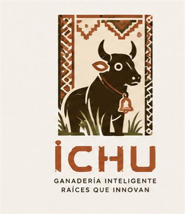

### 1.1.2. Perfiles de integrantes del equipo

| Integrantes | Foto | Descripción del perfil |
|---|---|---|
| Seminario Castillo,Diego Vicente U202412951 |  | Estudiante de Ingeniería de Software con interés en el análisis, diseño y desarrollo de soluciones tecnológicas. Se caracteriza por su organización, capacidad de adaptación y disposición para colaborar en equipo. |
| Aliaga Ocampo, Alexander Auden U202417693 |  | Estudiante de Ingeniería de Software con interés en el diseño de soluciones tecnológicas y la arquitectura de software. Se caracteriza por su compromiso, aprendizaje continuo y colaboración en equipo durante el desarrollo de proyectos. |
| Romero Meza, Jhimy Pool U202321510 |  | Estudiante de Ingeniería de Software (5mo ciclo). Se destaca por su responsabilidad, compromiso y disposición constante para colaborar. Cuenta con conocimientos previos en tecnología y en el desarrollo de proyectos, demostrando iniciativa y capacidad de aprendizaje autónomo. |

## 1.2. Solution Profile
### 1.2.1. Antecedentes y problemática
La ganadería es una de las actividades económicas y de sustento alimentario más antiguas y cruciales del mundo. Históricamente, la gestión de las unidades ganaderas se ha basado en procesos tradicionales y controles estrictamente manuales. El monitoreo del ganado en grandes extensiones de terreno siempre ha presentado enormes dificultades logísticas, requiriendo patrullajes físicos diarios por parte de los operarios para verificar visualmente el estado de salud, la ubicación y el comportamiento de cada animal.

En el contexto actual de la industria agropecuaria, el auge de tecnologías disruptivas ha abierto las puertas a la ganadería inteligente. El uso de sensores de bajo costo, redes inalámbricas de largo alcance (como LoRaWAN), plataformas en la nube y dispositivos móviles permite capturar parámetros biométricos y de comportamiento en tiempo real. Esto permite transformar un modelo de gestión reactivo donde un problema médico o una pérdida de animal se detecta cuando ya es demasiado tarde en un modelo predictivo y de monitoreo preventivo constante.

**Descripción de la Problemática (Análisis 5W2H)**

Para estructurar las dimensiones del problema del sector objetivo, se aplica la técnica 5W2H. Los hallazgos cuantitativos de esta tabla corresponden al cuestionario y a las entrevistas desarrolladas en el Capítulo II; no representan una estimación estadística de todo el sector ganadero.

| Elemento | Hallazgo identificado | Implicación para ICHU |
|---|---|---|
| **Who: ¿quién?** | Los usuarios principales son los ganaderos propietarios o administradores y los zootecnistas o médicos veterinarios que atienden sus hatos. | Diseñar una experiencia diferenciada para la gestión productiva y para la consulta clínica. |
| **What: ¿qué problema?** | Existe detección tardía de enfermedades, celos, partos y extravíos; además, los registros se encuentran fragmentados entre Excel y cuadernos. | Centralizar la ficha individual del animal, la telemetría, las alertas y los eventos productivos. |
| **Where: ¿dónde?** | En fundos, estancias, establos y potreros rurales de Apurímac, Cusco, Puno y otras zonas ganaderas con cobertura irregular. | Incorporar collar inteligente, ubicación y operación sin conexión. |
| **When: ¿cuándo?** | Durante campañas sanitarias, partos, periodos de celo, enfermedades metabólicas y situaciones de abigeato; también durante las actividades rutinarias de campo. | Generar recordatorios preventivos y alertas inmediatas según la gravedad del evento. |
| **Why: ¿por qué?** | La supervisión depende de observación visual, Excel, cuadernos y visitas veterinarias puntuales. La conectividad intermitente dificulta actualizar los registros desde el potrero. | Ofrecer una aplicación móvil offline con sincronización posterior y una plataforma web centralizada. |
| **How: ¿cómo se manifiesta?** | Los ganaderos realizan conteos e inspecciones físicas; los veterinarios reciben información incompleta o duplicada sobre tratamientos, vacunas y antecedentes. | Mantener trazabilidad por animal, registrar tratamientos y compartir información autorizada entre ganaderos y profesionales. |
| **How Much: ¿cuánto impacto tiene?** | En el cuestionario del Segmento 1, 2 de 2 participantes reportaron pérdidas de entre 5% y 10% del hato y calificaron el abigeato como frecuente y costoso. Próspero reportó la muerte de aproximadamente cinco vaquillas por partos prematuros y antecedentes de robos de 15 a 20 animales. | Priorizar alertas de salud y reproducción, geolocalización, reportes de costos y métricas de mortalidad. |

**Puntos más importantes a resolver por la solución propuesta**

La propuesta de software y hardware IoT tiene como meta prioritaria resolver los siguientes desafíos críticos:

**Detección temprana de anomalías de salud:** Monitorear parámetros biométricos y de actividad física para identificar signos precoces de enfermedad o fatiga extrema antes de que ocurra la muerte del animal.

**Prevención de pérdidas y robos:** Proporcionar geolocalización constante y alertas de geofencing (barreras geográficas virtuales) para avisar al ganadero de inmediato si un animal sale del área permitida o si se detecta un patrón de velocidad inusual de huida.

**Monitoreo del ciclo reproductivo**: Rastrear variaciones de comportamiento y temperatura que faciliten la detección oportuna de periodos de celo, optimizando las tasas de preñez y el manejo del nacimiento de crías.

**Centralización de datos individuales**: Reemplazar el registro manual por un historial digital individual de salud, genealogía, vacunación y movimientos de cada animal, accesible de forma centralizada y remota.

**Objetivos del Proyecto**

**Objetivo General**

Desarrollar una solución tecnológica distribuida e innovadora basada en Internet de las Cosas (IoT) que permita centralizar, procesar y visualizar información biométrica y de comportamiento animal en tiempo real o mediante sincronización posterior cuando no exista cobertura, facilitando la toma de decisiones preventivas y mejorando la eficiencia operativa en las unidades ganaderas.

**Objetivos Específicos**

- **Diseñar y simular el dispositivo físico de borde:** Desarrollar un prototipo funcional de collar inteligente mediante herramientas de modelado de circuitos, incorporando sensores de movimiento (acelerómetro), temperatura y posicionamiento GPS con un consumo de energía óptimo.
- **Implementar una API REST interna robusta:** Construir el servicio web de backend para la persistencia, procesamiento y analítica cuantitativa de los datos biométricos enviados por los dispositivos de borde.
- **Desarrollar aplicaciones cliente adaptables:** Implementar una aplicación móvil nativa o multiplataforma dirigida al personal de campo para alertas y monitoreo rápido en movimiento, junto con una aplicación web completa para que los administradores analicen historiales detallados y métricas estadísticas.
- **Desplegar una Landing Page informativa:** Crear un sitio web estático para la promoción comercial del modelo de negocio, integrando secciones de código de ética, términos y condiciones legales y enlaces a las plataformas operativas.
- **Integrar servicios externos de terceros:** Conectar la solución con un servicio meteorológico externo o una pasarela de mensajería (SMS/Email) para enriquecer la toma de decisiones y el envío de notificaciones automáticas ante emergencias.

**Restricciones del Proyecto**

Para asegurar la viabilidad técnica, el cumplimiento normativo y el rigor académico del curso, el proyecto se encuentra sujeto a las siguientes restricciones:

- **Restricciones de Stack Tecnológico:** El desarrollo de software debe apegarse estrictamente a las tecnologías autorizadas. Esto incluye el uso de HTML5, CSS3 y JavaScript para la Landing Page; Angular Framework (con Angular Material y TypeScript) o Vue para la Web Application; Spring Boot, ASP.NET Core o NestJS para los servicios web de backend; Flask con Peewee ORM y SQLite para los servicios Edge; y Kotlin (Android), Swift (iOS) o Flutter para las Mobile Applications.
- **Restricciones de Idioma y Localización:** Por exigencias del estándar del curso, el idioma por defecto para la interfaz de usuario, los mensajes de error y toda la interfaz de documentación técnica (como OpenAPI/Swagger) de todos los productos de la solución es estrictamente el inglés (en_US), requiriendo soporte de internacionalización (i18n) y accesibilidad (a11y) con atributos ARIA para español latinoamericano (es_419).
- **Restricciones de Diseño de Dispositivos IoT:** El diseño del circuito y simulación del collar inteligente debe ser elaborado obligatoriamente mediante herramientas autorizadas como Cirkit Designer o Wokwi, modelando de manera realista la comunicación con el Edge API.
- **Restricciones Normativas y de Responsabilidad Ética:** La solución debe incorporar en los pies de página (footer) de la Landing Page y de las aplicaciones un acceso explícito a los Términos y Condiciones del Servicio, estructurados en estricta conformidad con los códigos de ética para ingeniería de software establecidos por la ACM/IEEE y el Colegio de Ingenieros del Perú (CIP).
- **Restricciones de Gestión y Control de Código:** El control de versiones debe ser administrado en un repositorio público dentro de una organización en GitHub, empleando de manera rigurosa el flujo de trabajo de GitFlow, el estándar de mensajes conventional commits y versionamiento semántico.
### 1.2.2. Lean UX Process.
En esta sección se detalla el desarrollo y la aplicación del proceso Lean UX para nuestra solución digital orientada al sector ganadero. Este proceso permite alinear la visión del negocio con las necesidades reales de los usuarios, partiendo de un planteamiento del problema, seguido de supuestos verificables y, finalmente, hipótesis que serán validadas durante el proyecto.
#### 1.2.2.1. Lean UX Problem Statements.
De acuerdo con las pautas de diseño para iniciativas nuevas, se ha elaborado un planteamiento del problema que abarca las necesidades de los dos segmentos objetivo: ganaderos y zootecnistas o médicos veterinarios:

El estado actual de la ganadería extensiva y del seguimiento del ganado depende principalmente de inspecciones manuales en los potreros, identificación física y registros retrospectivos en papel. Estos procesos requieren mucho trabajo, son propensos a errores y presentan dificultades para escalar. Las soluciones existentes no combinan adecuadamente el monitoreo fisiológico continuo, como la temperatura corporal y los patrones de actividad, con la ubicación GPS dentro de un ecosistema digital accesible y fácil de utilizar. ICHU abordará esta brecha mediante una solución IoT integral basada en collares inteligentes que transmiten datos biométricos a una API REST central y a una aplicación web y móvil que visualiza el estado del ganado y genera alertas predictivas. El enfoque inicial estará dirigido a los ganaderos de escala media de la sierra sur del Perú, en las regiones de Apurímac, Cusco y Puno, y a los zootecnistas y médicos veterinarios que asesoran sus hatos. El éxito se evaluará mediante el uso diario de la aplicación, el tiempo de respuesta ante alertas críticas y la reducción de pérdidas de ganado durante el piloto.

#### 1.2.2.2. Lean UX Assumptions.
Para guiar el diseño centrado en el usuario, hemos estructurado nuestras creencias en cinco categorías de supuestos, redactados como enunciados verificables que serán validados durante el desarrollo.

| Categoría | Supuesto | Forma de validación |
|---|---|---|
| **A. Business Assumptions** | Los ganaderos están dispuestos a pagar una suscripción anual con tarifa fija bajo el modelo SaaS si se demuestra que la solución reduce la mortalidad del ganado en más de un 15%. | Entrevistas de disposición de pago, prueba piloto y seguimiento de conversión a suscripciones. |
| **A. Business Assumptions** | Un esquema de adquisición híbrido, que combine la venta física del collar inteligente a bajo costo con una suscripción digital, reducirá la barrera de entrada al mercado ganadero. | Pruebas de precio y comparación de interés entre venta de hardware, suscripción y paquete combinado. |
| **A. Business Assumptions** | Es factible producir collares IoT de bajo consumo utilizando hardware de código abierto, con un objetivo inicial de operación continua de hasta tres años por batería. | Pruebas de consumo, autonomía y transmisión realizadas con prototipos en laboratorio y campo. |
| **A. Business Assumptions** | Las alianzas con cooperativas ganaderas y veterinarios locales serán un canal principal de adquisición de clientes. | Registro de contactos, conversiones y suscripciones provenientes de cada alianza. |
| **B. Business Outcome Assumptions** | Se capturarán al menos 150 suscripciones activas de unidades ganaderas durante el primer año de operaciones. | Seguimiento mensual de clientes, planes activos y cancelaciones. |
| **B. Business Outcome Assumptions** | Se mantendrá una tasa de retención anual de suscripciones superior al 92%. | Análisis de cohortes y comparación entre suscripciones renovadas y canceladas. |
| **B. Business Outcome Assumptions** | La tasa de fallas técnicas o pérdida de señal de los collares IoT en el campo será inferior al 2% anual. | Registro de incidentes, disponibilidad de dispositivos y reportes de conectividad durante el piloto. |
| **B. Business Outcome Assumptions** | El costo de adquisición de clientes (CAC) disminuirá en un 25% durante el segundo semestre gracias a las recomendaciones orgánicas. | Comparación semestral del CAC y del origen de cada nuevo cliente. |
| **C. User Assumptions** | El usuario principal del Segmento 1 es el ganadero propietario o administrador de la finca, quien necesita interfaces legibles y pocos pasos. | Pruebas de usabilidad, tiempo de ejecución de tareas y entrevistas posteriores. |
| **C. User Assumptions** | El zootecnista o médico veterinario es un usuario clave que requiere acceso a historiales cuantitativos para realizar diagnósticos precisos. | Pruebas de consulta clínica, revisión de historiales y entrevistas con profesionales. |
| **C. User Assumptions** | Los ganaderos trabajan frecuentemente en zonas con conectividad intermitente y necesitan consultar datos locales previamente descargados. | Pruebas de campo en zonas con cobertura irregular y medición de tareas realizadas sin conexión. |
| **D. User Outcome and Benefit Assumptions** | El monitoreo automatizado y las alertas priorizadas reducirán el tiempo dedicado al conteo y a las inspecciones rutinarias. | Comparación del tiempo de trabajo antes y después de utilizar ICHU. |
| **D. User Outcome and Benefit Assumptions** | La geolocalización de los animales aumentará la sensación de seguridad y ayudará a prevenir abigeatos y extravíos. | Pruebas de alertas de alejamiento, recuperación de posiciones y encuestas de percepción. |
| **D. User Outcome and Benefit Assumptions** | Las anomalías térmicas detectadas automáticamente permitirán aislar oportunamente animales con posibles brotes epidémicos. | Medición del tiempo entre la detección, la alerta y la intervención del usuario. |
| **E. Feature Assumptions** | Un collar IoT hermético con sensores de temperatura, acelerómetro y GPS transmitirá datos biométricos estables al servicio Edge API. | Pruebas de precisión, autonomía, resistencia y continuidad de transmisión. |
| **E. Feature Assumptions** | Las notificaciones automáticas en la aplicación móvil y por SMS alertarán oportunamente ante desviaciones críticas del comportamiento animal. | Medición del tiempo de entrega, tasa de recepción y cantidad de falsos positivos. |
| **E. Feature Assumptions** | El panel de análisis permitirá visualizar métricas agrupadas, promedios de salud del hato y mapas de calor de pastoreo. | Pruebas de tareas, revisión de métricas consultadas y evaluación de utilidad por los usuarios. |
| **E. Feature Assumptions** | El modo sin conexión permitirá registrar datos localmente y sincronizarlos al recuperar señal, garantizando la continuidad operativa en campo. | Medición de registros creados sin conexión, sincronizaciones exitosas y datos faltantes. |

#### 1.2.2.3. Lean UX Hypothesis Statements.
Se redacta una declaración de hipótesis por cada Feature Assumption definido en la sección anterior, aplicando la estructura del template: el resultado de negocio que se busca alcanzar, las personas que deben obtenerlo, el beneficio que obtienen y la característica o solución que lo habilita.

**Hypothesis 1. Biometric and GPS Tracking**

**Creemos que lograremos** una tasa de renovación anual de suscripciones superior al 92%
**si** los administradores ganaderos
**alcanzan** la localización individual de cada animal y la detección temprana de indicios de enfermedad
**con** un collar inteligente de bajo consumo que registra temperatura corporal, índice de actividad y coordenadas de posición.

**Hypothesis 2. Real-Time Alerts**

**Creemos que lograremos** una reducción del 15% en la mortalidad del hato de las unidades productivas suscritas
**si** los ganaderos propietarios y administradores
**alcanzan** la capacidad de aislar y atender a un animal enfermo en menos de una hora desde la desviación de sus constantes
**con** un motor de alertas automáticas que notifica por aplicación móvil y por mensaje de texto cuando los indicadores biométricos superan los umbrales definidos.

**Hypothesis 3. Analytics Dashboard**

**Creemos que lograremos** 150 unidades productivas con suscripción activa durante el primer año, impulsadas por la recomendación profesional
**si** los zootecnistas y médicos veterinarios
**alcanzan** un diagnóstico sustentado en historiales biométricos, tendencias de temperatura y distribución de casos en el hato
**con** un panel de análisis integrado al RESTful API de desarrollo interno.

**Hypothesis 4. Offline Operation**

**Creemos que lograremos** que el 60% de las unidades productivas suscritas registre actividad en la aplicación al menos cinco días por semana
**si** el personal de campo de las unidades ganaderas
**alcanza** la continuidad de sus faenas en zonas sin cobertura celular, consultando fichas y registrando eventos en el momento en que ocurren
**con** un modo sin conexión que almacena los registros de forma local y los sincroniza al recuperar la señal.

#### 1.2.2.4. Lean UX Canvas.
A continuación, se presenta el Lienzo Lean UX de la startup ganadera, integrando los bloques estratégicos para validar de forma iterativa nuestro modelo de negocio digital:

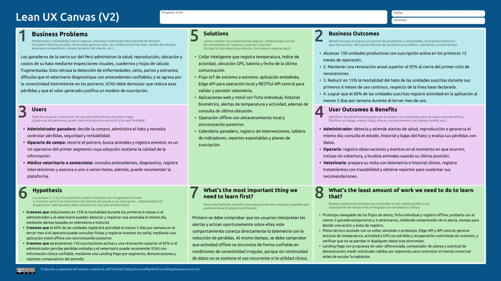

*Figura 10. Elaboración de creación propia por datos recolectados, startup SmartFarm.*

<table>
    <thead>
        <tr>
            <th>Bloque</th>
            <th>Descripción / Aplicación en el Proyecto Ganadero</th>
        </tr>
    </thead>
    <tbody>
        <tr>
            <td><strong>1. Business Problem</strong></td>
            <td>
                Los ganaderos de crianza extensiva enfrentan pérdidas por detecciones tardías
                de enfermedades, eventos reproductivos no atendidos y robo de ganado (abigeato).
                Los controles manuales son costosos, ineficientes y no escalan a grandes
                extensiones de tierra. Esta problemática fue corroborada mediante las entrevistas
                y cuestionarios del equipo.
            </td>
        </tr>
        <tr>
            <td><strong>2. Business Outcomes</strong></td>
            <td>
                <ol>
                    <li>Lograr 150 suscripciones SaaS activas en el primer año.</li>
                    <li>Mantener la tasa de cancelación por debajo del 8% anual.</li>
                    <li>Reducir los costos de soporte en hardware mediante un diseño robusto y de bajo consumo.</li>
                </ol>
            </td>
        </tr>
        <tr>
            <td><strong>3. Users</strong></td>
            <td>
                <ol>
                    <li>
                        <strong>Cesar Flores, administrador ganadero:</strong>
                        Arquetipo del Segmento 1. Toma las decisiones de negocio, evalúa costos y rentabilidad, y responde por la seguridad del hato.
                    </li>
                    <li>
                        <strong>Leonardo Rosales, médico veterinario:</strong>
                        Arquetipo del Segmento 2. Necesita historiales cuantitativos y datos continuos para sustentar diagnósticos y tratamientos.
                    </li>
                    <li>
                        <strong>Operario de campo:</strong>
                        Rol operativo dentro del Segmento 1. Ejecuta las faenas en el potrero y registra lo que observa durante la jornada.
                    </li>
                </ol>
            </td>
        </tr>
        <tr>
            <td><strong>4. User Outcomes &amp; Benefits</strong></td>
            <td>
                <ol>
                    <li>Reducción significativa del tiempo dedicado a inspecciones visuales manuales.</li>
                    <li>Prevención de pérdidas masivas por enfermedades contagiosas gracias a alertas tempranas.</li>
                    <li>Localización exacta de animales extraviados o robados.</li>
                </ol>
            </td>
        </tr>
        <tr>
            <td><strong>5. Solutions</strong></td>
            <td>
                <ol>
                    <li>
                        <strong>Dispositivos IoT:</strong>
                        Collares inteligentes con sensores biométricos y GPS.
                    </li>
                    <li>
                        <strong>Servicios Edge y RESTful API:</strong>
                        Procesamiento y almacenamiento centralizado de telemetría.
                    </li>
                    <li>
                        <strong>Aplicaciones web y móviles:</strong>
                        Interfaces amigables con alertas en tiempo real, mapas y analíticas.
                    </li>
                </ol>
            </td>
        </tr>
        <tr>
            <td><strong>6. Hypotheses</strong></td>
            <td>
                Creemos que lograremos una reducción del 15% en la mortalidad del hato y una
                renovación anual superior al 92% si los ganaderos y los profesionales que los
                asesoran alcanzan la detección temprana de anomalías y la continuidad del
                registro en campo, con collares inteligentes integrados a un motor de alertas
                y a un modo sin conexión con sincronización posterior.
            </td>
        </tr>
        <tr>
            <td>
                        <strong>7. What's the most important thing we need to learn first?</strong>
            </td>
            <td>
                <ol>
                    <li>
                        ¿Soportará la batería del collar IoT hasta tres años transmitiendo
                        telemetría continua?
                    </li>
                    <li>
                        ¿Los ganaderos comprenderán y adoptarán con facilidad la interfaz
                        del mapa de calor y alertas en sus smartphones?
                    </li>
                    <li>
                        ¿Es estable la transmisión de datos desde zonas rurales remotas
                        hacia nuestras APIs centralizadas?
                    </li>
                </ol>
            </td>
        </tr>
        <tr>
            <td>
                 <strong>8. What's the least amount of work we need to do to learn that?</strong>
            </td>
            <td>
                <ol>
                    <li>
                        Desarrollar un prototipo físico mínimo con ESP32 simulado en Wokwi
                        para probar consumo de batería y transmisión al Edge API.
                    </li>
                    <li>
                        Diseñar un <em>wireframe</em> interactivo en Figma y realizar pruebas
                        de usabilidad de navegación rápida con 3 ganaderos locales.
                    </li>
                    <li>
                        Implementar un <em>landing page</em> básico para medir el interés de
                        suscripción digital mediante clics en un <em>Call-to-Action</em>
                        simulado.
                    </li>
                </ol>
            </td>
        </tr>
    </tbody>
</table>

## 1.3. Segmentos objetivo.

Para garantizar la viabilidad del modelo de negocio de nuestra startup y diseñar soluciones de software adaptables que satisfagan las necesidades reales del sector ganadero, se ha realizado un proceso de segmentación de mercado basado en criterios geográficos, demográficos, psicográficos y conductuales. El análisis del dominio revela que el ecosistema productivo ganadero depende de la interacción coordinada de dos perfiles principales: los responsables de la gestión de la unidad productiva y los profesionales encargados de la salud y el manejo técnico del ganado.

A continuación, se describen los dos segmentos objetivo identificados para nuestra solución de monitoreo de ganado mediante tecnología IoT. Las afirmaciones estadísticas se respaldan con fuentes oficiales cuando corresponde y los hallazgos de las entrevistas se presentan como evidencia de la investigación propia.

**Segmento 1:** Medianos y Grandes Ganaderos (Propietarios y Administradores de Estancias)

Dentro de este segmento conviven dos roles operativos. El administrador ganadero, propietario o gestor de la unidad productiva, es quien decide la compra y responde por los resultados económicos del hato. El operario de campo es el personal que ejecuta las faenas en el potrero y registra lo que observa durante la jornada; no decide la compra, pero su adopción determina que la información llegue al sistema. Este segmento representa a los tomadores de decisiones financieras y estratégicas de las unidades de producción ganadera. Son los responsables de adquirir la solución digital y los collares inteligentes IoT, motivados por la optimización de costos, el aumento de la productividad de leche y carne, y la mitigación de pérdidas críticas causadas por muertes no detectadas, enfermedades y abigeato.

**A. Perfil Demográfico y Geográfico**

- **Edad:** Entre 35 y 65 años.
- **Género:** Masculino y femenino.
- **Nivel Educativo:** Educación técnica superior o universitaria completa (típicamente en carreras como Agronomía, Medicina Veterinaria, Zootecnia, Administración de Empresas o Ingeniería Industrial).
- **Ubicación:** Regiones ganaderas de la sierra sur del Perú, en particular Apurímac, Cusco y Puno, donde se realizó la investigación de campo. Cajamarca, Arequipa, La Libertad y San Martín se consideran mercados de expansión posterior.
- **Ocupación:** Propietarios de haciendas, gerentes generales de cooperativas ganaderas o administradores generales de estancias ganaderas medianas y grandes (hatos de entre 50 y más de 500 cabezas de ganado).
- **Dispositivos de Preferencia:** Teléfonos inteligentes de gama media-alta (Android e iOS), tabletas y computadoras portátiles o de escritorio para el control administrativo de la empresa.
- **Canales de Interacción Digital:** Redes sociales profesionales (LinkedIn), grupos especializados de WhatsApp, correos electrónicos corporativos, motores de búsqueda (Google) y portales de noticias del sector agropecuario.

**B. Características Psicográficas y Conductuales**

- **Personalidad:** Analíticos, orientados a resultados, visionarios, cautelosos con las inversiones de capital pero abiertos a la adopción de tecnologías validadas que demuestren un rápido retorno de inversión (ROI).
- **Habilidades:** Gestión de presupuestos, planificación estratégica, liderazgo de personal de campo y negociación con proveedores de la cadena de valor láctea o cárnica.
- **Estilo de Vida:** Dividen su tiempo entre la supervisión estratégica en campo (visitas periódicas a las estancias) y la gestión comercial en zonas urbanas. Valoran el control de sus activos y la tranquilidad de saber que su patrimonio está protegido de forma preventiva.
- **Marcas e Influencias:** Compran insumos de marcas reconocidas como Zoetis, MSD Animal Health, e influyen sus decisiones a través de gremios ganaderos locales (como la Asociación de Ganaderos del Perú - AGALEP), ferias agropecuarias nacionales y consultores zootecnistas de confianza.

**C. Evidencia de investigación y fuentes**

En el cuestionario del Segmento 1, los 2 participantes reportaron manejar entre 51 y 200 cabezas, trabajar en pastoreo extensivo o régimen mixto y tener conectividad regular en las zonas de pastoreo. Ambos reportaron pérdidas de entre 5% y 10% del hato y calificaron el abigeato como frecuente y costoso. Estos resultados corresponden a la muestra investigada y no deben generalizarse a toda la población ganadera.

Como contexto nacional, la Encuesta Nacional Agropecuaria del INEI identifica al ganado vacuno como una de las principales crianzas de las unidades agropecuarias del país [1]. El sistema SIEA del MIDAGRI permite consultar datos productivos y estadísticos actualizados por región [2]. Para la conectividad, OSIPTEL publica indicadores de cobertura y calidad de los servicios móviles por departamento, por lo que la disponibilidad debe validarse por predio y no asumirse como uniforme [3]. Las campañas sanitarias y sus periodos deben contrastarse con la información oficial de SENASA y con el calendario regional correspondiente [4].

**Segmento 2:** Zootecnistas y Médicos Veterinarios
Este segmento abarca a los especialistas técnicos encargados del diagnóstico preventivo, la atención de brotes de enfermedades, la sincronización reproductiva y la prescripción de tratamientos médicos para el ganado. Son asesores externos clave o personal de planta que requiere de datos cuantitativos precisos, históricos y en tiempo real para optimizar la salud colectiva e individual de los bovinos.

**A. Perfil Demográfico y Geográfico**

- **Edad:** Entre 28 y 60 años.
- **Género:** Masculino y femenino.
- **Nivel Educativo:** Educación universitaria completa y posgrados (Especializaciones, Maestrías) en Medicina Veterinaria, Zootecnia o Reproducción Animal.
- **Ubicación:** Ciudades intermedias cercanas a los valles ganaderos o residentes en las capitales de región, realizando visitas técnicas programadas o de emergencia a múltiples establos ganaderos.
- **Ocupación:** Médicos veterinarios independientes, consultores de salud animal, asesores de sanidad de cooperativas o directores de sanidad animal de grandes agropecuarias.
- **Dispositivos de Preferencia:** Smartphones de gama media-alta, tabletas robustas (con estuches protectores para uso en corrales) y laptops para análisis estadístico de datos y reportes clínicos.
- **Canales de Interacción Digital:** Correo electrónico, plataformas académicas y científicas (PubMed, ResearchGate), boletines de sanidad agropecuaria (SENASA), aplicaciones web profesionales de gestión de establos y redes sociales enfocadas en la comunidad médica veterinaria.

**B. Características Psicográficas y Conductuales**

- **Personalidad:** Metódicos, analíticos, orientados a la ciencia de datos, rigurosos con los protocolos de bioseguridad y apasionados por el bienestar animal. Valoran la precisión de los datos biométricos por encima de las estimaciones subjetivas.
- **Habilidades:** Diagnóstico clínico, análisis de parámetros fisiológicos complejos (temperatura, frecuencia de rumia, nivel de actividad), diseño de calendarios de vacunación, inseminación artificial y gestión de fármacos veterinarios.
- **Estilo de Vida:** Dinámico y móvil. Viajan frecuentemente entre diferentes establos y estancias ganaderas. Deben estar preparados para responder a emergencias a cualquier hora del día.
- **Marcas e Influencias:** Influenciados por publicaciones de revistas indexadas especializadas, laboratorios multinacionales (como Boehringer Ingelheim, Elanco, Bayer Sanidad Animal) y colegios médico-veterinarios locales (como el Colegio Médico Veterinario del Perú).

**C. Evidencia de investigación**

Las entrevistas del Segmento 2 muestran que los profesionales necesitan consultar historiales clínicos, tratamientos, constantes fisiológicas, rumia, actividad, reproducción y evidencia ecográfica antes o durante la visita al establo. Darwin, Eliseo y Dionisio coincidieron en la necesidad de alertas tempranas, reportes exportables e integración con ecógrafos y sistemas de nutrición. Estos hallazgos provienen de la investigación propia y deben validarse posteriormente con una muestra más amplia antes de convertirse en indicadores estadísticos generales.
# Capítulo II: Requirements Elicitation & Analysis

## 2.1. Competidores.

### 2.1.1. Análisis competitivo.

**Competitive Analysis Landscape**

| Sección | Criterio | ICHU IoT (nuestra startup) 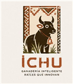 | Competidor 1: Allflex SenseHub  | Competidor 2: Digitanimal  | Competidor 3: Moocall 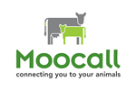 |
|---|---|---|---|---|---|
| **¿Por qué llevar a cabo este análisis?** | Objetivo del análisis | Comparar ICHU con sus principales competidores para identificar fortalezas, debilidades, oportunidades y amenazas, y determinar una ventaja competitiva clara y sostenible en el mercado de monitoreo inteligente de ganado. | | | |
| **Perfil** | Overview | Solución digital basada en collares inteligentes IoT con conectividad LoRaWAN y celular híbrida, integrada a una plataforma web y móvil nativa para el monitoreo biométrico y localización en tiempo real de ganado en pastoreo extensivo. | Líder global en identificación animal y monitoreo inteligente de ganado lechero y de carne, perteneciente al grupo MSD Animal Health, con infraestructura propietaria robusta. | Empresa de base tecnológica española que ofrece collares GPS y sensores para el monitoreo de la ubicación, temperatura y comportamiento de animales en pastoreo extensivo. | Compañía irlandesa especializada en dispositivos IoT acoplados a la cola del animal para la detección temprana del parto y collares para el monitoreo de celo. |
| **Perfil** | Ventaja competitiva: ¿qué valor ofrece a los clientes? | Conectividad híbrida adaptable (LoRaWAN/Red Celular) con modo offline para sincronización retrasada; algoritmos locales de bajo consumo; costo accesible sin necesidad de costosas antenas propietarias locales en cada rancho ganadero. | Monitoreo biométrico de altísima precisión (rumia, estrés por calor, celo) respaldado por décadas de investigación veterinaria y validación clínica a nivel industrial. | Alta durabilidad y resistencia del dispositivo GPS, geocofencing de gran precisión geográfica y mapeo visual avanzado de rutas de pastoreo sin antenas locales intermedias. | Especialización extrema y 100% enfocada en el parto y celo con alertas directas por SMS independientes de red local, con alta tasa de éxito preventivo en ganado gestante. |
| **Perfil de Marketing** | Mercado objetivo | Medianos y grandes productores ganaderos en América Latina con ganado de carne y doble propósito bajo esquemas de pastoreo extensivo o semi-intensivo. | Megaproductores de ganado lechero y de carne de alta producción bajo confinamiento o pastoreo intensivo que pueden costear alta infraestructura. | Ganaderos de montaña o pastoreo extensivo en Europa y América Latina que sufren pérdidas frecuentes por extravío o depredadores. | Criadores de ganado vacuno enfocados en la reproducción y mejora genética, con rodeos medianos que requieren monitoreo crítico en época de parición. |
| **Perfil de Marketing** | Estrategias de marketing | Demostraciones prácticas en asociaciones ganaderas locales, marketing digital enfocado en el ahorro de mano de obra y reducción de tasas de mortalidad animal, alianzas con veterinarias locales. | Venta consultiva directa corporativa, presencia imponente en ferias internacionales agropecuarias, marketing científico con publicaciones respaldadas por veterinarios. | Marketing de contenidos enfocado en la prevención del robo de ganado (abigeato), campañas digitales basadas en casos de éxito de recuperación de animales extraviados. | Publicidad de nicho en revistas y foros especializados en inseminación y cría, demostraciones de "antes y después" del parto, y distribución mediante veterinarias aliadas. |
| **Perfil de Producto** | Productos & Servicios | Collar inteligente con acelerómetro y sensor de temperatura; aplicación móvil nativa (Android/iOS); plataforma web de gestión analítica; API RESTful para servicios veterinarios. | Collares y aretes inteligentes SenseHub, antenas receptoras propietarias fijas de largo alcance, software SaaS de escritorio y aplicación móvil de alertas en tiempo real. | Collares de localización GPS con sensores de temperatura, plataforma web de visualización cartográfica, y aplicaciones para dispositivos móviles de rastreo y geocofencing. | Sensor Moocall Calving (acoplado a la cola), collar Moocall HEAT, servicio SaaS de envío de alertas por mensajes de texto integrados y aplicación para teléfonos inteligentes. |
| **Perfil de Producto** | Precios & Costos | Dispositivos de bajo costo de adquisición única; plan de suscripción mensual flexible por escala de ganado (Premium y Básico) adaptado al volumen real del ganadero. | Costo de adquisición de hardware muy elevado; tarifas de instalación de antenas propietarias muy costosas; contrato de licenciamiento SaaS anual rígido y de alto valor. | Costo moderado por dispositivo collar; suscripción mensual obligatoria por la conectividad celular/NB-IoT integrada en cada collar de forma independiente. | Costo único por el sensor de parto; cuota de servicio anual fija obligatoria para cubrir el costo de las alertas de telefonía celular global por SMS. |
| **Perfil de Producto** | Canales de distribución (Web y/o Móvil) | Plataforma web (Landing Page) con e-commerce integrado; distribuidores regionales de insumos agropecuarios; y tiendas oficiales de aplicaciones móviles nativas. | Red global de distribuidores autorizados exclusivos de MSD Animal Health y representantes de ventas técnicas directas en zonas ganaderas industriales. | Sitio web con tienda en línea directa; envíos internacionales; alianzas de distribución con operadores de redes de telecomunicaciones IoT (como Telefónica) y conectividad satelital NB-NTN. | Tienda en línea oficial, marketplaces especializados (Amazon, agro-tiendas), y cooperativas ganaderas autorizadas con presencia física internacional. |
| **Análisis SWOT** | Fortalezas | Conectividad híbrida LoRaWAN/celular de bajo consumo, soporte nativo de modo sin conexión (offline) para guardado local en zonas remotas, arquitectura de software basada en microservicios ágiles que facilita la integración rápida mediante API RESTful con laboratorios y veterinarias. | Respaldo de una multinacional farmacéutica veterinaria, algoritmos de rumia probados científicamente a nivel mundial, red de soporte técnico in situ de alta presencia. | Dispositivos muy resistentes con excelente diseño industrial hermético, fuerte presencia de marca en el mercado ganadero de habla hispana. | Solución sumamente específica y validada para la reducción de mortalidad de terneros durante el parto, sin necesidad de configuraciones de red complejas por parte del usuario. |
| **Análisis SWOT** | Debilidades | Marca nueva en el mercado sin posicionamiento previo, presupuesto de marketing inicialmente limitado, dependencia de la capacidad de ensamblaje inicial para los lotes de collares físicos. | Costo de inversión restrictivo para productores pequeños y medianos, obligatoriedad de instalar antenas fijas receptoras en el terreno (inviable para grandes pastizales extensivos sin energía eléctrica). | Fuerte dependencia de la conectividad de redes de telecomunicaciones de terceros para la transmisión de datos, falta de integración directa y amigable con servicios locales de atención de salud animal del sector. | Alcance funcional muy limitado (no sirve para geolocalización, control de pastoreo diario, ni detección generalizada de enfermedades comunes del ganado). |
| **Análisis SWOT** | Oportunidades | Creciente necesidad de digitalización en el sector ganadero latinoamericano para mitigar el robo de ganado (abigeato); alta disponibilidad de redes de comunicación IoT abiertas de largo alcance (LoRaWAN). | Migración de medianos ganaderos hacia ganaderías intensivas de alta eficiencia donde el retorno de inversión se percibe más rápido. | Expansión de redes de conectividad celular de banda estrecha (NB-IoT) en América Latina que podrían reducir el consumo de sus baterías. | Alianzas con proveedores de semen y genética bovina para empaquetar el dispositivo en programas de reproducción bovina de alta gama. |
| **Análisis SWOT** | Amenazas | Fluctuación de precios de los componentes electrónicos para la fabricación de los collares; posibilidad de ingreso rápido de competidores chinos de bajo costo con hardware genérico sin valor analítico. | Desintermediación del mercado por soluciones de software de código abierto e integraciones de sensores genéricos. | Lanzamiento de collares inteligentes de bajo costo por parte de startups locales latinoamericanas con mejor soporte al cliente y tarifas flexibles. | Obsolescencia del dispositivo de cola si los collares biométricos de la competencia logran predecir el parto con la misma o mayor precisión a menor costo general. |

### 2.1.2. Estrategias y tácticas frente a competidores.

Para posicionar a ICHU IoT con éxito, nuestra startup implementará un conjunto de estrategias y tácticas comerciales y de ingeniería de software orientadas a contrarrestar las fortalezas de los competidores establecidos y capitalizar sus debilidades en el contexto ganadero latinoamericano:

#### Estrategia 1: Reducción de Barreras Económicas y Tecnológicas de Infraestructura

- **Táctica Comercial:** Eliminar la necesidad de costosas antenas fijas propietarias en el rancho ganadero (la gran debilidad de Allflex). El ganadero podrá optar por el collar inteligente ICHU, que transmite de forma local desde cada animal de la manada y sincroniza los datos directamente con nuestra plataforma, reduciendo a una fracción los costos de instalación física.
- **Táctica de Ingeniería:** Diseñar el collar inteligente con conectividad híbrida que almacene la telemetría en memoria flash local cuando el ganado se encuentre en "zonas ciegas" sin señal. Una vez que el ganado retorne a áreas de cobertura o se aproxime al corral principal, los datos se sincronizarán de forma transparente y asíncrona hacia nuestro Edge API.

#### Estrategia 2: Optimización Energética de los Dispositivos Físicos

- **Táctica Comercial:** Promocionar una vida útil de la batería del collar de hasta 3 años, reduciendo drásticamente las horas de mano de obra asociadas al cambio de baterías y manipulación estresante del ganado (superando la debilidad de Digitanimal).
- **Táctica de Ingeniería:** Implementar en los dispositivos embebidos un algoritmo inteligente de transmisión dinámica. Si el ganado se encuentra en reposo (determinado por el acelerómetro local), el módulo GPS/transmisor entra en modo de ultra bajo consumo (Deep Sleep), transmitiendo únicamente cuando se detecten patrones de actividad inusual, geocofencing cruzado o anomalías térmicas en el animal.

#### Estrategia 3: Flexibilidad de Suscripción y Monetización Adaptativa

- **Táctica Comercial:** Ofrecer un modelo de negocio SaaS con planes escalables basados en el tamaño real de la unidad ganadera (por cabeza de ganado), permitiendo a los medianos productores adoptar la tecnología de forma incremental. Esto contrasta directamente con los planes de pago anuales rígidos e inaccesibles de Allflex y Digitanimal.
- **Táctica de Ingeniería:** Implementar en nuestro backend de servicios web un módulo dinámico de suscripciones y facturación asimilado por el microservicio correspondiente, permitiendo habilitar o deshabilitar de forma automática características del software (como reportes avanzados o alertas SMS críticas) basándose en el plan activo del usuario.

#### Estrategia 4: Integración del Ecosistema de Salud mediante API RESTful de Desarrollo Interno

- **Táctica Comercial:** Posicionar a ICHU IoT no solo como un rastreador o un sensor aislado, sino como una plataforma abierta que conecta al ganadero con su médico veterinario de confianza. El veterinario podrá visualizar análisis clínicos e históricos de salud de manera remota para prescribir tratamientos oportunos, reduciendo las visitas físicas improductivas.
- **Táctica de Ingeniería:** Diseñar y documentar rigurosamente los endpoints de nuestro RESTful API con OpenAPI/Swagger, permitiendo que sistemas externos de laboratorios o software de gestión de terceros se integren de forma segura mediante protocolos estandarizados, expandiendo el valor del ecosistema sin comprometer la seguridad de la información.

## 2.2. Entrevistas.

### 2.2.1. Diseño de entrevistas.

A continuación, se presenta la relación de preguntas principales y complementarias estructuradas para cada uno de los dos segmentos objetivo identificados. El cuestionario recopila tanto la información demográfica y de perfil requerida para construir los User Personas (arquetipos) como la información operativa y de dolor para mapear los requisitos de software del sistema.

**Segmento 1:** Medianos y Grandes Ganaderos (Propietarios y Administradores de Estancias)

Este segmento representa al comprador principal (Buyer Persona) y tomador de decisiones financieras de la estancia. El objetivo es identificar la viabilidad de la plataforma web administrativa, el modelo de suscripción SaaS y los indicadores clave (KPIs) de productividad que desean ver en pantalla.

#### BLOQUE 1: Datos Demográficos y de Perfil (Información Complementaria)

**Objetivo:** Construir el arquetipo recolectando características demográficas, ocupación, biografía y canales digitales de interacción.

1. ¿Cuál es su nombre, edad, nivel de instrucción y en qué distrito/región se encuentra su estancia ganadera?
2. ¿Cuál es su ocupación o rol principal en el día a día en torno al ganado?
3. ¿Qué dispositivos digitales prefiere utilizar en su rutina diaria (computadora de escritorio, laptop, tablet, teléfono inteligente)?

---

#### BLOQUE 2: Comportamiento, Infraestructura y Frustraciones

**Objetivo:** Entender el contexto operativo actual del rancho, sus cuellos de botella tecnológicos y sus principales puntos de dolor.

1. ¿Cuántas cabezas de ganado maneja actualmente en su unidad productiva y bajo qué régimen (pastoreo extensivo, estabulado o semi-intensivo)?
2. ¿Qué herramientas o sistemas de software utiliza actualmente para llevar el control del inventario de animales, partos, muertes e historial médico?
3. ¿Cómo es el estado de la conectividad a internet (red celular 3G/4G/5G, internet satelital, etc.) en la casa del rancho y en las zonas de pastoreo?
4. ¿Cuál ha sido la pérdida económica más significativa que ha tenido en el último año debido a enfermedades no detectadas a tiempo o muerte súbita de animales?
5. ¿Cómo le afecta el robo de ganado (abigeato) o el extravío de animales en términos de costos de búsqueda y pérdida patrimonial?
6. Al contratar consultorías veterinarias externas, ¿cuáles son los principales problemas de comunicación o falta de datos históricos que experimenta?

---

#### BLOQUE 3: Validación de la Propuesta de Software (ICHU)

**Objetivo:** Validar el modelo de negocio, el hardware y los indicadores clave (KPIs) del proyecto.

1. Si existiera una plataforma web que centralizara el historial de salud, ubicación y alertas térmicas de cada animal sin que usted tenga que estar físicamente en el corral, ¿cómo cambiaría su proceso de toma de decisiones?
2. ¿Qué información cuantitativa (gráficos de temperatura, horas de actividad, alertas de celo) consideraría indispensable visualizar en un tablero de control ejecutivo?
3. ¿Bajo qué condiciones o modelo de suscripción (ej. un pago mensual por cabeza de ganado monitoreada) consideraría rentable implementar esta solución de software en su negocio?

---

#### BLOQUE 4: Captura de Funcionalidades

**Objetivo:** Obtener los requisitos técnicos y módulos específicos que deben programarse en el sistema.

##### 1. Funcionalidades de Sanidad y Trazabilidad (El Historial del Animal)

1. En su trabajo diario controlando la salud del ganado, ¿qué datos médicos necesita registrar sí o sí en el sistema? (Ej. tipo de vacuna, fecha, dosis, nombre del veterinario).
2. Si el software tuviera un perfil individual por cada vaca, ¿qué información específica le gustaría encontrar al abrir ese perfil?
3. ¿Le gustaría que el sistema le envíe notificaciones automáticas? De ser así, ¿de qué tipo? (Ej. recordatorios de revacunación, alertas de parto, periodos de cuarentena).

##### 2. Funcionalidades de Inventario y Movimientos (Control de Stock)

1. Para llevar el control de cuántas cabezas de ganado tiene, ¿qué funciones específicas le pediría a la plataforma? ¿Le sirve poder agruparlos por lotes, por edad, por raza o por potrero?
2. Cuando ocurre un nacimiento o una muerte en el campo, ¿qué campos obligatorios le gustaría que el capataz llene en la aplicación para que usted tenga la información completa?
3. ¿Necesita que el software le permita registrar el movimiento de animales de un potrero a otro? ¿Qué datos le gustaría ver en esa función? (Ej. días de descanso del pasto, carga animal).

##### 3. Funcionalidades Financieras y de Insumos (El Negocio)

**Objetivo:** Capturar las herramientas de administración económica que espera encontrar.

1. En la parte administrativa de su trabajo, ¿qué funcionalidades le gustaría tener para controlar sus gastos? ¿Necesita un módulo para registrar la compra de alimento y medicinas?
2. ¿Le interesaría que el sistema descuente automáticamente el stock de su inventario cada vez que se aplica una medicina a un animal?
3. Como administrador, ¿qué reportes exactos necesita exportar a fin de mes? (Ej. un reporte en Excel de mortalidad mensual, gráficos de ganancia de peso, costos operativos por cabeza).

##### 4. Usabilidad en el Campo (La Interfaz de Trabajo)

**Objetivo:** Capturar cómo debe ser la herramienta física para que no entorpezca su trabajo en el corral.

1. Cuando usted o su equipo están en la manga (corral) trabajando directamente con el animal, ¿qué botones o funciones necesitan que estén más a la mano en la pantalla del celular para no perder tiempo?
2. Sabiendo que muchas veces no hay internet en el potrero, ¿qué acciones específicas necesita poder guardar en la aplicación sin conexión (modo offline) para que se actualicen cuando regrese a la casa?

**Segmento 2:** Zootecnistas y Médicos Veterinarios

Este segmento proporciona el sustento técnico-científico del dominio de salud. El objetivo es validar qué variables cuantitativas de telemetría biométrica (temperatura, acelerometría) requiere el veterinario para predecir anomalías de salud y cómo la API RESTful de ICHU debe estructurar los historiales clínicos para consumo de sistemas externos.

#### BLOQUE 1: Sobre Él/Ella y su Ecosistema de Trabajo (Rompehielos y Perfil)

**Objetivo:** Entender quién es el usuario, cómo se mueve en su día a día y qué nivel de adopción tecnológica tiene.

1. Para empezar, me encantaría conocer un poco sobre usted y su trayectoria: **¿cómo decidió especializarse en esta área y cuántos años lleva ejerciendo en la asesoría ganadera?**
2. En una semana típica de trabajo, **¿cómo distribuye su tiempo entre el trabajo de escritorio, el laboratorio y las visitas físicas a los establos o estancias?**
3. Cuando está en el corral trabajando directamente con los animales, **¿qué dispositivo tecnológico utiliza más**, y cuál prefiere usar cuando llega a su oficina para analizar datos o redactar informes médicos?
4. **¿En qué fuentes, canales o comunidades (foros, asociaciones, WhatsApp) se apoya** cuando necesita discutir un caso clínico complejo o investigar sobre nuevas herramientas para su profesión?

---

#### BLOQUE 2: Casos Clínicos y Captura de Parámetros Biométricos (El Algoritmo)

**Objetivo:** Que el veterinario indique los números, variables y reglas médicas que el sistema y el hardware deben medir y procesar.

1. Pensando en las enfermedades infecciosas más críticas de esta zona (como Anaplasmosis, Piroplasmosis o el Complejo Respiratorio), **¿a partir de qué grado exacto de temperatura corporal, o tras cuántas horas de alteración continua, usted determina que un bovino entra en una fase de riesgo inminente?**
2. Descríbame un caso clínico reciente donde un trastorno digestivo o metabólico haya pasado desapercibido por el personal. **Si usted hubiera tenido un registro exacto de la caída en las horas de rumia o inactividad del animal, ¿cómo habría cambiado su intervención?**
3. Desde el punto de vista reproductivo, para detectar un celo silencioso con precisión, **¿qué combinación exacta de datos biométricos (por ejemplo, cruzar picos de actividad física con variaciones de temperatura) le daría la certeza clínica para indicar una inseminación?**
4. Después de aplicar un protocolo de antibióticos fuerte para un cuadro grave, **¿qué parámetros vitales necesita monitorear obligatoriamente en las siguientes 12, 24 o 48 horas para confirmar que el fármaco está funcionando?**

---

#### BLOQUE 3: Captura de Funcionalidades para el Software (La Interfaz)

**Objetivo:** Descubrir los módulos, botones, reportes y alertas que el equipo de desarrollo debe programar en la aplicación web y móvil.

1. Si tuviera nuestra aplicación móvil abierta mientras evalúa a un paciente en la manga, **¿qué datos médicos específicos necesita poder registrar rápidamente en el historial digital de ese animal con un par de clics?** (Ej. diagnóstico, dosis, fármaco, tiempo de retiro de leche/carne).
2. Imagínese que abre la plataforma web en su computadora un lunes por la mañana. Para hacer un análisis epidemiológico rápido de todo un lote, **¿qué gráficos, filtros de búsqueda o cruces de variables necesita ver obligatoriamente en la pantalla principal?**
3. Pensando en la prevención de mortalidad, **¿qué tipo de alertas automáticas le gustaría que el sistema le envíe directamente a su celular como una "Alerta Roja"?** (Ej. notificaciones de partos distócicos, caídas abruptas de temperatura).
4. A la hora de entregar resultados o justificar sus tratamientos ante el dueño de la estancia, **¿qué tipo de reportes automatizados le gustaría que el software genere para que usted pueda exportarlos o imprimirlos directamente?**
5. Para evitar que usted haga un doble trabajo de registro (interoperabilidad), **¿con qué otros sistemas de laboratorios, software de nutrición o entidades estatales de sanidad necesitaría que nuestra plataforma se conecte en el futuro?**

---

Con esta estructura, la entrevista se aborda en tres fases: primero el perfil del profesional, luego la calibración de los parámetros clínicos para los sensores del sistema y, finalmente, la captura de las funcionalidades que el software debe implementar.

### 2.2.2. Registro de entrevistas.

**Video editado de las entrevistas:** [Abrir video en SharePoint](https://upcedupe-my.sharepoint.com/:v:/g/personal/u202323243_upc_edu_pe/IQCWBM7VmG-wQpKSMg4lQ3R4ARyUf9668Ua8FlogmvsDBS0?nav=eyJyZWZlcnJhbEluZm8iOnsicmVmZXJyYWxBcHAiOiJPbmVEcml2ZUZvckJ1c2luZXNzIiwicmVmZXJyYWxBcHBQbGF0Zm9ybSI6IldlYiIsInJlZmVycmFsTW9kZSI6InZpZXciLCJyZWZlcnJhbFZpZXciOiJNeUZpbGVzTGlua0NvcHkifX0&e=pKyJVK)

**Carpeta con las entrevistas completas:** [Abrir carpeta en Google Drive](https://drive.google.com/drive/folders/1Lx-SoAs_OQUHSQWLl1PhLo1HGMW5-NvT?usp=sharing)

**Criterio de asignación por segmento**

Los entrevistados se clasifican según el rol que desempeñan frente a la unidad productiva, y no según su formación profesional. Por esa razón, Meikoll Morell y Grober Barrientos figuran en el Segmento 1 pese a contar con formación en zootecnia y medicina veterinaria: en ambos casos, la entrevista aborda su responsabilidad sobre la gestión, el inventario y la economía del predio en el que trabajan, que es la perspectiva propia de ese segmento. El Segmento 2 reúne a los profesionales que prestan asesoría clínica a establos que no administran.

#### Segmento 1: Medianos y Grandes Ganaderos

##### Entrevista 1

> **Entrevistado:** Próspero Contreras Flores
> **Cargo/Rol:** Ganadero, propietario de predio ganadero
> **Ubicación:** Región Apurímac, Perú
> **Duración:** 00:22:45
> **Entrevistador:** Flor Contreras

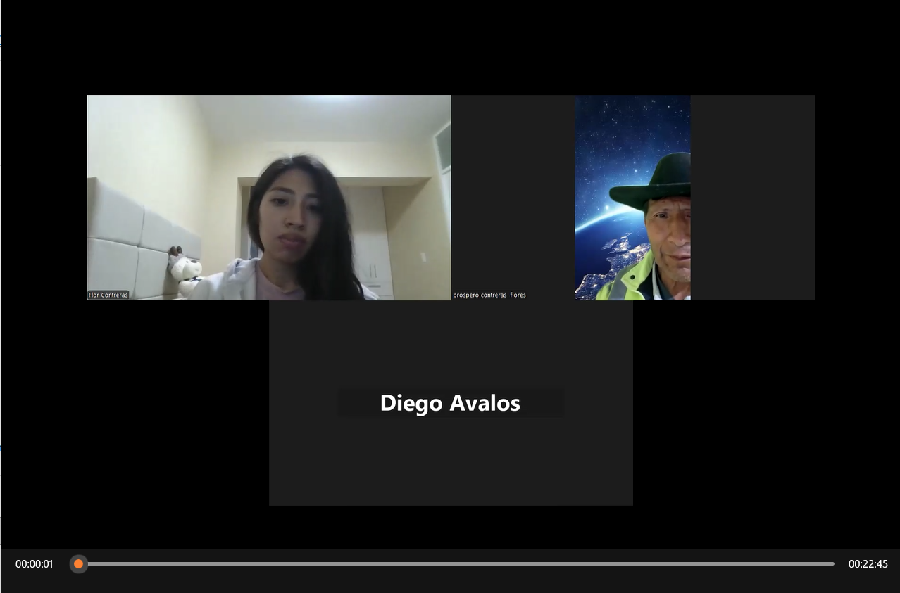

> **Video: (Inicio: 0:01)** https://upcedupe-my.sharepoint.com/:v:/g/personal/u202323243_upc_edu_pe/IQCWBM7VmG-wQpKSMg4lQ3R4ARyUf9668Ua8FlogmvsDBS0?nav=eyJyZWZlcnJhbEluZm8iOnsicmVmZXJyYWxBcHAiOiJPbmVEcml2ZUZvckJ1c2luZXNzIiwicmVmZXJyYWxBcHBQbGF0Zm9ybSI6IldlYiIsInJlZmVycmFsTW9kZSI6InZpZXciLCJyZWZlcnJhbFZpZXciOiJNeUZpbGVzTGlua0NvcHkifX0&e=pKyJVK

> **Resumen:**
> La entrevista realizada a Próspero Contreras Flores, ganadero ubicado en la región de Apurímac, describe la dinámica operativa y los desafíos clave en la gestión de un predio con aproximadamente 100 cabezas de ganado bajo un régimen de pastoreo extensivo. Actualmente, la administración del inventario y el registro de eventos de salud se realizan de forma rudimentaria mediante hojas de cálculo en Excel y cuadernos de notas, lo que genera vacíos significativos en la trazabilidad médica individual del hato y propicia pérdidas económicas por partos prematuros no supervisados y casos de abigeato (robo de ganado). La infraestructura local presenta una cobertura de internet intermitente (aproximadamente 50% de señal en los potreros), por lo que el productor requiere una herramienta digital multidispositivo (smartphone en campo y laptop en oficina) con capacidad de almacenamiento offline. La solución ideal demandada debe centralizar las fichas clínicas individuales, emitir notificaciones preventivas ajustadas al calendario sanitario andino (vacunación contra carbúnculo, desparasitación), predecir eventos reproductivos (detección de celos y proximidad de partos) y consolidar reportes administrativos de costos y mortalidad bajo un modelo de suscripción anual.

##### Entrevista 2

> **Entrevistado:** Meikoll Morell Bosa Cárdenas
> **Cargo/Rol:** Ingeniero zootecnista, propietario de la Hacienda del Marqués
> **Ubicación:** Pampa de Anta, Cusco, Perú
> **Duración:** 00:15:17
> **Entrevistador:** Flor Contreras

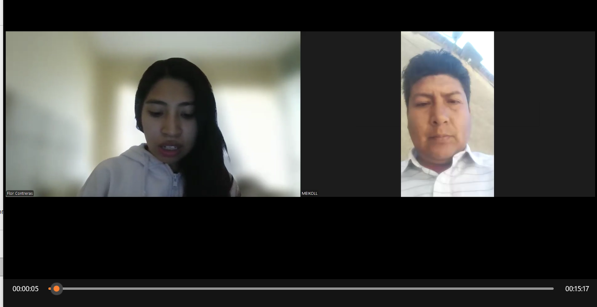

> **Video: (Inicio: 6:01)** https://upcedupe-my.sharepoint.com/:v:/g/personal/u202323243_upc_edu_pe/IQCWBM7VmG-wQpKSMg4lQ3R4ARyUf9668Ua8FlogmvsDBS0?nav=eyJyZWZlcnJhbEluZm8iOnsicmVmZXJyYWxBcHAiOiJPbmVEcml2ZUZvckJ1c2luZXNzIiwicmVmZXJyYWxBcHBQbGF0Zm9ybSI6IldlYiIsInJlZmVycmFsTW9kZSI6InZpZXciLCJyZWZlcnJhbFZpZXciOiJNeUZpbGVzTGlua0NvcHkifX0&e=pKyJVK

> **Resumen:**
> El ingeniero zootecnista Meikoll Morell Bosa Cárdenas, propietario de la Hacienda del Marqués en Pampa de Anta (Cusco), maneja 40 cabezas de ganado Brown Swiss bajo un régimen semi-extensivo, 20 toros en engorde intensivo y caballos peruanos de paso. Su principal canal de control actual consiste en fichas individuales ingresadas en Excel desde su laptop y smartphone, pero identifica que el mayor problema en su gestión es la falta de hábito para registrar las intervenciones inmediatamente después del trabajo de campo, lo que deriva en pérdida de historial clínico y de trazabilidad. Respecto a pérdidas económicas, señala eventos de negligencia en partos y accidentes en equinos, además de vulnerabilidad ante el abigeato, donde la geolocalización por microchip ha fallado por falta de señal en zonas rurales. Para optimizar su toma de decisiones, Meikoll muestra interés en adoptar una solución de software bajo suscripción anual, priorizando que funcione desde el teléfono en modo offline para actualizar datos automáticamente al recuperar conexión. Entre las funciones clave que exige destacan las notificaciones automáticas para campañas sanitarias (dosificación, vacunas y vitaminas), alertas sobre el tiempo y peso estimado en ganadería de engorde, módulos de control de costos por alimento y medicinas por cabeza para evaluar la rentabilidad de los ciclos trimestrales, y la capacidad de adjuntar fotografías de los animales como evidencia del estado físico y respaldo ante robos.

##### Entrevista 3

> **Entrevistado:** Grober Barrientos Talaverano
> **Cargo/Rol:** Médico veterinario zootecnista, encargado de la asistencia técnica en sanidad, manejo, alimentación y registros
> **Ubicación:** Fundo Agropecuario Yavi Yavi, Cusco, Perú
> **Duración:** 00:23:02
> **Entrevistador:** Flor Contreras

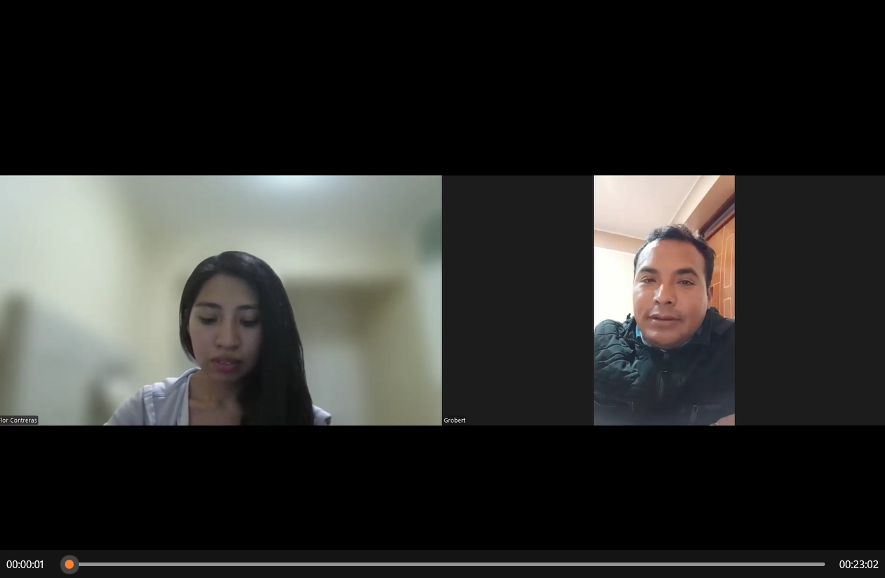

> **Video: (Inicio: 12:43)** https://upcedupe-my.sharepoint.com/:v:/g/personal/u202323243_upc_edu_pe/IQCWBM7VmG-wQpKSMg4lQ3R4ARyUf9668Ua8FlogmvsDBS0?nav=eyJyZWZlcnJhbEluZm8iOnsicmVmZXJyYWxBcHAiOiJPbmVEcml2ZUZvckJ1c2luZXNzIiwicmVmZXJyYWxBcHBQbGF0Zm9ybSI6IldlYiIsInJlZmVycmFsTW9kZSI6InZpZXciLCJyZWZlcnJhbFZpZXciOiJNeUZpbGVzTGlua0NvcHkifX0&e=pKyJVK

> **Resumen:**
> Grober Barrientos Talaverano, un médico veterinario zootecnista de 34 años. Grober trabaja en el Fundo Agropecuario Yavi Yavi (Cusco), donde se encarga de brindar asistencia técnica en sanidad, manejo, alimentación y registros de ganado. Durante la charla, Grober explicó que manejan animales criollos, cruzados y un lote de 65 cabezas productoras de leche (Brown Swiss y Fleckvieh). Actualmente utiliza Excel en su computadora para llevar sus registros, aunque enfrenta problemas de conectividad intermitente en la zona de pastoreo. Indicó que la principal causa de mortalidad bovina en su zona es el mal de altura en terneros, cuyos primeros signos suelen evidenciarse en la reducción del movimiento y del tiempo de pastoreo. Por ello, destacó que le sería de gran utilidad una plataforma o sistema que registre y alerte sobre variaciones en las constantes fisiológicas (temperatura, frecuencias) y patrones de desplazamiento, además de permitir el filtrado por categorías, el control de costos e inventario y la generación de reportes e historiales de salud, sanidad y reproducción en tiempo real.

#### Segmento 2: Zootecnistas y Médicos Veterinarios

##### Entrevista 1

> **Entrevistado:** Darwin Carbajal Vilca
> **Cargo/Rol:** Médico veterinario zootecnista, criador de ganado Brown Swiss
> **Ubicación:** Puno, Perú
> **Duración:** 00:21:28
> **Entrevistador:** Flor Contreras

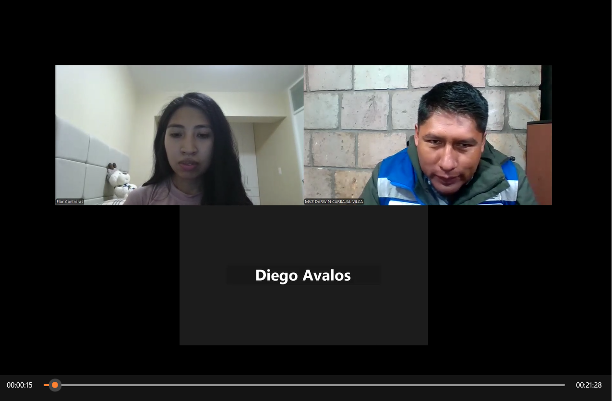

> **Video: (Inicio: 18:07)** https://upcedupe-my.sharepoint.com/:v:/g/personal/u202323243_upc_edu_pe/IQCWBM7VmG-wQpKSMg4lQ3R4ARyUf9668Ua8FlogmvsDBS0?nav=eyJyZWZlcnJhbEluZm8iOnsicmVmZXJyYWxBcHAiOiJPbmVEcml2ZUZvckJ1c2luZXNzIiwicmVmZXJyYWxBcHBQbGF0Zm9ybSI6IldlYiIsInJlZmVycmFsTW9kZSI6InZpZXciLCJyZWZlcnJhbFZpZXciOiJNeUZpbGVzTGlua0NvcHkifX0&e=pKyJVK

> **Resumen:**
> Darwin Carbajal Vilca, médico veterinario zootecnista y criador de ganado vacuno Brown Swiss en Puno con más de 18 años de experiencia en inseminación artificial, administra el fundo "Flores de Coña" con 26 animales de pedigree y PPC. Su jornada combina labor de campo e inspección en establo en primeras y últimas horas del día con trabajo de escritorio e investigación clínica. En su práctica médica identifica desafíos clave como la detección tardía del celo silencioso, reconocible habitualmente al segundo o tercer día por sangrado vulvar, y el impacto fatal de trastornos metabólicos de rápida evolución como el timpanismo o la intoxicación por ensilado alterado. Para optimizar su gestión, requiere una solución tecnológica integrada que permita registrar historias clínicas digitales en campo para validar fármacos administrados, recibir alertas preventivas sobre caídas en la rumia o alzas térmicas, analizar curvas epidemiológicas a nivel de hato y adjuntar evidencia ecográfica para agilizar los registros de gestación ante ASCRIGAR Perú.

##### Entrevista 2

> **Entrevistado:** Eliseo Ramírez Mena
> **Cargo/Rol:** Bachiller en Medicina Veterinaria y Zootecnia
> **Ubicación:** Perú
> **Duración:** 00:17:24
> **Entrevistador:** Flor Contreras

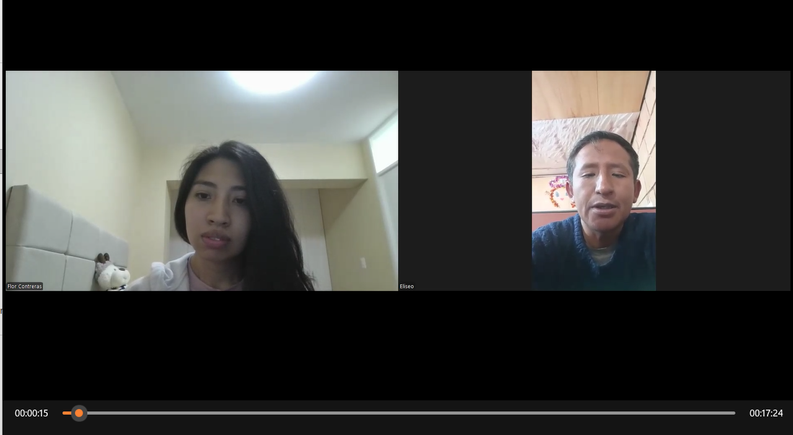

> **Video: (Inicio: 24:01)** https://upcedupe-my.sharepoint.com/:v:/g/personal/u202323243_upc_edu_pe/IQCWBM7VmG-wQpKSMg4lQ3R4ARyUf9668Ua8FlogmvsDBS0?nav=eyJyZWZlcnJhbEluZm8iOnsicmVmZXJyYWxBcHAiOiJPbmVEcml2ZUZvckJ1c2luZXNzIiwicmVmZXJyYWxBcHBQbGF0Zm9ybSI6IldlYiIsInJlZmVycmFsTW9kZSI6InZpZXciLCJyZWZlcnJhbFZpZXciOiJNeUZpbGVzTGlua0NvcHkifX0&e=pKyJVK

> **Resumen:**
> La entrevista expone la rutina laboral y las necesidades tecnológicas de Eliseo Ramírez Mena, bachiller en Medicina Veterinaria y Zootecnia con más de dos años de experiencia en el manejo de ganado vacuno y ovino. Su jornada diaria distribuye la mañana en labores de campo con los animales y la tarde en trabajo de oficina, registro de datos en computadora e impresión de informes para clientes. En el aspecto sanitario y reproductivo, Eliseo enfatiza que los tratamientos dependen del diagnóstico clínico observable, como la variación de temperatura, el apetito, la alteración de rumiación o conductas en celo, y del apoyo de colegas en casos complejos, así como del uso de intervenciones inmediatas ante emergencias metabólicas como el timpanismo gaseoso. Frente a la propuesta de un software y una aplicación móvil veterinaria, el especialista prioriza la utilidad de sincronizar imágenes de ecógrafos para evaluar la gestación en tiempo real desde el celular, la emisión de alertas rojas automáticas cuando decaen las constantes vitales del animal, la automatización de reportes ejecutivos para sustituir el llenado manual en Excel, y la integración de módulos nutricionales que identifiquen deficiencias minerales o de nutrientes en la dieta del ganado.

##### Entrevista 3

> **Entrevistado:** Dionisio Rodríguez
> **Cargo/Rol:** Zootecnista
> **Ubicación:** Chile (con trabajo de campo en Perú)
> **Duración:** 00:16:31
> **Entrevistador:** Flor Contreras

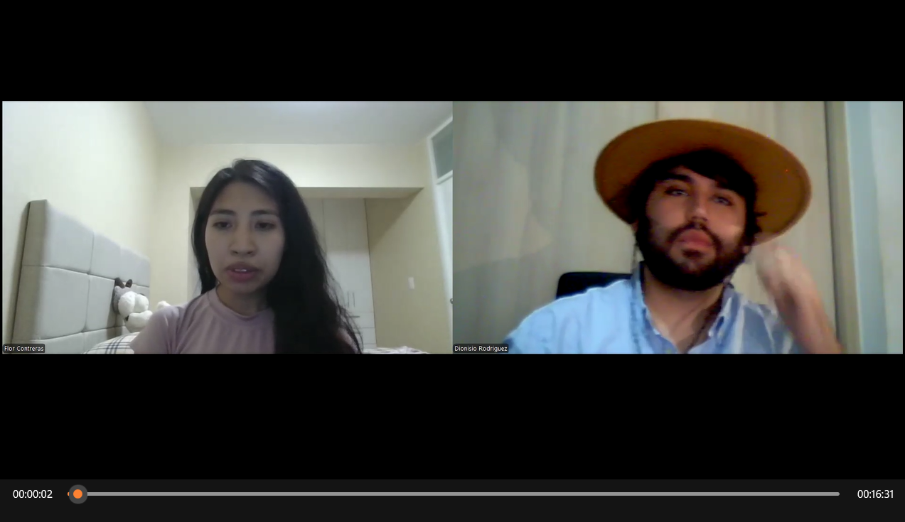

> **Video: (Inicio: 29:32)** https://upcedupe-my.sharepoint.com/:v:/g/personal/u202323243_upc_edu_pe/IQCWBM7VmG-wQpKSMg4lQ3R4ARyUf9668Ua8FlogmvsDBS0?nav=eyJyZWZlcnJhbEluZm8iOnsicmVmZXJyYWxBcHAiOiJPbmVEcml2ZUZvckJ1c2luZXNzIiwicmVmZXJyYWxBcHBQbGF0Zm9ybSI6IldlYiIsInJlZmVycmFsTW9kZSI6InZpZXciLCJyZWZlcnJhbFZpZXciOiJNeUZpbGVzTGlua0NvcHkifX0&e=pKyJVK

> **Resumen:**
> Esta entrevista explora las necesidades operativas y tecnológicas de Dionisio Rodríguez, zootecnista chileno con trabajo de campo en Perú, para guiar el desarrollo de la plataforma ganadera ICHU de SmartFarm. Rodríguez explica que pasa la mayor parte de su jornada en el terreno registrando datos y fotos en su teléfono inteligente, reservando la computadora de oficina para la elaboración de informes. Para la detección temprana de enfermedades metabólicas o infecciosas y la identificación de celos silenciosos, fundamenta su diagnóstico en el seguimiento continuo de la temperatura corporal, la inactividad, la disminución de la rumia y los cambios de conducta, recurriendo a exámenes de laboratorio solo en casos complejos. En cuanto al diseño de la plataforma, solicita alertas automáticas ante fiebres o partos, reportes exportables a Excel o PDF, e integración directa con equipos de campo como ecógrafos portátiles y software de nutrición para evitar la duplicidad en el registro de información.

### 2.2.3. Análisis de entrevistas.

#### Análisis de entrevistas del Segmento 1: Medianos y Grandes Ganaderos

Para complementar las entrevistas en profundidad del Segmento 1, se aplicó un cuestionario estructurado a 2 ganaderos (propietarios y administradores de estancias de Apurímac y Cusco) con el objetivo de cuantificar su contexto operativo, sus pérdidas económicas actuales y sus preferencias sobre el modelo de negocio y las funcionalidades del software. A continuación, se presenta el análisis porcentual de los resultados y, posteriormente, el análisis cualitativo según los resúmenes de las entrevistas realizadas.

##### Análisis porcentual según los gráficos del cuestionario

**1. ¿Qué herramientas utiliza actualmente para el control del inventario de animales? (2 respuestas)**

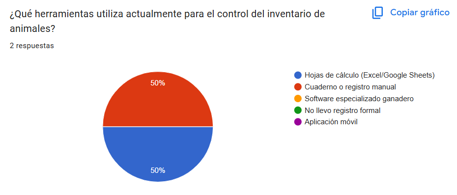

*Figura 1. Elaboración propia a partir de los datos recolectados. Startup SmartFarm.*

[Cuestionario ampliado del Segmento 1: Ganaderos](https://drive.google.com/file/d/1WZdTKVgyGmAlKlI4ZXnRhkK2MJL7fO8D/view?usp=sharing)

Como muestra el gráfico, el **50% utiliza hojas de cálculo (Excel/Google Sheets) y el 50% restante cuaderno o registro manual**; ningún ganadero emplea software especializado ganadero ni aplicación móvil. Este patrón confirma que el 100% del segmento digitaliza de forma rudimentaria o no digitaliza nada, sin ningún uso de herramientas especializadas. Además, el registro se divide entre lo semi-digital (Excel) y lo totalmente análogo (cuaderno), lo que genera trazabilidad fragmentada. En consecuencia, ICHU debe incorporar una **migración simple desde Excel y cuadernos hacia la ficha digital por animal**, sin exigir competencias técnicas avanzadas a usuarios acostumbrados a registrar en papel.

**2. Si existiera una plataforma web que centralizara el historial de salud, ubicación y alertas de cada animal, ¿qué tan útil sería para su negocio? (2 respuestas)**

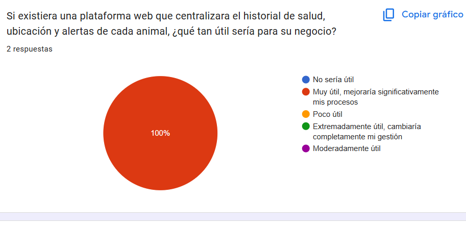

*Figura 2. Elaboración propia a partir de los datos recolectados. Startup SmartFarm.*

[Cuestionario ampliado del Segmento 1: Ganaderos](https://drive.google.com/file/d/1WZdTKVgyGmAlKlI4ZXnRhkK2MJL7fO8D/view?usp=sharing)

El gráfico evidencia una validación total de la propuesta de valor: el **100% de los ganaderos calificó la plataforma centralizada como "Muy útil, mejoraría significativamente mis procesos"**, sin ninguna respuesta neutra o negativa. Este dato porcentual respalda directamente el núcleo del producto ICHU: la centralización del historial de salud, la ubicación y las alertas por animal en un único sistema, frente a la dispersión actual en Excel y cuadernos que los propios entrevistados identifican como su principal debilidad de gestión.

##### Contexto operativo del segmento (respuestas complementarias)

Las respuestas del cuestionario complementan el perfil del segmento con los siguientes datos cuantificados:

- **Escala y manejo:** el 100% maneja entre **51 y 200 cabezas** (coincide con los 100 cabezas de Próspero y las 40 + 20 de engorde de Meikoll); el **50% trabaja bajo pastoreo extensivo y el 50% bajo régimen mixto**, confirmando que el modo offline es obligatorio.
- **Conectividad:** el **100% califica la conectividad en las zonas de pastoreo como regular (solo en algunas zonas)**, evidencia directa que sostiene la conectividad híbrida LoRaWAN/celular con sincronización retrasada del collar.
- **Pérdidas económicas:** el **100% reportó pérdidas del 5-10% del valor del hato en el último año** por enfermedades no detectadas a tiempo, y el **100% califica el abigeato como un problema frecuente y costoso**. Ambos datos dimensionan el retorno esperado de la solución.
- **Modelo de suscripción:** el **100% prefiere el pago anual con tarifa fija**, validando el modelo comercial definido en la estrategia 3 y coincidiendo con lo declarado por Próspero y Meikoll en sus entrevistas.
- **Notificaciones deseadas:** el **100% desea recibir todas las notificaciones automáticas** (alertas de temperatura anormal, recordatorios de revacunación, alertas de parto y celo, avisos de cuarentena), con énfasis explícito en las alertas de parto y celo como grupo prioritario.
- **Tablero de control:** las preferencias se dividen entre **inventario actualizado y movimientos (50%)** y **horas de actividad y alertas de celo (50%)**; ambas vías corresponden a los contextos de Gestión del Hato y Monitoreo Biométrico.
- **Monitoreo individual vs. por lotes:** el segmento valora ambos enfoques (50% menciona monitoreo por lote, 50% monitoreo individual), concluyendo que el monitoreo individual "ayuda a tomar mejores decisiones y corregir en el momento oportuno": la individualización por animal es la apuesta correcta del producto.

##### Análisis cualitativo según los resúmenes de entrevistas

El cruce de los tres resúmenes del Segmento 1 (Próspero Contreras Flores, Meikoll Morell Bosa Cárdenas y Grober Barrientos Talaverano) revela un patrón de necesidades convergente:

- **Registro fragmentado y sin trazabilidad.** Los tres trabajan con Excel y/o cuadernos (Próspero: Excel + cuaderno; Meikoll: fichas individuales en Excel; Grober: Excel en computadora), coincidiendo con el gráfico de herramientas (50% Excel / 50% cuaderno). Próspero lo resume: los servicios veterinarios son "puntuales" y no existe ficha clínica por animal; Meikoll identifica que el problema raíz es la **falta de hábito de registro** inmediato tras el trabajo de campo, lo que deriva en pérdida de historial clínico.

- **Conectividad intermitente como restricción de diseño.** Próspero reporta señal en solo el 50% de sus potreros, Grober enfrenta conectividad intermitente en la zona de pastoreo, y Meikoll, aunque tiene buena señal con Movistar y Claro, experimentó fallas de señal durante la propia entrevista en Apurímac. El 100% del cuestionario lo confirma ("regular, solo en algunas zonas"). Los tres exigen que la aplicación funcione **offline y sincronice automáticamente al recuperar conexión**.

- **Alertas sanitarias y reproductivas como demanda común.** Próspero pide notificaciones ajustadas al calendario sanitario andino (carbúnculo, desparasitación) y predicción de partos con una semana de anticipación; Meikoll exige notificaciones para campañas sanitarias y alertas de tiempo/peso en engorde; Grober solicita alertas sobre variaciones de constantes fisiológicas y patrones de desplazamiento (el mal de altura en terneros, primera causa de mortalidad en su zona, se manifiesta primero como reducción del movimiento y del tiempo de pastoreo). El cuestionario lo cuantifica: el 100% desea el paquete completo de notificaciones, con prioridad en parto y celo.

- **Abigeato y geolocalización como dolor patrimonial.** Próspero ha sufrido robos de 15-20 ganados y lo califica de "golpe a la ganadería"; Meikoll no pudo recuperar 2 de 3 caballos robados pese a tener microchip por falta de señal rural; ambos ganaderos del cuestionario lo califican como problema "frecuente y costoso". Las respuestas abiertas proponen la solución: GPS en el animal con monitoreo automático de movimiento, reemplazando al microchip que ya falló por falta de señal.

- **Control de costos y rentabilidad como lenguaje gerencial.** Próspero pide presupuesto por campaña sanitaria y reportes mensuales de muertes, enfermos, celos e inseminaciones; Meikoll exige control de costo por kilo y balance trimestral del engorde; Grober solicita control de costos e inventario con filtrado por categorías. Los reportes ejecutivos deben incluir producción de leche por día, consumo de alimento y constantes fisiológicas, según las respuestas abiertas.

- **Suscripción anual y valor estratégico.** Los tres aceptan el modelo de suscripción, que Próspero y Meikoll declaran expresamente anual, y el 100% del cuestionario ratifica "pago anual con tarifa fija". Grober añade el potencial de certificaciones (mejoramiento genético por PPC y su base de datos) y mejoramiento genético a partir de registros multi-generacionales (días abiertos, índice de fertilidad, producción per cápita anual), que amplían el valor del sistema más allá del monitoreo diario.

En síntesis, las entrevistas del Segmento 1 validan los pilares de la solución: **ficha digital individual centralizada (migración desde Excel/cuaderno), conectividad híbrida con modo offline obligatorio, alertas sanitarias y reproductivas basadas en el calendario ganadero, geolocalización contra el abigeato, control de costos por cabeza y modelo de suscripción anual**.

#### Análisis de entrevistas del Segmento 2: Zootecnistas y Médicos Veterinarios

Para complementar las entrevistas en profundidad del Segmento 2, se aplicó un cuestionario estructurado a 3 profesionales del sector (zootecnistas y médicos veterinarios) con el objetivo de cuantificar sus prácticas diagnósticas, sus umbrales clínicos de referencia y sus preferencias sobre las funcionalidades del software. A continuación, se presenta el análisis porcentual de los resultados y, posteriormente, el análisis cualitativo según los resúmenes de las entrevistas realizadas.

##### Análisis porcentual según los gráficos del cuestionario

**1. ¿Qué dispositivos informáticos utiliza habitualmente para registrar el historial de tratamientos y diagnósticos? (3 respuestas)**

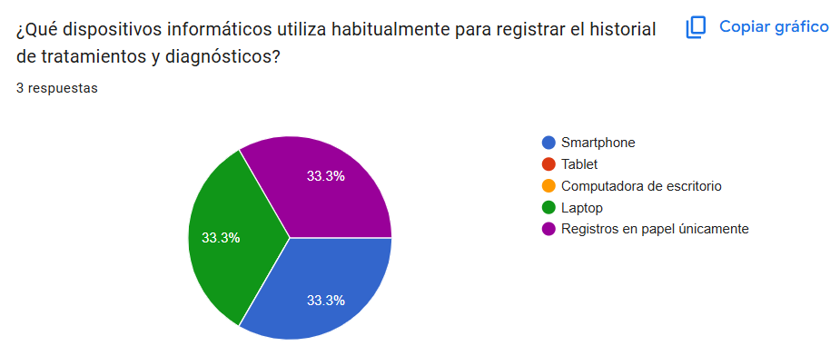

*Figura 3. Elaboración propia a partir de los datos recolectados. Startup SmartFarm.*

[Cuestionario ampliado del Segmento 2: Zootecnistas y médicos veterinarios](https://drive.google.com/file/d/15h2MLOWtvMBic0O97VnSMJxAeW9ZpUy2/view?usp=drive_link)

Como muestra el gráfico, los dispositivos de registro se distribuyen de forma exactamente equitativa: **33.3% smartphone, 33.3% laptop y 33.3% registros en papel únicamente**. Ningún profesional emplea tablet ni computadora de escritorio como dispositivo principal. Este patrón porcentual evidencia que un tercio del segmento aún no digitaliza su información clínica, mientras que los dos tercios restantes dependen de dispositivos móviles o portátiles. En consecuencia, la plataforma ICHU debe responder con una **aplicación móvil de primera clase** (compatible con smartphones y laptops) que además ofrezca un proceso de migración simple para trasladar los registros en papel hacia el sistema digital centralizado.

**2. ¿Qué tan confiables son los registros manuales de vacunación, inseminación y medicamentos en los establos que asesora? (3 respuestas)**

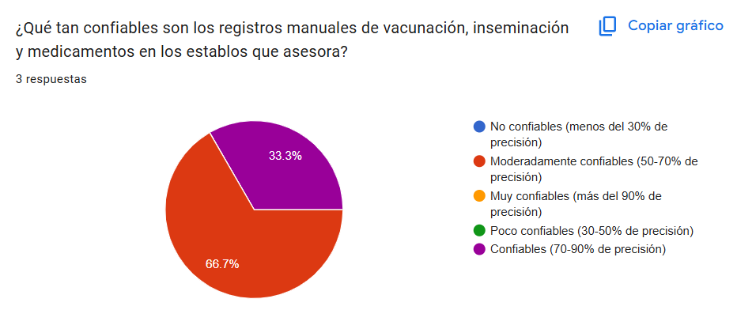

*Figura 4. Elaboración propia a partir de los datos recolectados. Startup SmartFarm.*

[Cuestionario ampliado del Segmento 2: Zootecnistas y médicos veterinarios](https://drive.google.com/file/d/15h2MLOWtvMBic0O97VnSMJxAeW9ZpUy2/view?usp=drive_link)

Según el gráfico, el **66.7% de los entrevistados califica los registros manuales como moderadamente confiables (50-70% de precisión)** y el **33.3% restante como confiables (70-90% de precisión)**. Es destacable que **ningún profesional los considera muy confiables ni confiables al 100%**, es decir, el 100% reconoce un margen de error de al menos un 10% en la información clínica que hoy sostiene sus decisiones. Este dato porcentual valida directamente la propuesta de valor de ICHU: historias clínicas digitales con trazabilidad completa (qué se aplicó, cuándo y quién), reduciendo riesgos ya observados por los propios entrevistados, como intoxicaciones por dosificación repetida o fallos de preñez por vacunación omitida.

**3. ¿Qué parámetro cuantitativo continuo desearía conocer del animal pero que actualmente le es imposible medir de forma manual? (3 respuestas)**

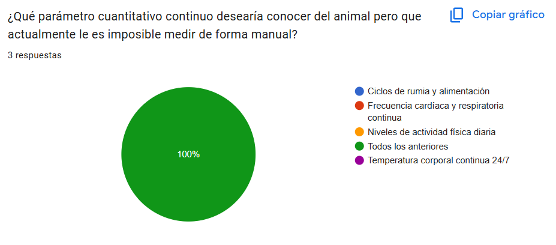

*Figura 5. Elaboración propia a partir de los datos recolectados. Startup SmartFarm.*

[Cuestionario ampliado del Segmento 2: Zootecnistas y médicos veterinarios](https://drive.google.com/file/d/15h2MLOWtvMBic0O97VnSMJxAeW9ZpUy2/view?usp=drive_link)

El gráfico evidencia un resultado unánime: el **100% de los entrevistados seleccionó "Todos los anteriores"**, es decir, desea medir de forma continua los **ciclos de rumia y alimentación, la frecuencia cardíaca y respiratoria, los niveles de actividad física diaria y la temperatura corporal continua 24/7**. La unanimidad absoluta del segmento convierte a estos cuatro parámetros en el **núcleo obligatorio de telemetría biométrica** que el collar inteligente de ICHU debe capturar, ya que constituyen variables que la observación manual no logra registrar de manera precisa y sostenida.

##### Análisis cualitativo según los resúmenes de entrevistas

El cruce de los tres resúmenes del Segmento 2 (Darwin Carbajal Vilca, Eliseo Ramírez Mena y Dionisio Rodríguez) revela un patrón de necesidades convergente:

- **Trabajo bifásico campo-oficina.** Los tres profesionales dividen su jornada: labor de campo e inspección en establo en primeras y últimas horas del día (Darwin), mañana en campo y tarde en oficina con registro en computadora (Eliseo), y registro en el terreno desde el smartphone reservando la oficina para informes (Dionisio). Esto confirma el hallazgo porcentual de dispositivos y exige que ICHU ofrezca **sincronización bidireccional entre la app móvil en campo y la plataforma web de oficina**.

- **Diagnóstico basado en variables continuas no medibles a mano.** Darwin fundamenta su práctica en la detección de celo silencioso (reconocido tardíamente al segundo o tercer día por sangrado vulvar) y en trastornos metabólicos de evolución fatal como el timpanismo; Eliseo diagnostica según la variación de temperatura, apetito, alteración de rumiación y conductas de celo; Dionisio realiza seguimiento continuo de temperatura corporal, inactividad, disminución de rumia y cambios de conducta. Los tres coinciden con el gráfico de parámetros (100% "Todos los anteriores"): **necesitan monitoreo biométrico continuo** que anticipe lo que hoy solo detectan visualmente cuando el cuadro ya está avanzado.

- **Alertas preventivas como prioridad compartida.** Darwin pide alertas por caídas de rumia o alzas térmicas; Eliseo solicita alertas rojas automáticas cuando decaen las constantes vitales; Dionisio requiere alertas ante fiebres o partos. Esta triple convergencia posiciona al **motor de alertas automáticas** como la funcionalidad más crítica del producto para este segmento, preferiblemente inmediata para cuadros graves y con resumen diario para cambios menores.

- **Historia clínica digital centralizada.** Darwin necesita registrar historias clínicas digitales en campo para validar fármacos administrados; Eliseo quiere sustituir el llenado manual en Excel por reportes automáticos; Dionisio busca evitar la duplicidad de registros. Los tres coinciden con el dato de confiabilidad (66.7% solo moderada) en que **el registro fragmentado y manual es el principal dolor operativo** del segmento.

- **Integración con equipos de campo y entidades oficiales.** Darwin requiere adjuntar evidencia ecográfica para agilizar registros de gestación ante ASCRIGAR Perú; Eliseo prioriza sincronizar imágenes de ecógrafos para evaluar gestación en tiempo real desde el celular; Dionisio pide integración directa con ecógrafos portátiles y software de nutrición. Además, Eliseo y Dionisio coinciden en demandar **módulos nutricionales** que identifiquen deficiencias minerales o de nutrientes. Esta convergencia define un requisito arquitectónico clave para la **API RESTful de ICHU**: interoperabilidad con dispositivos de diagnóstico por imagen y sistemas externos de nutrición.

- **Reportes ejecutivos comparativos.** Dionisio solicita reportes exportables a Excel o PDF y Eliseo automatización de reportes ejecutivos; ambos coinciden con la necesidad expresada en el cuestionario de graficar enfermedades por establecimiento, mortalidad y problemas reproductivos por mes, lo que sustenta el **módulo de analítica del ICHU Web Application**.

En síntesis, las entrevistas del Segmento 2 validan cuantitativa y cualitativamente los pilares de la solución: **telemetría biométrica continua (rumia, temperatura, actividad, frecuencias cardíaca y respiratoria), motor de alertas clínicas configurables, historia clínica digital centralizada con API abierta, soporte móvil offline y reportes exportables**.

## 2.3. Needfinding.

En esta sección se consolidan y sintetizan los hallazgos cualitativos y cuantitativos obtenidos durante la fase de investigación de campo, entrevistas en profundidad y análisis competitivo. El proceso de Needfinding nos permite transformar los datos brutos recolectados de los actores del sector ganadero en artefactos visuales y estructurados de diseño de experiencia de usuario (UX), garantizando que el desarrollo del ecosistema de software ICHU responda de manera directa a las necesidades reales, dolores operativos y metas estratégicas de cada perfil de usuario.

### 2.3.1. User Personas.

**Introducción y método de construcción**

Para la construcción de los arquetipos de usuario, el equipo procesó la información recolectada en la fase de entrevistas y el análisis del mercado ganadero. Se identificaron dos patrones de comportamiento que representan a los dos segmentos objetivo definidos para el ecosistema de software ICHU.

Del análisis de entrevistas se tomaron como insumo principal las herramientas de registro que utiliza cada segmento, el estado de la conectividad en sus zonas de trabajo, las pérdidas económicas declaradas, los dispositivos de preferencia y los parámetros que cada perfil necesita conocer del animal. Del análisis competitivo se incorporaron las expectativas de precio y de modalidad de contratación, junto con las funcionalidades que los competidores ya ofrecen y que condicionan lo que cada segmento espera encontrar.

**Segmento 1: Medianos y Grandes Ganaderos.** Propietarios y administradores de unidades productivas, enfocados en la rentabilidad, la reducción de pérdidas por mortalidad y abigeato, y la toma de decisiones a partir de indicadores del hato.

**User Persona 1: Cesar Flores**

Arquetipo del Segmento 1, construido a partir de los patrones identificados en las entrevistas a Próspero Contreras, Meikoll Morell y Grober Barrientos.

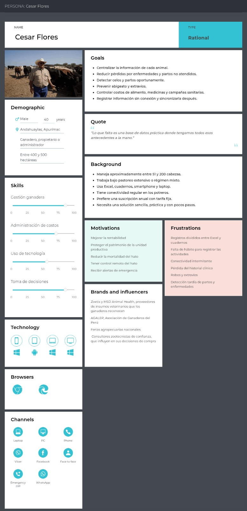

[Ficha de User Persona y Empathy Map en UXPressia](https://uxpressia.com/w/v8FzI/t/AIZ5N)

**Segmento 2: Zootecnistas y Médicos Veterinarios.** Profesionales orientados al monitoreo biométrico continuo, al diagnóstico clínico temprano y a la revisión de historiales de salud consolidados.

**User Persona 2: Leonardo Rosales**

Arquetipo del Segmento 2, construido a partir de los patrones identificados en las entrevistas a Darwin Carbajal, Eliseo Ramírez y Dionisio Rodríguez.

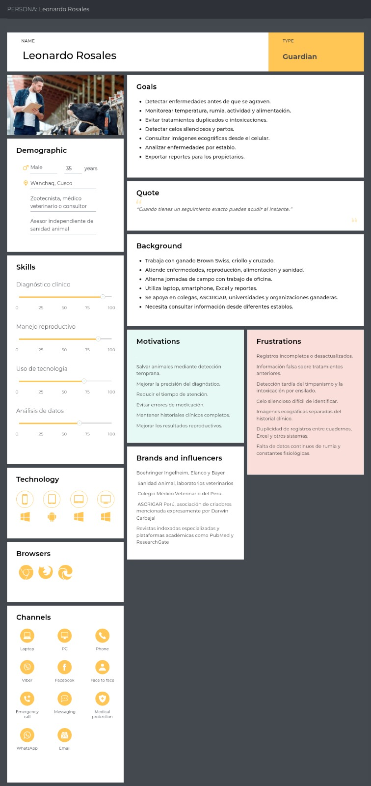

[Ficha de User Persona y Empathy Map en UXPressia](https://uxpressia.com/w/v8FzI/t/AIZ5N)

Ambas fichas fueron elaboradas en UXPressia y contemplan los atributos propios de un arquetipo: datos demográficos, biografía, personalidad, habilidades, objetivos, frustraciones, tecnología de preferencia, marcas e influencias, y canales de interacción.

### 2.3.2. User Task Matrix.

El User Task Matrix concentra las tareas que cada arquetipo ejecuta para cumplir sus objetivos. Se trata de actividades que ambos segmentos realizan hoy con independencia de que exista una solución de software, por lo que no deben confundirse con funcionalidades del sistema. Las tareas se identificaron a partir de las descripciones de jornada recogidas en las seis entrevistas.

La frecuencia expresa con qué regularidad se ejecuta la tarea y la importancia expresa cuánto afecta al objetivo del arquetipo que la tarea se realice mal o no se realice. Ambas se valoran en tres niveles: alta, media y baja.

| Tarea | Cesar Flores: frecuencia | Cesar Flores: importancia | Leonardo Rosales: frecuencia | Leonardo Rosales: importancia |
|---|---|---|---|---|
| Recorrer el potrero y contar las cabezas del hato | Alta | Alta | Baja | Baja |
| Observar el comportamiento del animal para detectar anomalías | Alta | Alta | Alta | Alta |
| Tomar constantes fisiológicas de un animal sospechoso | Media | Alta | Alta | Alta |
| Registrar un evento sanitario o reproductivo | Media | Alta | Alta | Alta |
| Consultar los antecedentes clínicos de un animal | Media | Alta | Alta | Alta |
| Identificar individualmente a un animal por su arete | Alta | Media | Alta | Media |
| Coordinar la visita de un profesional veterinario | Media | Alta | No aplica | No aplica |
| Desplazarse entre predios para atender a distintos clientes | Baja | Baja | Alta | Alta |
| Programar y ejecutar una campaña sanitaria | Baja | Alta | Media | Alta |
| Aplicar un tratamiento o una inseminación | Baja | Alta | Alta | Alta |
| Verificar el resultado de un tratamiento aplicado | Media | Alta | Alta | Alta |
| Buscar un animal extraviado en el terreno | Baja | Alta | Baja | Baja |
| Registrar costos de alimento, medicinas e insumos | Media | Alta | Baja | Media |
| Elaborar reportes para sustentar decisiones | Baja | Media | Alta | Alta |
| Consultar el calendario sanitario de la región | Baja | Media | Media | Alta |
| Interpretar imágenes ecográficas de gestación | No aplica | No aplica | Media | Alta |
| Evaluar la rentabilidad del ciclo productivo | Baja | Alta | Baja | Baja |

**Lectura del cuadro**

Las tareas de mayor frecuencia e importancia para Cesar Flores son el recorrido del potrero con el conteo de cabezas y la observación del comportamiento animal. Ambas son actividades de vigilancia que consumen buena parte de su jornada y cuyo resultado determina si un problema se detecta a tiempo. Le siguen en importancia, aunque con menor frecuencia, la coordinación de la visita veterinaria y la búsqueda de animales extraviados: son tareas esporádicas, pero cada ocurrencia tiene consecuencias económicas directas.

Para Leonardo Rosales, la concentración de frecuencia e importancia se desplaza hacia la consulta de antecedentes clínicos, la toma de constantes, la aplicación de tratamientos y la elaboración de reportes. Su jornada se reparte entre el trabajo de campo y el de oficina, y ambas mitades dependen de información que hoy está dispersa.

La coincidencia más relevante entre ambos arquetipos está en la observación del comportamiento animal y en el registro de eventos: los dos ejecutan estas tareas con alta frecuencia e importancia, pero las registran en soportes distintos y sin conexión entre sí, lo que explica la duplicidad de información que ambos segmentos reportaron.

La diferencia más marcada está en el alcance geográfico. Cesar Flores concentra todas sus tareas en una sola unidad productiva, mientras que Leonardo Rosales se desplaza entre varios predios, lo que convierte la portabilidad de la información en una necesidad exclusiva del Segmento 2. Una segunda diferencia es el eje económico: la evaluación de rentabilidad y el control de costos son tareas propias del administrador y resultan marginales para el profesional veterinario.

### 2.3.3. User Journey Mapping.

Los User Journey Maps que se presentan a continuación describen el recorrido actual de cada arquetipo, en la situación previa a la existencia de la solución. Se elaboran en su versión As-Is con el fin de evidenciar, sobre la secuencia real de actividades, en qué momentos se concentran los puntos de dolor identificados durante las entrevistas. Por esa razón, ninguna etapa incorpora la plataforma ICHU ni los dispositivos que forman parte de la propuesta: los canales representados son los medios que los entrevistados utilizan hoy, es decir cuadernos de campo, hojas de cálculo, comunicación telefónica, observación directa del animal y visita presencial.

El recorrido de Cesar Flores abarca el ciclo de gestión de su hato, desde el recorrido matinal de supervisión hasta el cierre económico de la campaña, e incluye los episodios críticos de detección tardía de enfermedad y de pérdida de animales por muerte o abigeato. El recorrido de Leonardo Rosales abarca la atención de una emergencia sanitaria en un establo que asesora, desde la recepción del aviso telefónico hasta el informe entregado al propietario y el seguimiento posterior del tratamiento aplicado.

Ambos mapas fueron elaborados en UXPressia y están vinculados a la ficha de User Persona correspondiente dentro de la misma herramienta.

**User Journey Map As-Is de Cesar Flores**

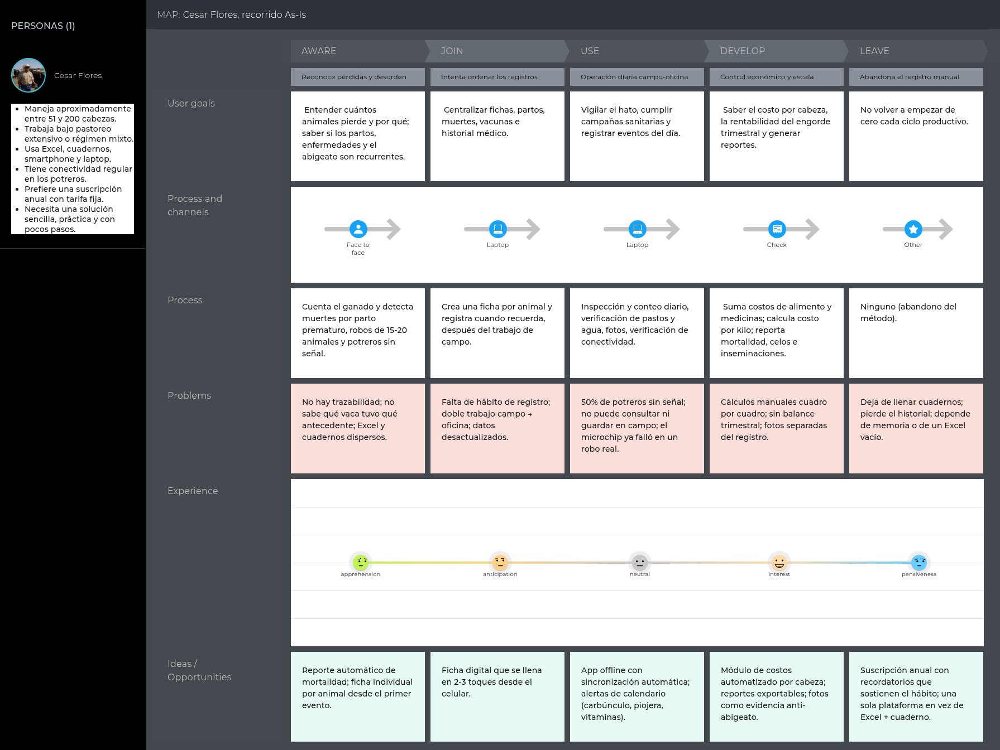

*Figura 6. Elaboración de creación propia por datos recolectados, startup SmartFarm.*

[User Journey Map de Cesar Flores en UXPressia](https://uxpressia.com/w/v8FzI/t/AIZ5N)

**User Journey Map As-Is de Leonardo Rosales**

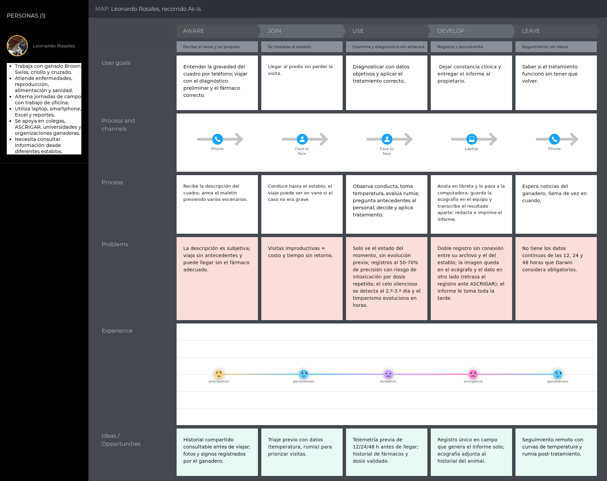

*Figura 7. Elaboración de creación propia por datos recolectados, startup SmartFarm.*

[User Journey Map de Leonardo Rosales en UXPressia](https://uxpressia.com/w/v8FzI/t/AIZ5N)

#### As-Is Mapping

**As-Is Map de Cesar Flores**

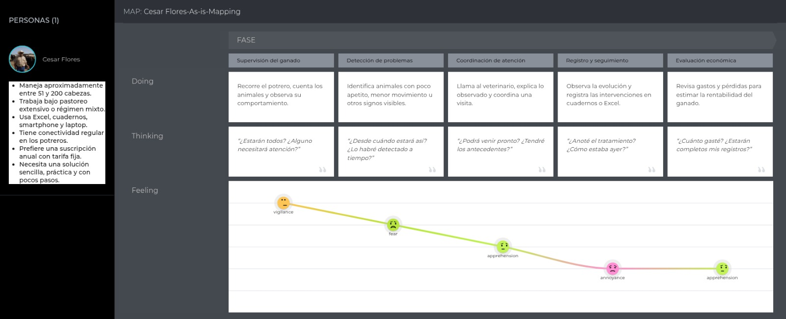

**As-Is Map de Leonardo Rosales**

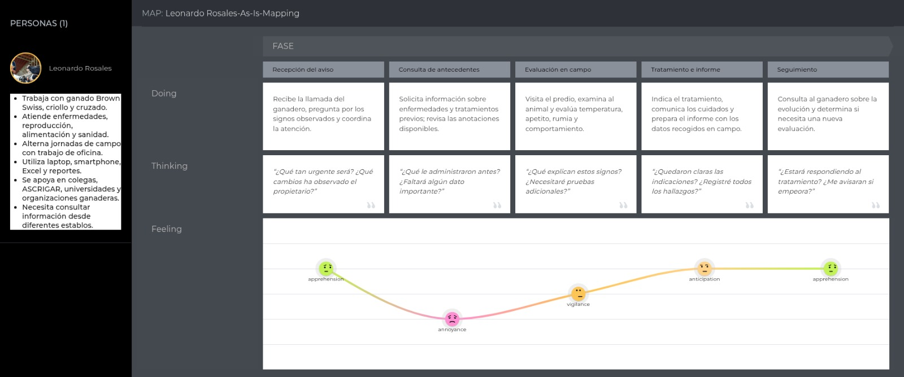

**Lectura de los recorridos**

En el recorrido de Cesar Flores, la emoción desciende en dos momentos concretos: cuando descubre que un animal lleva días enfermo sin que él lo advirtiera, y cuando constata una pérdida por muerte o robo. Ambos comparten la misma causa, que es la ausencia de información entre el instante en que el problema comienza y el instante en que se vuelve visible.

En el recorrido de Leonardo Rosales, el punto más bajo se sitúa en la consulta de antecedentes, porque es el momento en que comprueba que la información sobre la cual debe decidir es incompleta o poco confiable. Los tramos siguientes heredan esa limitación: el diagnóstico se emite con datos parciales y el seguimiento posterior queda sin verificación.

Ambos recorridos convergen en que el registro se realiza siempre después de la actividad, nunca durante, y en un soporte que no está disponible para la otra parte cuando lo necesita.

### 2.3.4. Empathy Mapping.

Para la elaboración de los Empathy Maps, el equipo partió de la ficha de cada User Persona y colocó al arquetipo en el centro del lienzo. A partir de ahí, cada integrante aportó observaciones derivadas de los resúmenes de entrevista, respondiendo de forma sucesiva a las preguntas que estructuran la herramienta: con quién se empatiza, qué necesita hacer, qué dice, qué ve, qué hace, qué escucha, y cómo se siente y qué piensa. La sesión cerró con la identificación de los Pains, a partir de la pregunta sobre qué le preocupa, y de los Gains, a partir de la pregunta sobre qué puede ayudar a resolver sus problemas y qué podría convencerlo de que la propuesta es la alternativa adecuada.

**Empathy Map de Cesar Flores**

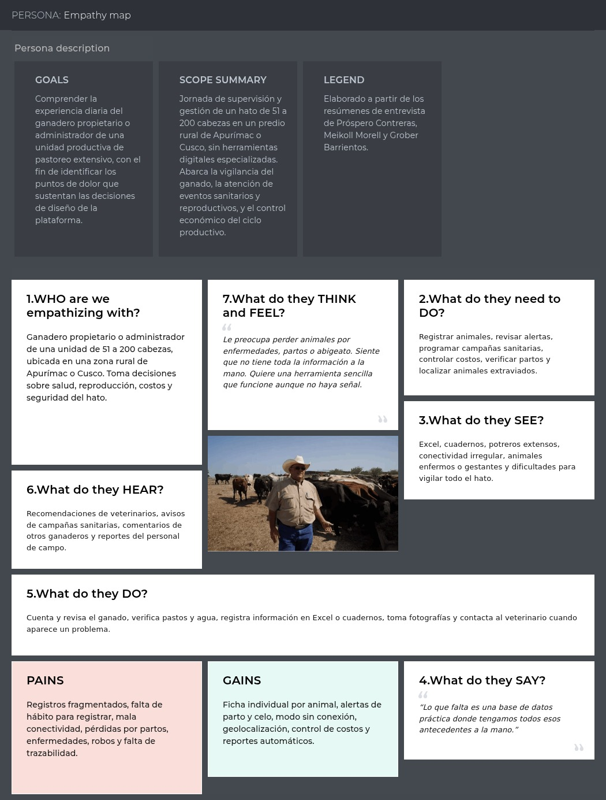

[Empathy Map del Segmento 1 en UXPressia](https://uxpressia.com/w/v8FzI/t/AIZ5N)

Se empatiza con un ganadero propietario o administrador de una unidad de 51 a 200 cabezas, ubicada en una zona rural de Apurímac o Cusco, que toma las decisiones sobre salud, reproducción, costos y seguridad del hato.

Necesita registrar animales, revisar alertas, programar campañas sanitarias, controlar costos, verificar partos y localizar animales extraviados. Lo que ve a diario son hojas de cálculo, cuadernos, potreros extensos, conectividad irregular y animales enfermos o gestantes cuya vigilancia completa le resulta inabordable. Escucha recomendaciones de veterinarios, avisos de campañas sanitarias, comentarios de otros ganaderos y reportes de su personal de campo. Lo que hace es contar y revisar el ganado, verificar pastos y agua, registrar información en hojas de cálculo o cuadernos, tomar fotografías y contactar al veterinario cuando aparece un problema. Lo resume en una frase: "Lo que falta es una base de datos práctica donde tengamos todos esos antecedentes a la mano".

Piensa y siente que le preocupa perder animales por enfermedades, partos o abigeato, y que no tiene toda la información a la mano. Aspira a una herramienta sencilla que funcione aunque no haya señal.

Sus **Pains** son los registros fragmentados, la falta de hábito para registrar, la mala conectividad, las pérdidas por partos, enfermedades y robos, y la ausencia de trazabilidad. Sus **Gains** son la ficha individual por animal, las alertas de parto y celo, el modo sin conexión, la geolocalización, el control de costos y los reportes automáticos.

**Empathy Map de Leonardo Rosales**

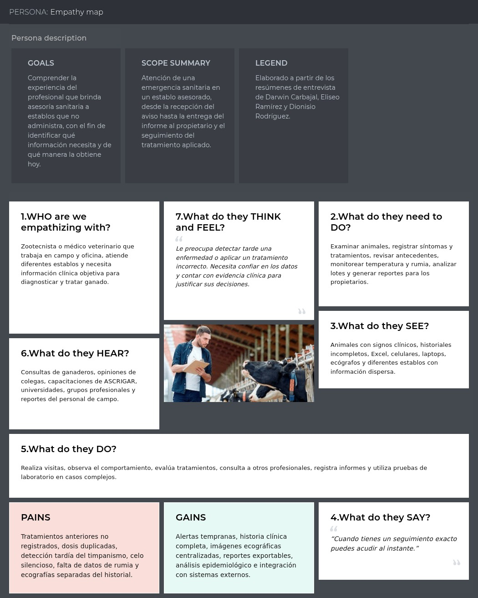

[Empathy Map del Segmento 2 en UXPressia](https://uxpressia.com/w/v8FzI/t/AIZ5N)

Se empatiza con un zootecnista o médico veterinario que trabaja en campo y en oficina, atiende diferentes establos y necesita información clínica objetiva para diagnosticar y tratar ganado.

Necesita examinar animales, registrar síntomas y tratamientos, revisar antecedentes, monitorear temperatura y rumia, analizar lotes y generar reportes para los propietarios. Lo que ve son animales con signos clínicos, historiales incompletos, hojas de cálculo, celulares, laptops, ecógrafos y establos distintos con información dispersa. Escucha consultas de ganaderos, opiniones de colegas, capacitaciones de la asociación de criadores, universidades, grupos profesionales y reportes del personal de campo. Lo que hace es realizar visitas, observar el comportamiento, evaluar tratamientos, consultar a otros profesionales, registrar informes y recurrir a pruebas de laboratorio en los casos complejos. Lo resume así: "Cuando tienes un seguimiento exacto puedes acudir al instante".

Piensa y siente que le preocupa detectar tarde una enfermedad o aplicar un tratamiento incorrecto. Necesita confiar en los datos y contar con evidencia clínica para justificar sus decisiones.

Sus **Pains** son los tratamientos anteriores no registrados, las dosis duplicadas, la detección tardía del timpanismo, el celo silencioso, la falta de datos de rumia y las ecografías separadas del historial. Sus **Gains** son las alertas tempranas, la historia clínica completa, las imágenes ecográficas centralizadas, los reportes exportables, el análisis epidemiológico y la integración con sistemas externos.

## 2.4. Big Picture EventStorming.

El Big Picture EventStorming permite al equipo construir una comprensión compartida del dominio ganadero antes de tomar cualquier decisión de diseño. A diferencia de las técnicas orientadas a la solución, esta sesión se concentra en los hechos relevantes que ocurren en el negocio, con independencia de qué sistema los registre.

**Desarrollo de la sesión**

La sesión se organizó en cinco etapas sucesivas, siguiendo la secuencia habitual de la técnica.

En la **exploración caótica**, cada integrante escribió en notas de color naranja los hechos relevantes del dominio que había identificado en las entrevistas, redactados siempre en pasado y desde la perspectiva del negocio, sin discutir todavía su orden ni su pertinencia.

En el **ordenamiento temporal**, el equipo dispuso los eventos sobre una línea de tiempo que recorre el ciclo productivo del hato, desde la incorporación del animal hasta su baja, y resolvió los duplicados y las formulaciones ambiguas.

En la **identificación de eventos pivote**, se marcaron los hechos que separan fases claramente distintas del proceso de negocio y que, por lo tanto, anticipan las fronteras entre contextos.

En la **detección de hot spots**, se señalaron con notas rosadas las zonas de desacuerdo, de reglas de negocio no resueltas o de dependencia respecto de terceros, que requieren validación posterior con los usuarios.

Finalmente, en la **identificación de eventos pivote y áreas de dominio emergentes**, se usaron los cambios de estado más significativos para proponer agrupaciones preliminares. Estas áreas son hipótesis de exploración y no representan todavía bounded contexts definitivos.

Las siguientes láminas documentan la progresión completa de la sesión. Se reconstruyeron en formato vectorial para conservar legibilidad en el informe, manteniendo los eventos, actores, problemas y oportunidades que aparecen en el modelo del dominio.

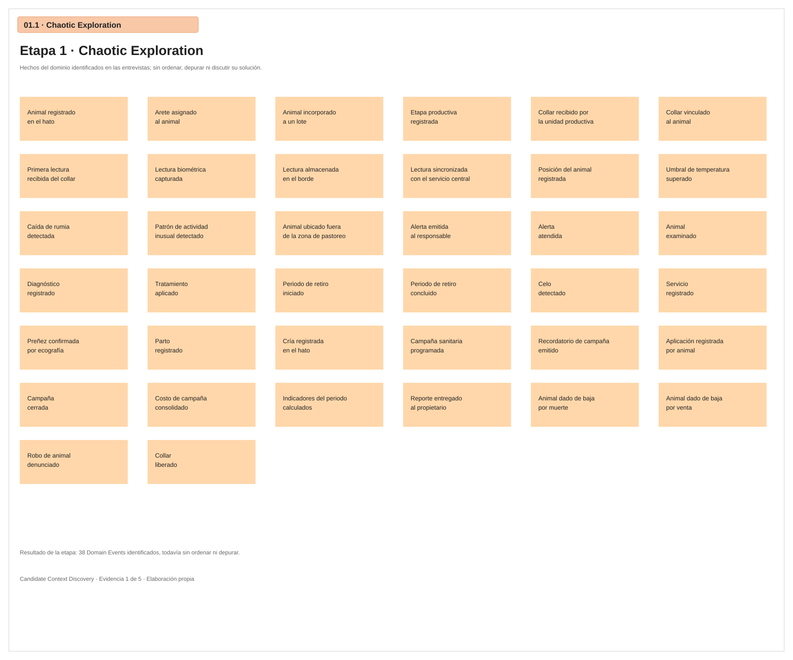

*Figura 2.4.1. Chaotic Exploration: 38 Domain Events identificados sin ordenar. Elaboración propia.*

[Abrir tablero Figma del Big Picture EventStorming](https://www.figma.com/board/weAhLf9otmp9sh32i7ke4i/SmartFarm-%E2%80%94-2.4-Big-Picture-EventStorming.jam?node-id=0-1&t=4gtnxsvBNUxUdR76-1)

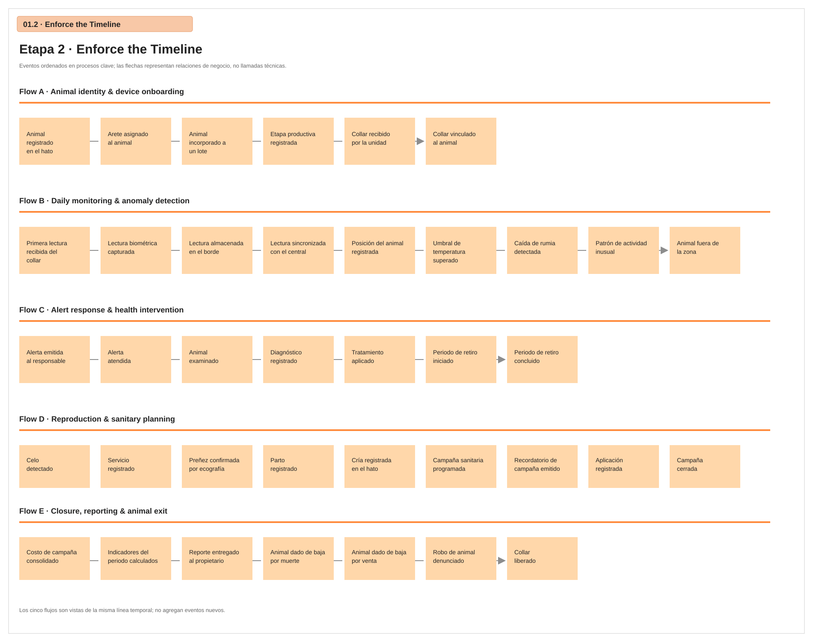

*Figura 2.4.2. Enforce the Timeline: eventos organizados en cinco procesos clave. Elaboración propia.*

[Abrir tablero Figma del Big Picture EventStorming](https://www.figma.com/board/weAhLf9otmp9sh32i7ke4i/SmartFarm-%E2%80%94-2.4-Big-Picture-EventStorming.jam?node-id=0-1&t=4gtnxsvBNUxUdR76-1)

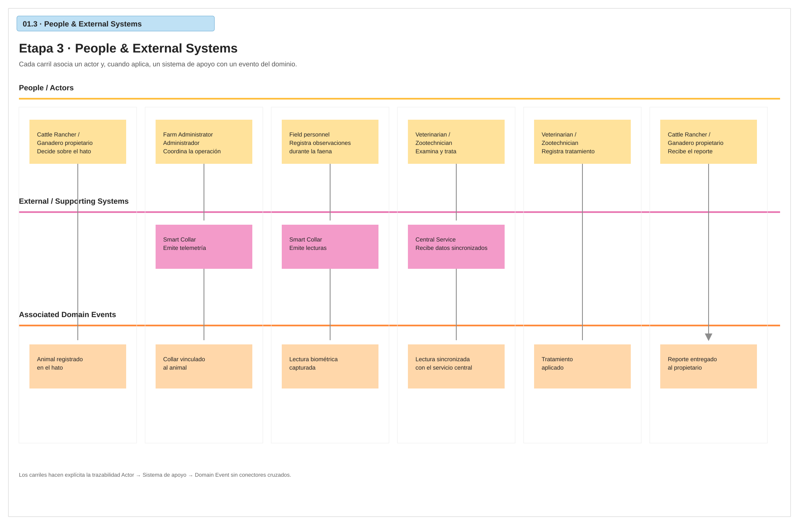

*Figura 2.4.3. People & External Systems: actores y sistemas de apoyo asociados a los eventos. Elaboración propia.*

[Abrir tablero Figma del Big Picture EventStorming](https://www.figma.com/board/weAhLf9otmp9sh32i7ke4i/SmartFarm-%E2%80%94-2.4-Big-Picture-EventStorming.jam?node-id=0-1&t=4gtnxsvBNUxUdR76-1)

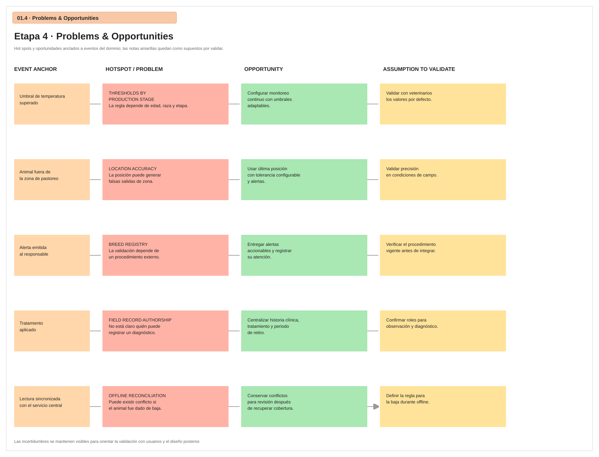

*Figura 2.4.4. Problems & Opportunities: hot spots, oportunidades y supuestos por validar. Elaboración propia.*

[Abrir tablero Figma del Big Picture EventStorming](https://www.figma.com/board/weAhLf9otmp9sh32i7ke4i/SmartFarm-%E2%80%94-2.4-Big-Picture-EventStorming.jam?node-id=0-1&t=4gtnxsvBNUxUdR76-1)

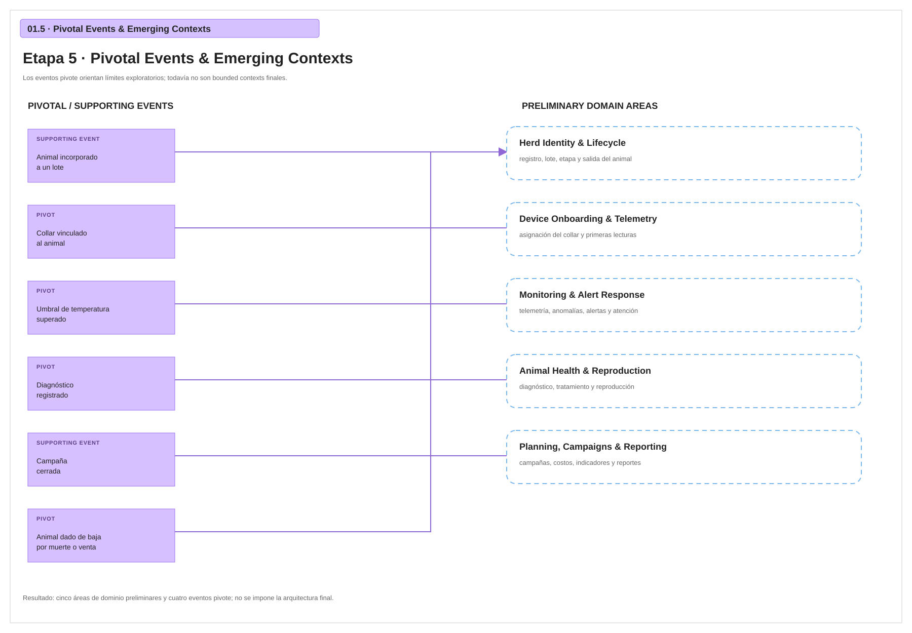

*Figura 2.4.5. Pivotal Events & Emerging Contexts: áreas preliminares derivadas de los cambios de estado. Elaboración propia.*

[Abrir tablero Figma del Big Picture EventStorming](https://www.figma.com/board/weAhLf9otmp9sh32i7ke4i/SmartFarm-%E2%80%94-2.4-Big-Picture-EventStorming.jam?node-id=0-1&t=4gtnxsvBNUxUdR76-1)

**Domain Events identificados, ordenados temporalmente**

| Fase del negocio | Domain Events |
|---|---|
| Incorporación del animal | Animal registrado en el hato, Arete asignado al animal, Animal incorporado a un lote, Etapa productiva registrada |
| Asignación de dispositivos | Collar recibido por la unidad productiva, Collar vinculado al animal, Primera lectura recibida del collar |
| Vigilancia diaria | Lectura biométrica capturada, Lectura almacenada en el borde, Lectura sincronizada con el servicio central, Posición del animal registrada |
| Detección de anomalías | Umbral de temperatura superado, Caída de rumia detectada, Patrón de actividad inusual detectado, Animal ubicado fuera de la zona de pastoreo |
| Atención sanitaria | Alerta emitida al responsable, Alerta atendida, Animal examinado, Diagnóstico registrado, Tratamiento aplicado, Periodo de retiro iniciado, Periodo de retiro concluido |
| Ciclo reproductivo | Celo detectado, Servicio registrado, Preñez confirmada por ecografía, Parto registrado, Cría registrada en el hato |
| Planificación sanitaria | Campaña sanitaria programada, Recordatorio de campaña emitido, Aplicación registrada por animal, Campaña cerrada |
| Cierre del ciclo | Costo de campaña consolidado, Indicadores del periodo calculados, Reporte entregado al propietario |
| Salida del animal | Animal dado de baja por muerte, Animal dado de baja por venta, Robo de animal denunciado, Collar liberado |

**Eventos pivote**

El equipo identificó cuatro hechos que marcan cambios de fase en el proceso de negocio y que, por lo tanto, señalan fronteras candidatas entre contextos:

- **Collar vinculado al animal.** Separa la gestión del inventario de dispositivos de la vigilancia del animal. A partir de este hecho, la telemetría deja de pertenecer a un aparato y pasa a pertenecer a un ser vivo con historia.
- **Umbral de temperatura superado.** Separa la captura de datos de la respuesta sanitaria. Antes de este hecho el sistema observa, después interviene.
- **Diagnóstico registrado.** Separa la sospecha de la certeza clínica y habilita el tratamiento, el periodo de retiro y la trazabilidad de lo aplicado.
- **Animal dado de baja.** Cierra la historia del animal y determina qué información alimenta los indicadores de mortalidad del periodo.

**Hot spots**

| Zona de incertidumbre | Descripción | Cómo se resolverá |
|---|---|---|
| Umbrales por etapa productiva | No existe consenso sobre si el umbral térmico debe ser único o variar según edad, raza y etapa. Darwin propuso valores distintos para terneros y adultos | Validar con los tres profesionales del Segmento 2 antes de fijar los valores por defecto |
| Autoría del registro en campo | No está definido si el operario puede registrar un diagnóstico o únicamente una observación | Resolver como regla de negocio en la definición de roles |
| Dependencia de la asociación de criadores | El registro de gestación ante la asociación sigue un procedimiento externo que el equipo no controla | Verificar el procedimiento vigente antes de comprometer cualquier integración |
| Precisión de la ubicación | La lectura de posición tiene un margen de error que puede generar falsas salidas de zona | Definir una tolerancia configurable y validarla en el piloto |
| Conciliación de registros sin conexión | No está resuelto qué ocurre cuando un registro creado sin cobertura afecta a un animal que fue dado de baja entretanto | Definir la regla de conflicto durante el diseño táctico |

## 2.5. Ubiquitous Language.

El Lenguaje Ubicuo (Ubiquitous Language) es el vocabulario compartido y riguroso que utiliza tanto el equipo de desarrollo como los actores del dominio ganadero para referirse a los mismos conceptos sin ambigüedad, tal como lo describe Eric Evans en su libro *Domain-Driven Design: Tackling Complexity in the Heart of Software*. Este glosario fue construido a partir de las entrevistas realizadas a los dos segmentos objetivo y se organiza según los Bounded Contexts definidos para la plataforma ICHU. Recoge únicamente términos del dominio ganadero, es decir, conceptos que los propios ganaderos, zootecnistas y médicos veterinarios emplean en su actividad. No se incluyen términos técnicos del área de ingeniería de software, aunque algunos de ellos aparezcan más adelante en el diseño de la solución.

### Términos transversales del dominio

| Término | Español | Descripción |
|---|---|---|
| **Herd** | Hato | Conjunto total de ganado vacuno que posee una unidad productiva; unidad de supervisión y control del ganadero. |
| **Ear Tag** | Arete | Identificador físico visible colocado en la oreja del animal; número de identificación individual con el que los productores nombran a cada vaca. |
| **Cattle Rustling** | Abigeato | Robo de ganado; principal amenaza patrimonial identificada en las entrevistas del Segmento 1. |
| **Silent Heat** | Celo silencioso | Estado reproductivo en el que la vaca no manifiesta signos externos evidentes de celo; suele detectarse tardíamente (2-3 días después) por sangrado vulvar. |
| **Days Open** | Días abiertos | Intervalo entre el parto y la nueva preñez de una vaca; indicador clave de eficiencia reproductiva. |
| **Bloat** | Timpanismo | Trastorno metabólico digestivo de rápida evolución por acumulación de gases en el rumen, que puede causar la muerte del animal en horas. |
| **High Mountain Disease** | Mal de altura | Principal causa de mortalidad de terneros en zonas andinas; se manifiesta primero como reducción del movimiento y del tiempo de pastoreo. |
| **Breed Registry** | Registro de criadores / ASCRIGAR Perú | Asociación de criadores que registra la genealogía (pedigree) y los nacimientos del ganado vacuno; actúa como entidad de registro reproductivo ("la RENIEC de las vacas"). |
| **Purebred and Performance Certificate (PPC)** | Registro de Pureza Pedigrí y Crecimiento | Certificación de linaje de un animal gestionada por la asociación de criadores de registro. |
| **Livestock Calendar** | Calendario ganadero | Calendario sanitario regional preestablecido que determina las épocas de campañas (ej. vacunación contra carbúnculo entre mayo y julio, control de piojera en junio). |
| **Livestock Task** | Faena ganadera | Actividad operativa programada sobre el ganado: dosificación, vacunación, vitaminación, revisión. |

### Identity & Access Management

| Término | Español | Descripción |
|---|---|---|
| **Herd Advisory** | Asesoría del hato | Relación por la cual un profesional atiende de forma periódica el ganado de una unidad productiva que no administra; se inicia por acuerdo con el propietario y puede terminar cuando este lo decide. |
| **Advisory Scope** | Alcance de la asesoría | Conjunto de animales de una unidad productiva sobre los que el profesional tiene competencia para diagnosticar, prescribir y registrar intervenciones. |
| **Colegiatura** | Colegiatura | Número de registro del profesional ante el colegio médico veterinario, que acredita su habilitación para ejercer. |

### Profiles

| Término | Español | Descripción |
|---|---|---|
| **Cattle Rancher** | Ganadero propietario | Usuario del Segmento 1 que posee la unidad productiva, compra el plan y decide sobre la operación del hato. |
| **Farm Administrator** | Administrador de estancia | Usuario del Segmento 1 encargado de la gestión diaria y de los reportes de la unidad productiva. |
| **Veterinarian / Zootechnician** | Médico Veterinario / Zootecnista | Usuario del Segmento 2 que brinda asistencia técnica, diagnósticos y tratamientos sobre hatos de terceros. |
| **Ranch** | Fundo / Estancia / Hacienda | Unidad productiva ganadera identificada con nombre propio y ubicación geográfica (ej. Hacienda del Marqués, Fundo Flores de Coña). |

### Cattle Information

| Término | Español | Descripción |
|---|---|---|
| **Cattle** | Ganado vacuno | Entidad central del dominio; el conjunto de bovinos gestionados por una unidad productiva. |
| **Individual Record** | Ficha individual | Registro único por animal con su identificación, raza, etapa, sexo y datos reproductivos. |
| **Breed** | Raza | Clasificación genética del animal (Brown Swiss, Fleckvieh, criollo, cruzado). |
| **Life Stage** | Etapa | Fase de desarrollo del animal: ternero, vaquilla, vaquillona, vaca en producción, toro en engorde. |
| **Lot** | Lote | Agrupación de animales por criterio de manejo (edad, raza, potrero, categoría productiva). |
| **Paddock** | Potrero | Parcela de pastoreo donde se ubica un grupo de animales; define el régimen de pastoreo y los días de descanso del pasto. |
| **Genealogy** | Genealogía | Registro de ascendencia del animal (padre, madre) requerido para los registros de pedigree y PPC. |
| **Pregnancy Status** | Estado de preñez / gestación | Estado reproductivo de la vaca, con fecha probable de parto calculada desde la inseminación. |
| **Fertility Index** | Índice de fertilidad | Indicador derivado de los días abiertos y los ciclos de celo del animal. |
| **Physiological Baseline** | Constante fisiológica de referencia | Rango normal de temperatura (37-39.5 °C) y frecuencias cardíaca y respiratoria de una vaca adulta sana. |

### IoT Assets

| Término | Español | Descripción |
|---|---|---|
| **Smart Collar** | Collar inteligente | Dispositivo IoT físico colocado en el cuello del animal que captura temperatura, actividad, rumia y ubicación. |
| **Device Band** | Banda | Correa/accesorio del collar que se asigna a un animal específico y puede reemplazarse sin cambiar el dispositivo electrónico. |
| **Device Assignment** | Asignación de dispositivo | Relación entre un collar, un cliente y una vaca concreta, gestionada según el plan contratado. |
| **Battery Level** | Nivel de batería | Energía disponible del dispositivo; su vida útil promocionada es de hasta 3 años. |
| **Device Status** | Estado del collar | Condición operativa del collar según su última comunicación: en servicio, sin señal o con batería baja. |
| **Blind Zone** | Zona ciega | Área de pastoreo sin cobertura de red donde el collar almacena la información del animal en memoria local. |

### Operations & Monitoring

| Término | Español | Descripción |
|---|---|---|
| **Telemetry** | Telemetría | Datos capturados por el collar: temperatura corporal, ubicación, actividad física, ciclos de rumia y alimentación, frecuencias cardíaca y respiratoria. |
| **Rumination** | Rumia | Proceso de masticación regurgitada del bovino; su caída sostenida es la señal temprana más crítica de trastorno metabólico o intoxicación. |
| **Red Alert** | Alerta roja | Notificación inmediata de máxima prioridad enviada al celular cuando una constante vital decae o se cruza un umbral crítico (fiebre > 40 °C, hipotermia < 37 °C). |
| **Clinical Threshold** | Umbral clínico | Valor de referencia calibrado con los veterinarios (ej. neumonía a partir de 38.5-39 °C) que dispara las alertas del sistema. |
| **Last Known Location** | Última posición conocida | Dato de ubicación más reciente registrado por el collar, consultable incluso sin conexión. |
| **Geofence** | Geocerca | Límite virtual del potrero o del predio; su cruce genera una alerta de posible extravío o robo. |
| **Insemination Event** | Evento de inseminación | Registro con fecha del cruzamiento o inseminación artificial de una vaca, base para la predicción del parto. |
| **Time Since Insemination** | Tiempo desde la inseminación | Días transcurridos desde el evento reproductivo, usados para programar el diagnóstico de gestación y la alerta de parto (1 semana antes). |
| **Estrus Detection** | Detección de celo | Identificación algorítmica de celo a partir del cruce de picos de actividad, temperatura y caída de producción; incluye la variante silenciosa. |

### Planning

| Término | Español | Descripción |
|---|---|---|
| **Activity Planning** | Planificación de actividad | Programación de las faenas ganaderas sobre el calendario: vacunación, desparasitación, vitaminación, revisiones. |
| **Health Campaign** | Campaña sanitaria | Acción colectiva programada sobre el hato o parte de él, según la época del calendario ganadero (ej. campaña contra la piojera). |
| **Reminder** | Recordatorio | Notificación anticipada que avisa que una actividad programada se acerca ("te toca dosificar tal día"). |
| **Quarantine** | Cuarentena | Periodo de aislamiento programado ante una epidemia o el ingreso de nuevos animales. |
| **Gestation Window** | Periodo de gestación | Ventana estimada de parto por animal, generada automáticamente a partir del evento de inseminación. |
| **Fattening Cycle** | Ciclo de engorde | Programa de engorde intensivo con duración típica de tres meses, con seguimiento de días y peso estimado. |

### Dashboard & Analytics

| Término | Español | Descripción |
|---|---|---|
| **Key Performance Indicator (KPI)** | Indicador clave | Métrica de seguimiento: mortalidad mensual, animales enfermos, celos detectados, inseminaciones, producción de leche por día, costos por cabeza. |
| **Epidemiological Curve** | Curva epidemiológica | Gráfico de avance o control de una enfermedad en el hato a lo largo del tiempo. |
| **Executive Report** | Reporte ejecutivo | Documento exportable (Excel, PDF o Word) con los datos del hato: salud, sanidad, reproducción y finanzas. |
| **Fattening Balance** | Balance de engorde | Comparación de gasto vs. ganancia por ciclo trimestral y por cabeza. |
| **Trend** | Tendencia | Patrón histórico derivado de los datos consolidados del hato (enfermedades por época, días abiertos, producción per cápita anual). |

### Subscription Plans

| Término | Español | Descripción |
|---|---|---|
| **Plan** | Plan | Modalidad de suscripción contratada por el cliente, con límites de animales y dispositivos. |
| **Annual Subscription** | Suscripción anual | Modelo de pago anual con tarifa fija preferido por los entrevistados del Segmento 1. |
| **Device Limit** | Límite de dispositivos | Cantidad máxima de collares/bandas habilitadas según el plan, definida por el tamaño del hato. |
| **Plan Coverage** | Cobertura del plan | Conjunto de prestaciones incluidas en la modalidad contratada, como los reportes avanzados o el aviso por mensaje de texto. |
| **Renewal** | Renovación | Proceso de continuidad del servicio al finalizar el periodo contratado. |
# Capítulo III: Requirements Specification
## 3.1. To-Be Scenario Mapping

El To-Be Scenario Mapping representa el recorrido futuro que ICHU habilitará para cada segmento prioritario. Se modeló en UXPressia con las capas **Doing**, **Thinking** y **Feeling**, de modo que las decisiones de producto mantengan relación con el contexto operativo de cada perfil.

### 3.1.1. Propietario o administrador ganadero

*Figura 3.1. Recorrido futuro del propietario o administrador: revisión, priorización y seguimiento de alertas.*

### 3.1.2. Capataz u operario de campo

*Figura 3.2. Recorrido futuro del capataz u operario: atención de incidencias y registro de evidencia en campo.*

### 3.1.3. Médico veterinario o consultor

*Figura 3.3. Recorrido futuro del médico veterinario: evaluación clínica, indicación y seguimiento de tratamiento.*

**Resultado esperado.** El escenario futuro integra información IoT, atención humana y trazabilidad: una alerta se detecta, se prioriza, se atiende en campo, se sustenta clínicamente cuando corresponde y queda disponible para seguimiento y decisiones posteriores.

## 3.2. User Stories.

Los requisitos se organizan en doce Epics alineados con los Bounded Contexts definidos para la plataforma en el Ubiquitous Language. Esta correspondencia garantiza la trazabilidad entre lo que el negocio necesita y la manera en que se descompone la solución.

| Epic | Bounded Context asociado | Producto digital principal |
|---|---|---|
| EP-01 Gestión de cuenta y acceso | Identity & Access Management, Profiles | Web y móvil |
| EP-02 Registro e información del ganado | Cattle Information | Web y móvil |
| EP-03 Gestión de dispositivos IoT | IoT Assets | Web App |
| EP-04 Monitoreo y telemetría del ganado | Operations & Monitoring | Web y móvil |
| EP-05 Alertas preventivas y seguridad | Operations & Monitoring | Móvil y web |
| EP-06 Operación de campo sin conexión | Operations & Monitoring | Mobile App |
| EP-07 Historial y atención veterinaria | Cattle Information, Operations & Monitoring | Web y móvil |
| EP-08 Planificación del calendario ganadero | Planning | Web y móvil |
| EP-09 Análisis para la toma de decisiones | Dashboard & Analytics | Web App |
| EP-10 Landing Page y suscripciones | Subscription Plans | Landing Page |
| EP-11 Plataforma IoT e integración de servicios | Transversal (técnico) | Aplicación embebida, Edge API y RESTful API |
| EP-12 Control del abrevadero | Operations & Monitoring | Aplicación embebida, web y móvil |

**Epics, User Stories y Technical Stories**

| Epic / Story ID | Título | Descripción | Criterios de aceptación | Relacionado con (Epic ID) |
| --- | --- | --- | --- | --- |
| EP-01 | Gestión de cuenta y acceso | Agrupa las capacidades de registro, autenticación y autorización de acceso de terceros sobre la información de un hato. | No aplica | No aplica |
| US-01 | Registrar una cuenta de unidad productiva | Como administrador ganadero, deseo registrar mi unidad productiva en ICHU, para gestionar mi hato desde la plataforma. | Given que el correo indicado no está asociado a ninguna cuenta When se registra la unidad productiva con nombre, región, distrito y número estimado de cabezas Then la cuenta queda creada en estado `pendiente de verificación` y se asocia al administrador como propietario de la unidad.  Given que el correo indicado ya está asociado a una cuenta existente When se intenta registrar la unidad productiva Then el registro no se crea y el sistema informa que el correo ya está en uso. | EP-01 |
| US-02 | Acceder a la plataforma | Como usuario registrado, deseo acceder a la plataforma con mis credenciales, para operar sobre la información que me corresponde. | Given que las credenciales corresponden a una cuenta verificada When se solicita el acceso Then la sesión queda iniciada con el rol asociado a la cuenta y con el alcance de las unidades productivas a las que tiene acceso.  Given que se registran cinco intentos fallidos consecutivos sobre la misma cuenta When se solicita un nuevo acceso Then el sistema bloquea temporalmente la cuenta durante 15 minutos y registra el intento con su fecha y hora. | EP-01 |
| US-03 | Completar el perfil profesional | Como médico veterinario, deseo completar mi perfil con mi especialidad, número de colegiatura y años de experiencia, para que los ganaderos que me autoricen conozcan mis credenciales. | Given que el perfil profesional está incompleto When se registran especialidad, número de colegiatura y años de experiencia Then el perfil pasa a estado `completo` y sus datos quedan disponibles para los administradores que evalúen autorizarlo.  Given que el número de colegiatura ya figura en otro perfil verificado When se intenta guardar el perfil Then el sistema rechaza el registro e indica la duplicidad del número de colegiatura. | EP-01 |
| US-04 | Autorizar a un médico veterinario sobre el hato | Como administrador ganadero, deseo autorizar a un médico veterinario a consultar y registrar información clínica de mi hato, para que pueda atender a mis animales con datos completos. | Given que el médico veterinario tiene un perfil profesional completo When el administrador le concede autorización sobre su unidad productiva Then la autorización queda registrada con su fecha de inicio y el alcance concedido, y el veterinario accede únicamente a los animales de esa unidad.  Given que la autorización define una fecha de vencimiento When esa fecha se cumple Then la autorización pasa a estado `vencida` y las consultas posteriores del veterinario sobre ese hato son rechazadas. | EP-01 |
| US-05 | Revocar la autorización de un médico veterinario | Como administrador ganadero, deseo revocar la autorización concedida a un médico veterinario, para retirar su acceso cuando termina la relación de asesoría. | Given que existe una autorización vigente When el administrador la revoca Then la autorización pasa a estado `revocada` con la fecha del cambio, y los registros clínicos previamente creados por ese veterinario se conservan con su autoría original. | EP-01 |
| US-39 | Solicitar autorización sobre una nueva unidad productiva | Como médico veterinario, deseo solicitar autorización sobre el hato de un ganadero que acaba de contratarme, para acceder a su información sin depender de que él sepa dónde concederla. | Given que el veterinario tiene un perfil profesional completo y la unidad productiva existe When solicita autorización sobre ella indicando el motivo de la asesoría Then la solicitud queda registrada en estado `pendiente` y se pone a disposición del administrador de esa unidad para su decisión.  Given que ya existe una solicitud pendiente o una autorización vigente del mismo veterinario sobre esa unidad When se intenta registrar una nueva solicitud Then no se crea la solicitud y el sistema indica el estado de la relación existente.  Given que el administrador rechaza la solicitud When se registra la decisión Then la solicitud pasa a estado `rechazada` con su fecha, y el veterinario no accede a ningún dato de esa unidad productiva. | EP-01 |
| EP-02 | Registro e información del ganado | Agrupa las capacidades para mantener la identidad y los datos productivos de cada animal del hato. | No aplica | No aplica |
| US-06 | Registrar un animal en el hato | Como administrador ganadero, deseo registrar un animal con su identificación y sus datos productivos, para incorporarlo a la gestión del hato. | Given que el número de arete no está registrado en la unidad productiva When se registra el animal con número de arete, raza, sexo, fecha de nacimiento y etapa productiva Then el animal queda incorporado al hato en estado `activo` y se le asigna un identificador interno único.  Given que el número de arete ya existe en la misma unidad productiva When se intenta registrar el animal Then el registro no se crea y el sistema indica el animal que ya ocupa ese número de arete. | EP-02 |
| US-07 | Consultar la ficha de un animal | Como administrador ganadero, deseo consultar la ficha de un animal, para conocer su identificación, su etapa productiva y el collar que tiene asignado. | Given que el animal pertenece a una unidad productiva sobre la que se tiene acceso When se consulta su ficha Then el sistema entrega el número de arete, la raza, el sexo, la etapa productiva, el estado del animal, el collar asignado y la fecha de la última lectura recibida.  Given que el animal no tiene un collar asignado When se consulta su ficha Then el sistema entrega los datos de identificación e indica la ausencia de dispositivo asociado, sin datos de telemetría. | EP-02 |
| US-08 | Actualizar la etapa productiva de un animal | Como administrador ganadero, deseo actualizar la etapa productiva de un animal, para que los indicadores del hato reflejen su situación real. | Given que el animal se encuentra en estado `activo` When se registra un cambio de etapa productiva con su fecha de vigencia Then la nueva etapa queda registrada y la etapa anterior se conserva en el historial del animal con su periodo de vigencia.  Given que la fecha de vigencia indicada es posterior a la fecha actual When se intenta registrar el cambio Then el sistema rechaza la operación e indica que la fecha de vigencia no puede ser futura. | EP-02 |
| US-09 | Registrar la baja de un animal | Como administrador ganadero, deseo registrar la baja de un animal por muerte, venta o robo, para mantener el inventario del hato actualizado y medir la mortalidad real. | Given que el animal se encuentra en estado `activo` When se registra su baja con el motivo (muerte, venta, robo o descarte) y la fecha del evento Then el animal pasa a estado `inactivo`, deja de considerarse en el conteo del hato y el motivo queda disponible para el cálculo de la tasa de mortalidad.  Given que el animal tiene un collar asignado When se registra su baja Then el collar queda liberado y disponible para asignarse a otro animal. | EP-02 |
| EP-03 | Gestión de dispositivos IoT | Agrupa las capacidades para administrar el inventario de collares inteligentes y su asignación a los animales del hato. | No aplica | No aplica |
| US-10 | Asignar un collar inteligente a un animal | Como administrador ganadero, deseo asignar un collar inteligente a un animal, para que su telemetría quede vinculada a la ficha correspondiente. | Given que el collar está registrado en la unidad productiva y no tiene animal asignado When se asigna al animal indicado Then la asignación queda registrada con su fecha de inicio y las lecturas posteriores de ese collar se atribuyen a dicho animal.  Given que la cantidad de collares asignados alcanza el límite del plan contratado When se intenta asignar un collar adicional Then la asignación es rechazada y el sistema indica el límite del plan vigente. | EP-03 |
| US-11 | Consultar el estado del inventario de collares | Como administrador ganadero, deseo consultar el estado de mis collares, para identificar cuáles están sin señal o con batería baja antes de que dejen de reportar. | Given que la unidad productiva tiene collares registrados When se consulta el inventario de dispositivos Then el sistema entrega, por cada collar, el animal asignado, el nivel de batería de la última lectura y la fecha de la última comunicación recibida.  Given que un collar no reporta lecturas durante más de 48 horas When se consulta el inventario Then el collar figura en estado `sin comunicación` junto a la fecha de su última lectura. | EP-03 |
| US-12 | Liberar un collar de un animal | Como administrador ganadero, deseo liberar un collar del animal que lo porta, para reasignarlo cuando el animal causa baja o el dispositivo requiere mantenimiento. | Given que el collar tiene un animal asignado When se registra su liberación con el motivo correspondiente Then la asignación se cierra con su fecha de término, el collar pasa a estado `disponible` y la telemetría registrada durante el periodo de asignación se conserva vinculada al animal. | EP-03 |
| EP-04 | Monitoreo y telemetría del ganado | Agrupa las capacidades para consultar la información biométrica y de ubicación capturada por los collares. | No aplica | No aplica |
| US-13 | Consultar la telemetría reciente de un animal | Como administrador ganadero, deseo consultar la temperatura, la actividad y la ubicación reciente de un animal, para detectar oportunamente posibles anomalías. | Given que el collar asignado al animal ha transmitido lecturas válidas en las últimas 24 horas When se consulta su telemetría reciente Then el sistema entrega la temperatura corporal, el índice de actividad, las coordenadas y la fecha y hora de cada lectura del periodo.  Given que la última lectura válida tiene más de 24 horas de antigüedad When se consulta la telemetría reciente Then el sistema entrega la última lectura disponible e indica el tiempo transcurrido desde su registro. | EP-04 |
| US-14 | Consultar el historial biométrico de un animal | Como médico veterinario, deseo consultar la evolución de la temperatura, la actividad y la rumia de un animal en un periodo determinado, para sustentar mi diagnóstico con datos y no con una observación puntual. | Given que el veterinario cuenta con una autorización vigente sobre la unidad productiva When consulta el historial del animal para un periodo determinado Then el sistema entrega las lecturas del periodo junto con las alertas y los eventos clínicos registrados en las mismas fechas.  Given que el periodo solicitado excede la antigüedad de los datos conservados When se realiza la consulta Then el sistema entrega los datos disponibles e indica la fecha de la lectura más antigua conservada.  Given que la autorización del veterinario está vencida o revocada When intenta consultar el historial Then la consulta es rechazada y el intento queda registrado con su fecha y el motivo del rechazo. | EP-04 |
| US-15 | Definir las zonas de pastoreo permitidas | Como administrador ganadero, deseo delimitar las zonas de pastoreo permitidas de mi predio, para que el sistema pueda determinar cuándo un animal se encuentra fuera de ellas. | Given que se define un área cerrada de al menos tres vértices dentro del predio When se guarda la zona con su nombre y el lote de animales al que aplica Then la zona queda registrada y las lecturas de ubicación de esos animales se evalúan contra sus límites.  Given que el área definida no es un polígono cerrado o presenta lados que se cruzan When se intenta guardarla Then el sistema rechaza la definición e indica que el área no es válida para la evaluación de límites. | EP-04 |
| EP-05 | Alertas preventivas y seguridad | Agrupa las capacidades para detectar automáticamente anomalías de salud, eventos reproductivos y riesgos de robo o extravío. | No aplica | No aplica |
| US-16 | Recibir una alerta por anomalía de salud | Como administrador ganadero, deseo recibir una alerta cuando la temperatura o la actividad de un animal se desvíe de sus valores normales, para intervenir antes de que el cuadro se agrave. | Given que existe un umbral configurado para la especie y la etapa productiva del animal When una lectura supera ese umbral Then el sistema genera una alerta asociada al animal, con el tipo de anomalía, el valor detectado, el umbral superado y la fecha y hora de la lectura que la originó.  Given que existe una alerta abierta del mismo tipo para el mismo animal When se reciben nuevas lecturas que también superan el umbral dentro de las 6 horas siguientes Then el sistema incorpora las lecturas a la alerta existente y no genera una alerta adicional.  Given que el animal se encuentra en estado `inactivo` When se recibe una lectura que supera el umbral Then el sistema no genera alerta y descarta la lectura por corresponder a un animal dado de baja. | EP-05 |
| US-17 | Recibir una alerta por salida del área permitida | Como administrador ganadero, deseo recibir una alerta cuando un animal salga de la zona de pastoreo asignada, para reducir el riesgo de abigeato o extravío. | Given que el animal pertenece a un lote con una zona de pastoreo definida When su ubicación registrada se sitúa fuera de los límites de esa zona Then el sistema genera una alerta de seguridad con las coordenadas, la distancia respecto al límite más cercano y la fecha y hora del evento.  Given que el animal regresa a la zona permitida When se recibe la lectura que lo confirma Then la alerta registra el retorno con su fecha y hora, y conserva la duración total de la salida.  Given que la lectura de ubicación tiene una precisión declarada mayor al margen de tolerancia configurado When se evalúa contra los límites de la zona Then el sistema no genera alerta y registra la lectura como no concluyente. | EP-05 |
| US-18 | Identificar un posible evento reproductivo | Como administrador ganadero, deseo que el sistema identifique variaciones de actividad y temperatura compatibles con un celo, para no depender de la observación visual que hoy detecta el celo silencioso con dos o tres días de retraso. | Given que existen lecturas continuas de actividad y temperatura de los últimos siete días para una hembra en edad reproductiva When el patrón de las últimas 24 horas se desvía del patrón base del animal según el criterio configurado Then el sistema registra un indicador de posible evento reproductivo con la fecha estimada de inicio y las lecturas que lo sustentan.  Given que el animal registra menos de siete días de lecturas continuas When se evalúa el patrón reproductivo Then el sistema no genera el indicador e informa que no existe línea base suficiente para el análisis. | EP-05 |
| US-19 | Atender una alerta | Como administrador ganadero, deseo dejar constancia de que atendí una alerta y de lo que encontré, para medir nuestro tiempo de respuesta y conservar el antecedente del animal. | Given que existe una alerta en estado `abierta` When se registra su atención con el hallazgo y la acción tomada Then la alerta pasa a estado `atendida`, queda registrado el tiempo transcurrido entre su generación y su atención, y el hallazgo se incorpora al historial del animal.  Given que una alerta permanece en estado `abierta` más allá del plazo definido para su severidad When se evalúa su antigüedad Then el sistema la marca como `vencida sin atención` y conserva el registro para el cálculo de indicadores de respuesta. | EP-05 |
| US-40 | Recibir una alerta por tratamiento sin respuesta | Como médico veterinario, deseo recibir una alerta cuando un animal que traté no mejora dentro del plazo esperado, para reevaluar el diagnóstico antes de que el cuadro se agrave. | Given que existe una intervención clínica con un plazo de respuesta esperado definido When transcurre ese plazo y las constantes del animal no retornan al rango normal de su etapa productiva Then el sistema genera una alerta dirigida al veterinario que aplicó la intervención, con el tratamiento administrado, el plazo vencido y la evolución de las constantes durante el periodo.  Given que las constantes del animal retornan al rango normal antes de vencer el plazo When se evalúa la evolución Then no se genera alerta y la intervención se marca como `con respuesta favorable` junto a la fecha en que se normalizaron las constantes.  Given que el animal deja de transmitir lecturas durante el periodo de seguimiento When vence el plazo Then el sistema genera la alerta indicando que la evaluación es no concluyente por ausencia de telemetría. | EP-05 |
| EP-06 | Operación de campo sin conexión | Agrupa las capacidades que permiten al operario consultar y registrar información durante sus faenas en zonas con conectividad intermitente. | No aplica | No aplica |
| US-20 | Localizar un animal extraviado | Como operario de campo, deseo consultar la última ubicación registrada de un animal, para reducir el tiempo de búsqueda en el potrero. | Given que el animal tiene al menos una lectura de ubicación registrada When el operario consulta su ubicación Then la aplicación entrega las coordenadas de la última lectura, la fecha y hora de su registro y la distancia respecto a la posición actual del operario.  Given que el animal no tiene ninguna lectura de ubicación registrada When el operario realiza la consulta Then la aplicación informa la ausencia de ubicación y entrega la fecha de la última comunicación recibida del collar. | EP-06 |
| US-21 | Registrar un evento de salud durante la faena | Como operario de campo, deseo registrar lo que observo en el animal en el momento en que lo observo, para que la información no se pierda al terminar la jornada. | Given que el operario identifica un evento de salud When registra el animal, el tipo de evento, la fecha y una observación Then el evento queda registrado con el animal, el tipo, la fecha, el autor y su estado de sincronización, y se incorpora al historial del animal.  Given que el registro no incluye la identificación del animal o el tipo de evento When se intenta guardarlo Then el evento no se registra y la aplicación indica cuáles de los datos obligatorios faltan. | EP-06 |
| US-22 | Operar sin cobertura y sincronizar al recuperarla | Como operario de campo, deseo consultar fichas y registrar eventos sin cobertura celular, para mantener la continuidad de mis faenas en las zonas donde no hay señal. | Given que el dispositivo móvil no tiene cobertura When el operario consulta una ficha descargada previamente o registra un evento Then la aplicación entrega la información local indicando la fecha de su última actualización, y los registros creados quedan en estado `pendiente de sincronizar`.  Given que existen registros en estado `pendiente de sincronizar` y el dispositivo recupera la cobertura When se ejecuta la sincronización Then los registros se envían en el orden en que fueron creados y cada uno pasa a estado `sincronizado` o conserva el estado pendiente junto al motivo del fallo.  Given que un registro pendiente afecta a un animal que fue dado de baja mientras el dispositivo estaba sin cobertura When se ejecuta la sincronización Then el registro no se aplica, se conserva como conflicto y se informa el motivo para su revisión manual. | EP-06 |
| EP-07 | Historial y atención veterinaria | Agrupa las capacidades para centralizar la información clínica del animal y sustentar la atención profesional. | No aplica | No aplica |
| US-23 | Registrar una intervención clínica | Como médico veterinario, deseo registrar las vacunaciones, tratamientos e inseminaciones que aplico, para que el historial del animal refleje con exactitud qué se le administró y cuándo. | Given que el veterinario cuenta con autorización vigente sobre la unidad productiva When registra una intervención con su tipo, fecha, producto administrado, dosis y observación Then la intervención queda registrada en el historial del animal con la identificación del profesional que la aplicó.  Given que se registra un tratamiento cuyo periodo de retiro aún no ha vencido para ese animal When se intenta registrar una nueva aplicación del mismo producto Then el sistema advierte el periodo de retiro vigente y su fecha de término antes de admitir el registro.  Given que la intervención carece de fecha o de tipo When se intenta guardarla Then no se registra y el sistema indica los datos obligatorios faltantes. | EP-07 |
| US-24 | Preparar una atención con información previa | Como médico veterinario, deseo revisar de forma remota la telemetría y los eventos recientes de un animal antes de desplazarme al predio, para llegar con un diagnóstico preliminar. | Given que el veterinario cuenta con autorización vigente y el animal registra una alerta abierta When consulta su información previa a la atención Then el sistema entrega las lecturas del periodo de la alerta, los eventos registrados por el operario, las intervenciones clínicas previas y los periodos de retiro vigentes.  Given que el animal no registra intervenciones clínicas previas When se consulta su información Then el sistema entrega la telemetría y los eventos disponibles e indica la ausencia de antecedentes clínicos. | EP-07 |
| US-25 | Adjuntar evidencia de diagnóstico por imagen | Como médico veterinario, deseo adjuntar la imagen ecográfica al registro de una intervención reproductiva, para sustentar el diagnóstico de gestación sin duplicar el registro en otro sistema. | Given que existe una intervención reproductiva registrada para el animal When se adjunta una imagen de diagnóstico con su fecha de captura Then la imagen queda vinculada a esa intervención y disponible en el historial reproductivo del animal.  Given que el archivo adjunto excede el tamaño máximo admitido o no corresponde a un formato de imagen soportado When se intenta adjuntarlo Then el adjunto es rechazado y el sistema indica el límite o el formato admitido. | EP-07 |
| US-41 | Consultar el periodo de retiro vigente de un animal | Como médico veterinario, deseo conocer si un animal se encuentra dentro del periodo de retiro de algún producto, para indicar al ganadero si su leche o su carne pueden destinarse al consumo. | Given que el animal registra intervenciones con productos que declaran periodo de retiro When se consulta su situación de retiro Then el sistema entrega los productos con retiro vigente, la fecha de término de cada uno y el destino de producción restringido en cada caso.  Given que el animal no registra periodos de retiro vigentes When se realiza la consulta Then el sistema informa que su producción no presenta restricción e indica la fecha del último periodo de retiro concluido. | EP-07 |
| US-42 | Evaluar la respuesta de un animal a un tratamiento | Como médico veterinario, deseo comparar las constantes del animal antes y después de aplicar un tratamiento, para confirmar con datos si el protocolo está funcionando. | Given que existe una intervención clínica registrada y telemetría del animal anterior y posterior a su aplicación When se consulta la evaluación de respuesta Then el sistema entrega la temperatura, la actividad y la rumia promedio de las 48 horas previas y de las 12, 24 y 48 horas posteriores a la aplicación, junto con la variación entre ambos periodos.  Given que la telemetría posterior a la aplicación abarca menos de 12 horas When se solicita la evaluación Then el sistema entrega los datos disponibles e indica que el periodo mínimo de comparación aún no se cumple. | EP-07 |
| US-43 | Registrar un diagnóstico diferencial descartado | Como médico veterinario, deseo dejar constancia de las hipótesis diagnósticas que descarté y por qué, para que otro profesional que atienda al animal no repita el mismo análisis. | Given que existe un caso clínico abierto para el animal When se registra una hipótesis descartada con el motivo y el hallazgo que la descarta Then la hipótesis queda incorporada al caso clínico con la fecha y la autoría, y se presenta a cualquier profesional autorizado que consulte el caso.  Given que el caso clínico se cierra con un diagnóstico confirmado When se registra el cierre Then las hipótesis descartadas se conservan asociadas al caso y no pueden modificarse. | EP-07 |
| US-44 | Registrar el resultado de un examen de laboratorio externo | Como médico veterinario, deseo incorporar al historial del animal el resultado del laboratorio al que derivé la muestra, para que el diagnóstico quede sustentado en un solo lugar. | Given que existe un caso clínico abierto para el animal When se registra el resultado con el laboratorio de origen, la fecha de la toma de muestra, la fecha del resultado y el hallazgo Then el resultado queda vinculado al caso clínico y disponible en el historial del animal.  Given que la fecha de la toma de muestra es posterior a la fecha del resultado When se intenta registrar Then la operación es rechazada indicando la inconsistencia entre ambas fechas. | EP-07 |
| US-45 | Consultar el historial reproductivo de un animal | Como médico veterinario, deseo consultar los servicios, partos e intervalos reproductivos de una hembra, para decidir si continúa en el programa reproductivo o pasa a descarte. | Given que la hembra registra al menos un servicio o un parto When se consulta su historial reproductivo Then el sistema entrega los servicios con su fecha y método, los partos registrados, los días abiertos de cada intervalo y el número de servicios por preñez lograda.  Given que la hembra no registra eventos reproductivos When se realiza la consulta Then el sistema informa la ausencia de historial reproductivo y entrega su edad y etapa productiva actual. | EP-07 |
| US-46 | Consultar el plan nutricional vigente de un lote | Como médico veterinario, deseo conocer la ración que recibe el lote, para descartar una causa nutricional antes de atribuir el cuadro a una enfermedad infecciosa. | Given que el lote tiene un plan nutricional registrado y vigente When se consulta junto con la telemetría del lote Then el sistema entrega la composición de la ración, su fecha de vigencia y la evolución del promedio de rumia del lote durante ese periodo.  Given que el lote registró un cambio de ración dentro del periodo consultado When se realiza la consulta Then el sistema identifica la fecha del cambio y separa los promedios de rumia anteriores y posteriores a esa fecha. | EP-07 |
| US-47 | Registrar una recomendación de manejo para el ganadero | Como médico veterinario, deseo dejar registrada una recomendación dirigida al administrador de la unidad productiva, para que la indicación no se pierda al terminar la visita. | Given que el veterinario cuenta con autorización vigente sobre la unidad productiva When registra una recomendación con su alcance, el plazo sugerido y los animales o el lote afectados Then la recomendación queda registrada en estado `pendiente` con la autoría del profesional y se pone a disposición del administrador.  Given que el administrador registra la ejecución de la recomendación When se guarda la respuesta Then la recomendación pasa a estado `atendida` con su fecha y se conserva el tiempo transcurrido desde su emisión. | EP-07 |
| US-48 | Exportar el informe clínico de un animal | Como médico veterinario, deseo exportar el informe clínico de un animal con mis datos profesionales, para entregarlo al ganadero como sustento de mi atención. | Given que el animal registra intervenciones clínicas del periodo solicitado When se solicita la exportación del informe Then el sistema genera el documento con la identificación del animal, las intervenciones del periodo, los resultados de laboratorio vinculados, el diagnóstico registrado y los datos profesionales del veterinario que lo emite.  Given que el periodo solicitado no registra intervenciones clínicas When se solicita la exportación Then el informe no se genera y el sistema informa la ausencia de intervenciones en el periodo. | EP-07 |
| US-49 | Comparar un animal con el promedio de su lote | Como médico veterinario, deseo contrastar las constantes de un animal con las de su lote en el mismo periodo, para distinguir un problema individual de una condición que afecta a todo el grupo. | Given que el lote registra telemetría de al menos cinco animales durante el periodo consultado When se compara un animal contra su lote Then el sistema entrega los valores del animal, el promedio del lote y la desviación del animal respecto a ese promedio para temperatura, actividad y rumia.  Given que el lote registra menos de cinco animales con telemetría en el periodo When se solicita la comparación Then el sistema no entrega el contraste e informa que la cantidad de animales es insuficiente para establecer un promedio de referencia. | EP-07 |
| EP-08 | Planificación del calendario ganadero | Agrupa las capacidades para programar las faenas sanitarias y reproductivas del hato y dar seguimiento a su ejecución. | No aplica | No aplica |
| US-26 | Programar una campaña sanitaria | Como administrador ganadero, deseo programar las campañas de vacunación y desparasitación de mi hato, para ajustarlas al calendario sanitario de mi región y no depender de recordarlas de memoria. | Given que se define una campaña con su tipo, fecha programada y el lote de animales al que aplica When se guarda la programación Then la campaña queda registrada en estado `programada` y cada animal del lote queda asociado a ella como pendiente de aplicación.  Given que la fecha programada se superpone con el periodo de retiro vigente de alguno de los animales del lote When se guarda la programación Then la campaña se registra y el sistema identifica los animales afectados por el periodo de retiro. | EP-08 |
| US-27 | Recibir el recordatorio de una faena programada | Como administrador ganadero, deseo recibir un recordatorio antes de cada faena programada, para preparar los insumos y el personal con anticipación. | Given que existe una campaña en estado `programada` y un plazo de aviso configurado When la fecha actual alcanza ese plazo de anticipación Then el sistema genera un recordatorio con el tipo de campaña, la fecha programada y la cantidad de animales pendientes.  Given que la campaña ya fue registrada como ejecutada When se alcanza el plazo de aviso Then el sistema no genera el recordatorio. | EP-08 |
| US-28 | Registrar la ejecución de una faena | Como operario de campo, deseo registrar qué animales recibieron efectivamente la aplicación durante la faena, para que el avance de la campaña refleje el trabajo realizado. | Given que existe una campaña en estado `programada` o `en ejecución` When se registran los animales atendidos con la fecha de aplicación Then esos animales pasan a estado `aplicado` dentro de la campaña y la campaña actualiza su porcentaje de avance.  Given que todos los animales del lote figuran como aplicados When se registra la última aplicación Then la campaña pasa a estado `ejecutada` con su fecha de cierre. | EP-08 |
| US-50 | Programar una revisión de seguimiento | Como médico veterinario, deseo programar la revisión posterior de un animal que traté, para verificar su evolución sin depender de que el ganadero me avise. | Given que existe una intervención clínica registrada para el animal When se programa una revisión de seguimiento con su fecha y el objetivo de la evaluación Then la revisión queda registrada en estado `programada`, vinculada a la intervención que la origina, y se incorpora al calendario de la unidad productiva.  Given que el animal causa baja antes de la fecha programada When se alcanza esa fecha Then la revisión pasa a estado `no aplicable` conservando el motivo de baja del animal. | EP-08 |
| US-51 | Identificar los animales con campañas sanitarias vencidas | Como médico veterinario, deseo conocer qué animales de los hatos que asesoro tienen campañas vencidas, para priorizar mi visita y reducir el riesgo sanitario del grupo. | Given que existen campañas cuya fecha programada ya transcurrió y conservan animales sin aplicación registrada When se consulta la situación sanitaria de las unidades productivas autorizadas Then el sistema entrega los animales pendientes agrupados por unidad productiva y tipo de campaña, con los días transcurridos desde la fecha programada.  Given que todas las campañas de las unidades autorizadas figuran como ejecutadas When se realiza la consulta Then el sistema informa que no existen campañas vencidas e indica la fecha de la próxima campaña programada. | EP-08 |
| EP-09 | Análisis para la toma de decisiones | Agrupa las capacidades para visualizar indicadores agregados del hato y sustentar decisiones productivas y sanitarias. | No aplica | No aplica |
| US-29 | Consultar los indicadores del hato | Como administrador ganadero, deseo consultar los indicadores agregados de mi hato, para conocer el estado del negocio sin recorrer el predio. | Given que la unidad productiva registra animales activos con telemetría del periodo consultado When se consulta el tablero de indicadores Then el sistema entrega la cantidad de animales monitoreados, las alertas abiertas por tipo, los animales fuera de su zona asignada y la tasa de mortalidad del periodo, indicando el rango de fechas empleado en el cálculo.  Given que el periodo consultado no registra lecturas para una parte de los animales When se calculan los indicadores Then el sistema entrega los valores disponibles e indica cuántos animales quedaron excluidos del cálculo por ausencia de datos. | EP-09 |
| US-30 | Analizar tendencias y distribución del hato | Como médico veterinario, deseo analizar la evolución de la temperatura, la actividad y la distribución de alertas del hato, para identificar un brote antes de que se extienda. | Given que existen lecturas históricas válidas para el periodo y el lote seleccionados When se consulta la tendencia de un indicador Then el sistema entrega la serie de valores del periodo, el valor promedio del lote y los animales cuyos valores se apartan del promedio más allá del criterio configurado.  Given que el periodo seleccionado abarca animales con lecturas incompletas When se genera el análisis Then el sistema entrega el resultado e indica la cantidad de lecturas faltantes que lo condicionan. | EP-09 |
| US-31 | Exportar un reporte ejecutivo | Como administrador ganadero, deseo exportar un reporte del periodo con los indicadores de salud, reproducción y mortalidad de mi hato, para sustentar decisiones y compartirlo con mi veterinario. | Given que existen datos para el periodo y el alcance seleccionados When se solicita la exportación del reporte en un formato disponible Then el sistema genera el archivo con los indicadores del periodo, el rango de fechas empleado y la fecha de generación.  Given que el periodo seleccionado no registra datos When se solicita la exportación Then el reporte no se genera y el sistema informa la ausencia de datos para el periodo. | EP-09 |
| US-52 | Analizar la curva epidemiológica de un evento sanitario | Como médico veterinario, deseo seguir la evolución de los casos de un mismo cuadro dentro del hato, para decidir si corresponde aislar un lote o levantar una cuarentena. | Given que existen al menos dos casos clínicos del mismo tipo registrados en la unidad productiva durante el periodo When se consulta la curva epidemiológica de ese cuadro Then el sistema entrega la cantidad de casos nuevos por fecha, los animales afectados, el lote al que pertenecen y la fecha del primer caso registrado.  Given que la cantidad de casos nuevos es cero durante un periodo igual o mayor al tiempo de incubación configurado para el cuadro When se consulta la curva Then el sistema identifica ese periodo sin casos nuevos como criterio disponible para evaluar el levantamiento de la restricción.  Given que existe un único caso registrado del cuadro consultado When se solicita la curva Then el sistema no la construye e informa que un solo caso no permite establecer una progresión. | EP-09 |
| US-53 | Consultar el consolidado de las unidades productivas que asesoro | Como médico veterinario, deseo revisar en una sola consulta el estado de todos los hatos que atiendo, para decidir a cuál acudir primero en la jornada. | Given que el veterinario tiene autorizaciones vigentes sobre varias unidades productivas When consulta el consolidado de su cartera Then el sistema entrega, por cada unidad productiva, las alertas abiertas por severidad, los animales en tratamiento sin respuesta y las campañas vencidas, ordenadas por severidad de la situación.  Given que una autorización se encuentra vencida o revocada When se construye el consolidado Then esa unidad productiva se excluye del resultado sin exponer ninguno de sus datos. | EP-09 |
| EP-10 | Landing Page y suscripciones | Agrupa las capacidades del sitio web estático para comunicar la propuesta de valor, orientar a cada segmento y presentar el modelo de suscripción. | No aplica | No aplica |
| US-32 | Conocer la propuesta de ICHU | Como visitante, deseo conocer el problema que resuelve ICHU, sus productos y sus beneficios, para evaluar si la solución se adapta a mi unidad productiva. | Given que el visitante ingresa a la Landing Page When recorre sus secciones principales Then encuentra descritos el problema abordado, la solución IoT, los beneficios por segmento y los productos digitales que componen la plataforma.  Given que el visitante accede desde un dispositivo con ancho de pantalla menor a 768 píxeles When consulta cualquier sección Then el contenido se presenta completo y legible sin desplazamiento horizontal. | EP-10 |
| US-33 | Acceder al destino correspondiente a mi segmento | Como visitante, deseo encontrar una acción dirigida a mi perfil, para llegar al producto digital o al punto de contacto que me corresponde. | Given que la Landing Page presenta una acción diferenciada por segmento When el visitante del segmento ganadero selecciona la acción correspondiente Then es dirigido al acceso de la Web Application; y el visitante del segmento veterinario es dirigido al registro de perfil profesional.  Given que el destino de un segmento aún no está disponible When el visitante selecciona esa acción Then la Landing Page ofrece un canal de contacto alternativo vigente. | EP-10 |
| US-34 | Solicitar una demostración | Como visitante del segmento ganadero, deseo solicitar una demostración, para evaluar la plataforma con mi propio caso antes de contratarla. | Given que la solicitud incluye nombre, región, número de cabezas y un correo con formato válido When se envía Then la solicitud queda registrada con su fecha y el segmento del solicitante, y el visitante recibe el plazo de contacto comprometido.  Given que la solicitud omite un dato obligatorio o el correo tiene un formato inválido When se envía Then la solicitud no se registra y se indican los datos que deben corregirse. | EP-10 |
| US-35 | Comparar los planes y estimar el costo | Como administrador ganadero, deseo comparar los planes según el tamaño de mi hato, para evaluar si la inversión es rentable antes de contratar. | Given que la sección de planes presenta las modalidades disponibles When el visitante las compara Then encuentra, por cada plan, el límite de dispositivos, las funcionalidades incluidas y la modalidad de cobro.  Given que el visitante indica su cantidad de cabezas When selecciona un plan Then se presenta el costo estimado para esa cantidad bajo la modalidad de cobro del plan.  Given que la cantidad indicada excede el límite del plan seleccionado When se calcula el costo Then se indica el límite excedido y se identifica el plan que cubre esa cantidad. | EP-10 |
| US-36 | Consultar los términos y condiciones del servicio | Como visitante, deseo acceder a los términos y condiciones, para conocer las responsabilidades y las condiciones de uso antes de entregar mis datos. | Given que el visitante se encuentra en cualquier sección de la Landing Page When consulta el pie de página Then encuentra el acceso a los términos y condiciones del servicio.  Given que el visitante accede al documento When este se presenta Then incluye las condiciones de uso, el tratamiento de los datos recolectados por los dispositivos y la fecha de su última actualización. | EP-10 |
| US-37 | Consultar la experiencia en mi idioma | Como visitante, deseo consultar el contenido en inglés o en español latinoamericano, para comprender la propuesta en el idioma que domino. | Given que la experiencia se presenta en inglés (en_US) de manera predeterminada When el visitante selecciona el español latinoamericano (es_419) Then la totalidad del contenido, incluidos los mensajes de error y los formatos de fecha y número, se presenta en es_419.  Given que el visitante seleccionó previamente un idioma When regresa a la experiencia en una sesión posterior Then el contenido se presenta en el idioma seleccionado anteriormente. | EP-10 |
| US-38 | Acceder a la experiencia con tecnología de asistencia | Como visitante que utiliza un lector de pantalla, deseo recorrer la Landing Page y comprender su contenido, para evaluar la propuesta en igualdad de condiciones. | Given que la experiencia se recorre mediante un lector de pantalla When se navega por sus secciones Then cada sección expone su función y su nombre accesible, y el contenido no textual cuenta con una alternativa textual equivalente.  Given que la experiencia se recorre únicamente mediante el teclado When se avanza por los elementos interactivos Then todos resultan alcanzables en un orden coherente con la secuencia del contenido y el elemento con el foco es identificable. | EP-10 |
| EP-11 | Plataforma IoT e integración de servicios | Agrupa las capacidades técnicas necesarias para capturar, transmitir, validar, almacenar y distribuir la telemetría entre el dispositivo, el Edge Service y la API central. | No aplica | No aplica |
| TS-01 | Capturar biometría y ubicación en el collar | Como desarrollador, deseo que el collar capture temperatura, actividad y ubicación a intervalos configurables, para disponer de telemetría confiable en el Edge Service. | Given que el dispositivo se encuentra operativo y se cumple el intervalo de muestreo configurado When se ejecuta la lectura Then genera un paquete con el identificador del dispositivo, la temperatura, el índice de actividad, la latitud, la longitud, el nivel de batería y la marca de tiempo de la captura.  Given que un sensor devuelve un valor fuera del rango físico admisible When se conforma el paquete Then el campo correspondiente se marca como inválido, se incluye el código de error del sensor y el resto de los campos se transmite. | EP-11 |
| TS-02 | Operar el collar en modo de bajo consumo | Como desarrollador, deseo que el collar reduzca su frecuencia de transmisión cuando el animal está en reposo, para prolongar la autonomía de la batería. | Given que el acelerómetro no detecta movimiento significativo durante el periodo configurado When se evalúa el estado del dispositivo Then el módulo de posicionamiento y el transmisor pasan a modo de suspensión profunda y el intervalo de muestreo se amplía al valor definido para el estado de reposo.  Given que el dispositivo se encuentra en suspensión profunda When detecta actividad inusual, una variación térmica que supera el umbral local o una posición fuera de la zona asignada Then reanuda la operación y transmite la lectura de forma prioritaria. | EP-11 |
| TS-03 | Conservar las lecturas no transmitidas en el collar | Como desarrollador, deseo que el collar almacene en memoria las lecturas que no pudo transmitir, para no perder datos mientras el animal permanece en zonas sin cobertura. | Given que el dispositivo no logra comunicarse con el Edge Service When genera una lectura válida Then la almacena en memoria en orden cronológico junto a su marca de tiempo de captura.  Given que existen lecturas almacenadas y se restablece la comunicación When se ejecuta la transmisión Then las lecturas se envían en lote conservando su orden y la memoria se libera únicamente tras la confirmación del Edge Service.  Given que la memoria disponible se agota antes de restablecerse la comunicación When se genera una nueva lectura Then se descarta la lectura más antigua, se conserva la más reciente y se registra la cantidad de lecturas descartadas. | EP-11 |
| TS-04 | Recibir telemetría en el Edge Service | Como desarrollador, deseo exponer en el Edge Service un endpoint de recepción de telemetría, para que las lecturas del collar queden almacenadas localmente en el predio. | Given que se recibe `POST /api/v1/telemetry` con `deviceId`, `temperature`, `activityIndex`, `latitude`, `longitude`, `batteryLevel` y `recordedAt` When el Edge Service valida el contenido y reconoce el dispositivo Then persiste la lectura en el almacenamiento local y responde `201 Created` con el recurso creado.  Given que se recibe `POST /api/v1/telemetry` con un `deviceId` no registrado en el Edge Service When se procesa la solicitud Then responde `401 Unauthorized`, no persiste la lectura y registra el intento.  Given que la solicitud omite un campo obligatorio o `recordedAt` no cumple el formato ISO 8601 When se procesa Then responde `400 Bad Request` indicando el campo que originó el rechazo. | EP-11 |
| TS-05 | Evaluar umbrales y generar alertas en el Edge Service | Como desarrollador, deseo que el Edge Service evalúe cada lectura contra los umbrales configurados, para que las alertas se generen aunque el predio esté sin conexión con la nube. | Given que se recibe una lectura cuya temperatura supera el umbral configurado para la etapa productiva del animal When el Edge Service la procesa Then genera una alerta local de severidad `CRITICAL`, consultable mediante `GET /api/v1/alerts?status=PENDING`.  Given que se recibe una lectura cuya posición se sitúa fuera del área asignada al animal When el Edge Service la evalúa Then genera una alerta local de tipo `GEOFENCE` con la distancia respecto al límite más cercano.  Given que el Edge Service no dispone de la configuración de umbrales del animal When procesa la lectura Then la persiste sin evaluar y la marca como pendiente de evaluación hasta recibir la configuración. | EP-11 |
| TS-06 | Sincronizar el Edge Service con la API central | Como desarrollador, deseo que el Edge Service envíe en lote la telemetría y las alertas pendientes a la API central, para que las aplicaciones consulten información consistente. | Given que existen registros pendientes y hay conectividad con la API central When el Edge Service envía `POST /api/v1/telemetry/batch` Then la API responde `201 Created` y los registros enviados pasan a estado `sincronizado` con su fecha de confirmación.  Given que la API central no responde o devuelve un error de la serie 5xx When se intenta la sincronización Then los registros conservan el estado pendiente y el envío se reintenta en el siguiente ciclo con un intervalo creciente.  Given que un registro del lote es rechazado por la API central When se procesa la respuesta Then ese registro se marca como rechazado con el motivo recibido y los registros restantes del lote conservan su resultado individual. | EP-11 |
| TS-07 | Validar y persistir la telemetría en la API central | Como desarrollador, deseo validar las lecturas recibidas antes de persistirlas, para que las aplicaciones no consulten datos inconsistentes. | Given que la lectura recibida tiene una estructura válida y referencia a un dispositivo asignado a un animal activo When se ejecuta la validación Then la telemetría se persiste asociada a ese animal y la operación se confirma con el identificador del registro creado.  Given que la lectura referencia un dispositivo sin animal asignado When se ejecuta la validación Then la lectura se persiste asociada al dispositivo y no al animal, y queda excluida de los indicadores del hato.  Given que la lectura tiene una marca de tiempo posterior a la fecha de recepción o anterior a la fecha de asignación del collar When se ejecuta la validación Then la operación es rechazada indicando la inconsistencia temporal detectada. | EP-11 |
| TS-08 | Exponer la telemetría de un animal | Como desarrollador, deseo consultar la telemetría de un animal en un rango de fechas a través de la API central, para construir el historial biométrico de la Web Application y la última posición de la Mobile Application. | Given que se recibe `GET /api/v1/animals/{animalId}/telemetry?from={from}&to={to}` con un token válido y autorización sobre la unidad productiva When la API localiza el animal Then responde `200 OK` con la colección de lecturas del rango, cada una con `id`, `animalId`, `temperature`, `activityIndex`, `latitude`, `longitude` y `recordedAt`.  Given que se recibe la solicitud con un `animalId` inexistente When la API no localiza el animal Then responde `404 Not Found` con un cuerpo de error en inglés.  Given que el token no tiene autorización vigente sobre la unidad productiva del animal When se procesa la solicitud Then responde `403 Forbidden` sin exponer datos del animal. | EP-11 |
| TS-09 | Registrar y actualizar alertas | Como desarrollador, deseo crear alertas y actualizar su estado a través de la API central, para implementar el flujo de recepción y atención de alertas en las aplicaciones. | Given que se recibe `POST /api/v1/alerts` con `animalId`, `type` (`TEMPERATURE`, `GEOFENCE`, `ACTIVITY`, `REPRODUCTIVE`), `severity` y `value` When la API valida y persiste la alerta Then responde `201 Created` con el recurso creado y solicita la notificación al destinatario configurado.  Given que se recibe `PATCH /api/v1/alerts/{alertId}` con `status = ACKNOWLEDGED` When la API localiza la alerta en estado `PENDING` Then responde `200 OK` con la alerta actualizada y la marca de tiempo de atención.  Given que se recibe `PATCH /api/v1/alerts/{alertId}` sobre una alerta ya atendida When se procesa la solicitud Then responde `409 Conflict` conservando la marca de tiempo de la atención original. | EP-11 |
| TS-10 | Gestionar las suscripciones y sus límites | Como desarrollador, deseo administrar la suscripción de una unidad productiva a través de la API central, para habilitar las funcionalidades que corresponden al plan contratado. | Given que se recibe `POST /api/v1/subscriptions` con `ranchId`, `planType` (`BASIC`, `PREMIUM`) y `headCount` When la API valida y persiste la suscripción Then responde `201 Created` con el plan, el límite de dispositivos, el monto, el estado y las funcionalidades habilitadas.  Given que la unidad productiva tiene una suscripción `BASIC` vigente When se recibe una solicitud dirigida a una funcionalidad exclusiva del plan `PREMIUM` Then la API responde `403 Forbidden` indicando el plan requerido.  Given que la solicitud omite `planType` o `headCount`, o `headCount` no es un entero positivo When se procesa Then responde `400 Bad Request` indicando el campo inválido. | EP-11 |
| TS-11 | Integrar el servicio de notificaciones | Como desarrollador, deseo integrar un servicio externo de mensajería, para que las alertas críticas alcancen al responsable aunque no tenga la aplicación abierta. | Given que se genera una alerta de severidad crítica y existe un destinatario configurado When se solicita el envío de la notificación Then el sistema registra la solicitud con el destinatario, el canal empleado y el estado de entrega devuelto por el servicio.  Given que el servicio externo no está disponible o devuelve un error When se intenta el envío Then el error queda registrado con su motivo, la alerta conserva su estado y el envío se reintenta según la política configurada. | EP-11 |
| TS-12 | Integrar un servicio meteorológico externo | Como desarrollador, deseo incorporar las condiciones meteorológicas de la ubicación del predio, para contextualizar las variaciones térmicas del hato y enriquecer las alertas sanitarias. | Given que la unidad productiva tiene coordenadas registradas When se consulta el servicio meteorológico externo para esa ubicación Then las condiciones obtenidas se asocian al periodo correspondiente y quedan disponibles para el análisis conjunto con la telemetría del hato.  Given que el servicio externo no responde dentro del tiempo de espera configurado When se procesa la consulta Then el sistema conserva la última información meteorológica obtenida, indica su antigüedad y no interrumpe el procesamiento de la telemetría. | EP-11 |
| EP-12 | Control del abrevadero | Agrupa las capacidades para vigilar la temperatura del agua de bebida y mantenerla dentro del rango en que el ganado la consume sin afectar su rendimiento. | No aplica | No aplica |
| US-54 | Consultar la temperatura del agua del abrevadero | Como administrador ganadero, deseo conocer la temperatura del agua de mis abrevaderos, para dejar de depender de la comprobación manual durante el recorrido del predio. | Given que el abrevadero tiene un controlador asignado que ha transmitido lecturas When se consulta su estado Then el sistema entrega la temperatura del agua, la fecha y hora de la lectura y el estado del actuador de calentamiento.  Given que el controlador no reporta lecturas durante más de 6 horas When se consulta el abrevadero Then el sistema lo presenta en estado `sin comunicación` junto a la fecha de su última lectura. | EP-12 |
| US-55 | Recibir una alerta por agua fuera del rango de consumo | Como administrador ganadero, deseo recibir una alerta cuando el agua se enfríe por debajo del rango en que el ganado bebe con normalidad, para evitar la caída de consumo que reduce la producción. | Given que existe un rango de temperatura configurado para el abrevadero When una lectura se sitúa fuera de ese rango durante más de 30 minutos continuos Then el sistema genera una alerta con la temperatura registrada, el rango configurado y la duración de la desviación.  Given que el actuador de calentamiento se encuentra activo y la temperatura no retorna al rango en el plazo definido When se evalúa la siguiente lectura Then la alerta escala su severidad e incorpora la sospecha de falla del actuador.  Given que la temperatura retorna al rango configurado When se recibe la lectura que lo confirma Then la alerta registra la normalización con su fecha y hora, y conserva la duración total de la desviación. | EP-12 |
| US-56 | Verificar el estado del abrevadero durante la faena | Como operario de campo, deseo verificar el estado de los abrevaderos desde el potrero, para priorizar cuáles reviso físicamente en lugar de recorrerlos todos. | Given que el predio registra varios abrevaderos con controlador asignado When el operario consulta su estado Then la aplicación entrega, por cada abrevadero, la temperatura de la última lectura, su condición respecto al rango configurado y la distancia desde la posición del operario.  Given que la aplicación no tiene cobertura When el operario realiza la consulta Then se entregan las últimas lecturas descargadas indicando la fecha de esa información. | EP-12 |
| US-57 | Relacionar la temperatura del agua con el consumo del lote | Como médico veterinario, deseo contrastar la temperatura del agua con la actividad y la rumia del lote, para descartar la causa hídrica antes de atribuir una caída de consumo a un cuadro clínico. | Given que existen lecturas del abrevadero y telemetría del lote que abreva en él durante el mismo periodo When se consulta el análisis conjunto Then el sistema entrega la serie de temperatura del agua y el promedio de rumia y actividad del lote en ese periodo.  Given que el lote no tiene abrevadero asignado When se solicita el análisis Then el sistema informa que no es posible establecer la relación por ausencia de asignación. | EP-12 |
| TS-13 | Capturar la temperatura del agua y accionar el calentamiento | Como desarrollador, deseo que el controlador del abrevadero mida la temperatura del agua y accione el calentador según el rango configurado, para sostener la temperatura sin intervención manual. | Given que el dispositivo se encuentra operativo y se cumple el intervalo de muestreo When ejecuta la lectura Then genera un paquete con el identificador del controlador, la temperatura del agua, el estado del actuador y la marca de tiempo de la captura.  Given que la temperatura desciende por debajo del límite inferior del rango configurado When el dispositivo evalúa la lectura Then activa el actuador de calentamiento y registra el evento de activación con su marca de tiempo.  Given que el sensor devuelve un valor fuera del rango físico admisible When se evalúa la lectura Then el actuador no se acciona, la lectura se marca como inválida y se incluye el código de error del sensor. | EP-12 |
| TS-14 | Registrar los eventos del controlador del abrevadero | Como desarrollador, deseo exponer en la API central la recepción de lecturas y eventos del controlador del abrevadero, para que las aplicaciones consulten el estado del agua junto con el resto de la telemetría. | Given que se recibe `POST /api/v1/water-controllers/{controllerId}/readings` con `waterTemperature`, `actuatorState` y `recordedAt` When la API valida el contenido y reconoce el controlador Then persiste la lectura asociada al abrevadero y responde `201 Created` con el recurso creado.  Given que se recibe la solicitud con un `controllerId` no registrado When se procesa Then responde `404 Not Found` y no persiste la lectura.  Given que se recibe `GET /api/v1/water-controllers/{controllerId}/readings?from={from}&to={to}` con un token autorizado When la API localiza el controlador Then responde `200 OK` con la colección de lecturas del rango solicitado. | EP-12 |

**Criterios de calidad aplicados a las User Stories**

- Cada historia tiene un identificador único y pertenece a una sola Epic.
- Cada historia representa una necesidad del negocio o una capacidad técnica concreta, trazable a un hallazgo de los capítulos I y II.
- Los criterios de aceptación describen comportamientos comprobables: nombran la entidad del dominio afectada, los datos que quedan registrados y el estado resultante.
- Ningún criterio de aceptación hace referencia a controles, pantallas, colores ni gestos de interacción.
- Las historias que admiten un flujo alternativo incluyen al menos un escenario de error o de excepción.
- Las Technical Stories se mantienen separadas de las historias dirigidas a usuarios y especifican el verbo HTTP, la ruta del endpoint y el código de respuesta esperado.
- Las historias de la Landing Page forman parte del alcance del primer sprint.
- Las historias de internacionalización (US-37) y accesibilidad (US-38) cubren los requisitos de i18n y a11y exigidos para la Landing Page y las Web Applications.

**Cobertura por User Persona**

Cada arquetipo de usuario cuenta con al menos 21 User Stories redactadas desde su rol. Ambos segmentos objetivo reciben así una especificación de requisitos equivalente en profundidad, sin que ninguno quede representado como un usuario secundario de la plataforma.

| Rol en la redacción | User Persona asociado | Segmento | User Stories |
|---|---|---|---|
| Administrador ganadero | Cesar Flores | Segmento 1 | 23 |
| Médico veterinario | Leonardo Rosales | Segmento 2 | 22 |
| Operario de campo | No aplica, es un rol operativo | Segmento 1 | 5 |
| Visitante | No aplica, es el rol base del sitio web estático | No aplica | 6 |
| Usuario registrado | No aplica, es un rol transversal de acceso | No aplica | 1 |
| Desarrollador | No aplica, corresponde a las Technical Stories | No aplica | 14 |

**Cobertura por producto digital**

| Producto digital | Historias | Identificadores |
|---|---|---|
| Landing Page | 7 | US-32 a US-38 |
| Web Application | 35 | US-01 a US-18, US-23 a US-31, US-39 a US-53 (vistas de gestión y análisis) |
| Mobile Application | 10 | US-13, US-19, US-20, US-21, US-22, US-27, US-40, US-47, US-55, US-56 |
| RESTful API central | 7 | TS-07 a TS-12, TS-14 |
| Edge API | 3 | TS-04, TS-05, TS-06 |
| Embedded Application | 4 | TS-01, TS-02, TS-03, TS-13 |

Cada producto digital del alcance cuenta con al menos tres historias propias. El Edge API se sitúa en ese mínimo y es el primer candidato a ampliarse conforme avance el diseño de la solución de borde.

**Trazabilidad con los hallazgos de la investigación**

| Hallazgo de la investigación | Historias que lo atienden |
|---|---|
| Registro fragmentado entre Excel y cuadernos, sin ficha clínica por animal (Próspero, Meikoll, Grober) | US-06, US-07, US-21, US-23 |
| Conectividad intermitente en las zonas de pastoreo: el 100% del cuestionario la califica como regular | US-22, TS-03, TS-05, TS-06 |
| Abigeato calificado como problema frecuente y costoso; microchip que falló por falta de señal (Meikoll) | US-15, US-17, US-20 |
| Celo silencioso detectado con dos o tres días de retraso (Darwin) | US-18 |
| Mal de altura en terneros, que se manifiesta primero como reducción del movimiento (Grober) | US-13, US-16, TS-01 |
| Necesidad unánime de medir rumia, temperatura, actividad y frecuencias de forma continua | TS-01, US-14, US-30 |
| Alertas rojas automáticas ante caída de constantes vitales (Darwin, Eliseo, Dionisio) | US-16, US-19, TS-09, TS-11 |
| Integración con ecógrafos y registro ante ASCRIGAR (Darwin, Eliseo, Dionisio) | US-25 |
| Reportes exportables a Excel o PDF para sustituir el llenado manual (Eliseo, Dionisio) | US-31 |
| Campañas sanitarias según el calendario andino: carbúnculo, desparasitación (Próspero, Meikoll) | US-26, US-27, US-28 |
| Preferencia unánime por el pago anual con tarifa fija | US-35, TS-10 |
| Control de costos y rentabilidad por cabeza (Próspero, Meikoll, Grober) | US-29, US-31 |
| Verificación manual de pastos y agua durante el recorrido diario del predio (Empathy Map de Cesar Flores) | US-54, US-55, US-56, TS-13, TS-14 |
| Caída del consumo y de la rumia como signo previo a un cuadro clínico (Darwin, Eliseo, Dionisio) | US-57 |
| Riesgo de intoxicación por dosificación repetida y de fallo de preñez por vacunación omitida | US-41, US-43, US-51 |
| Seguimiento obligatorio de constantes a las 12, 24 y 48 horas tras un protocolo de antibióticos (Darwin) | US-40, US-42 |
| Uso de exámenes de laboratorio en casos complejos (Eliseo, Dionisio) | US-44 |
| Mejoramiento genético a partir de días abiertos, índice de fertilidad y registros multigeneracionales (Grober) | US-45 |
| Módulos nutricionales que identifiquen deficiencias en la dieta (Eliseo, Dionisio) | US-46 |
| Justificación de tratamientos ante el dueño de la estancia mediante reportes (Eliseo) | US-47, US-48 |
| Análisis epidemiológico por lote y decisión de cuarentena (Darwin) | US-49, US-52 |
| Atención de múltiples establos con visitas programadas y de emergencia (Darwin, Eliseo, Dionisio) | US-39, US-50, US-53 |

## 3.3. Impact Mapping

El Impact Mapping relaciona las metas de negocio de SmartFarm con los cambios de comportamiento esperados en los actores, los entregables que la solución debe producir para provocarlos y las User Stories que los implementan. La técnica permite verificar que cada historia del backlog contribuye a una meta y descartar aquellas que no lo hacen.

Los Business Goals se formulan siguiendo los criterios SMART y toman como referencia las metas declaradas en los Business Outcome Assumptions del Lean UX Process. Son metas iniciales del modelo de negocio, no resultados comprobados, y serán contrastadas durante las entrevistas de validación.

**Business Goals**

| ID | Business Goal (SMART) | Origen |
|---|---|---|
| BG-01 | Alcanzar 150 unidades productivas con suscripción activa durante los primeros 12 meses de operación. | Business Outcome Assumption B.1 |
| BG-02 | Mantener una tasa de renovación anual de suscripciones superior al 92% al cierre del primer ciclo de renovaciones. | Business Outcome Assumption B.2 |
| BG-03 | Reducir en un 15% la mortalidad del hato de las unidades productivas suscritas durante los primeros 6 meses de uso continuo, respecto a su línea base declarada al momento de la contratación. | Business Assumption A.1 y pérdidas declaradas de entre 5% y 10% del hato |
| BG-04 | Lograr que el 60% de las unidades productivas suscritas registre actividad en la aplicación al menos cinco días por semana durante el tercer mes de uso. | Criterio de éxito del Problem Statement |

**Impact Map elaborado en UXPressia**

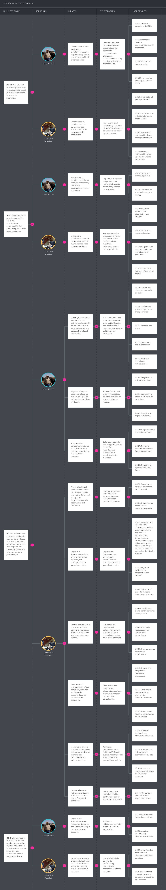

*Figura 9. Elaboración de creación propia por datos recolectados, startup SmartFarm.*

URL pública del proyecto de UXPressia con las fichas de User Persona y el Impact Map: https://uxpressia.com/w/v8FzI/i/luaWW

### Primer segmento objetivo

**Actor: Cesar Flores, administrador ganadero (arquetipo del Segmento 1)**

| Business Goal | Impact: cambio de comportamiento esperado | Deliverable: elemento que lo provoca | User Stories |
|---|---|---|---|
| BG-01 | Reconoce en el sitio web que la plataforma resuelve su problema y solicita una demostración sin intermediarios. | Landing Page con propuesta de valor diferenciada por segmento, comparador de planes con estimación de costo y canal de solicitud de demostración. | US-32, US-33, US-34, US-35 |
| BG-03 | Sustituye el recorrido visual diario del potrero por la revisión de las alertas que el sistema le entrega, y actúa sobre ellas el mismo día. | Motor de alertas por anomalía biométrica y por salida de zona, con notificación al responsable y registro del tiempo de respuesta. | US-16, US-17, US-19, TS-09, TS-11 |
| BG-03 | Registra la baja de cada animal con su motivo, en lugar de estimar las pérdidas a fin de año. | Ficha individual del animal con registro de altas, cambios de etapa y bajas con motivo. | US-06, US-08, US-09 |
| BG-03 | Programa las campañas sanitarias en la plataforma y deja de depender de recordarlas de memoria. | Calendario ganadero con programación de campañas, recordatorios anticipados y seguimiento de ejecución. | US-26, US-27, US-28 |
| BG-04 | Consulta los indicadores de su hato antes de tomar decisiones de compra de insumos o de descarte. | Tablero de indicadores del hato y reporte ejecutivo exportable. | US-29, US-31 |
| BG-02 | Percibe que la plataforma le ahorra pérdidas concretas y renueva su suscripción al vencer el periodo. | Reporte comparativo del periodo con mortalidad, alertas atendidas y tiempo de respuesta. | US-31, TS-10 |

**Actor: operario de campo (rol operativo del Segmento 1)**

| Business Goal | Impact: cambio de comportamiento esperado | Deliverable: elemento que lo provoca | User Stories |
|---|---|---|---|
| BG-04 | Registra lo que observa en el animal durante la faena, en lugar de intentar recordarlo al terminar la jornada. | Aplicación móvil con registro de eventos en campo y operación sin cobertura con sincronización posterior. | US-21, US-22 |
| BG-03 | Localiza al animal extraviado con la última posición registrada, en lugar de recorrer el predio completo. | Consulta de última ubicación con distancia respecto a la posición del operario. | US-20 |
| BG-03 | Deja constancia de qué animales recibieron efectivamente la aplicación durante la campaña. | Registro de ejecución de faenas con avance por animal. | US-28 |

### Segundo segmento objetivo

**Actor: Leonardo Rosales, médico veterinario (arquetipo del Segmento 2)**

| Business Goal | Impact: cambio de comportamiento esperado | Deliverable: elemento que lo provoca | User Stories |
|---|---|---|---|
| BG-03 | Prepara la visita al predio consultando de forma remota la telemetría del animal, en lugar de diagnosticar con la observación del momento. | Historial biométrico por animal con lecturas, alertas e intervenciones previas del periodo. | US-14, US-24 |
| BG-03 | Registra la intervención clínica en el momento de aplicarla, con producto, dosis y periodo de retiro. | Registro de intervenciones clínicas con trazabilidad de autoría y control de periodos de retiro. | US-23, US-25, US-41 |
| BG-03 | Verifica con datos si el protocolo aplicado está funcionando, en lugar de esperar a la siguiente visita para saberlo. | Evaluación de respuesta al tratamiento y alerta automática ante ausencia de mejora en el plazo esperado. | US-40, US-42, US-50 |
| BG-03 | Documenta el razonamiento clínico completo, incluidas las hipótesis descartadas y los resultados de laboratorio. | Caso clínico con diagnóstico diferencial, resultados externos e historial reproductivo consolidado. | US-43, US-44, US-45 |
| BG-03 | Identifica el brote a partir de la tendencia del lote, antes de que se manifieste clínicamente en varios animales. | Análisis de tendencias, curva epidemiológica del cuadro y contraste del animal contra el promedio de su lote. | US-30, US-49, US-52 |
| BG-03 | Descarta la causa nutricional antes de atribuir el cuadro a una enfermedad infecciosa. | Consulta del plan nutricional del lote contrastado con la evolución de la rumia. | US-46 |
| BG-04 | Organiza su jornada priorizando los hatos con la situación más severa, en lugar de seguir un orden fijo de visitas. | Consolidado de la cartera del profesional y detección de campañas sanitarias vencidas. | US-51, US-53 |
| BG-01 | Recomienda la plataforma a los ganaderos que asesora, actuando como canal de adquisición. | Perfil profesional verificable y esquema de autorización que le da acceso a los hatos de sus clientes. | US-03, US-04, US-05, US-39 |
| BG-02 | Incorpora la plataforma a su rutina de trabajo y deja de mantener registros paralelos en Excel. | Reporte ejecutivo exportable, informe clínico con datos profesionales y registro de recomendaciones con seguimiento. | US-25, US-31, US-47, US-48 |

**Lectura del Impact Map**

Tres conclusiones orientan la priorización del Product Backlog:

1. **El motor de alertas es el entregable de mayor impacto acumulado.** Aparece vinculado a BG-03 en los tres actores y es la funcionalidad que los seis entrevistados solicitaron de forma independiente. Ningún otro entregable concentra tanta contribución a las metas.
2. **La Landing Page es la única vía de contribución a BG-01.** Sin ella no hay adquisición, lo que confirma que sus historias pertenecen al primer sprint y no al final del backlog.
3. **El veterinario actúa como canal de adquisición, no solo como usuario.** Su impacto sobre BG-01 justifica invertir en el esquema de perfiles y autorizaciones (US-03 a US-05) pese a que no es el segmento que paga la suscripción.

## 3.3. Product Backlog

El Product Backlog ordena las User Stories y Technical Stories según su valor para el negocio, medido por su contribución a los Business Goals del Impact Map, y considerando las dependencias técnicas que habilitan cada capacidad.

**Criterios de ordenamiento**

1. **Contribución a los Business Goals.** Las historias vinculadas a BG-01 (adquisición) y BG-03 (reducción de mortalidad) encabezan el backlog, por ser las metas que sostienen el modelo de negocio.
2. **Habilitación del flujo de datos extremo a extremo.** Sin captura en el collar, recepción en el Edge y persistencia en la API central, ninguna capacidad de monitoreo, alerta o análisis puede entregarse. Esas Technical Stories se anticipan a las historias que dependen de ellas.
3. **Alcance del primer sprint.** Las historias de la Landing Page se ubican al inicio, dado que el sitio web estático es el primer punto de contacto del modelo de negocio y debe estar disponible desde la primera iteración.
4. **Las historias de acceso y autenticación no encabezan el backlog.** Son habilitadores transversales, no valor de negocio en sí mismos, por lo que se ubican inmediatamente antes de las capacidades que las requieren para operar con datos reales de usuarios.
5. **Capacidades de mantenimiento del inventario al final.** Las historias de actualización y baja del ganado o de administración del inventario de collares aportan valor una vez que existe información que mantener.

La estimación emplea únicamente los valores 1, 2, 3, 5 y 8 Story Points.

**Alcance comprometido y roadmap**

La columna *Sprint previsto* distingue las historias que el equipo se compromete a implementar durante el ciclo de las que quedan registradas como evolución posterior del producto. Esta distinción responde a la capacidad real del equipo y no a la importancia de cada historia: todas las que figuran en el roadmap conservan su valor para el negocio y su trazabilidad con la investigación, pero su desarrollo excede el tiempo disponible.

El criterio de asignación es el siguiente:

- **Sprint 1.** La Landing Page completa, incluidas la internacionalización y la accesibilidad, junto con el acceso a la plataforma y la ficha del animal. Al cierre de esta iteración el modelo de negocio es comunicable y existe una unidad productiva con ganado registrado.
- **Sprint 2.** El flujo de telemetría de extremo a extremo, desde la captura en el collar hasta la consulta en las aplicaciones, con el motor de alertas y la operación de campo sin conexión. Es la iteración que incorpora los productos embebido y de borde.
- **Sprint 3.** La analítica del hato, el calendario ganadero, el núcleo de la atención clínica veterinaria, la gestión de suscripciones y el controlador del abrevadero, que es el segundo dispositivo físico del alcance.
- **Roadmap.** Las integraciones con sistemas externos de laboratorio, nutrición y meteorología, el seguimiento clínico avanzado y las capacidades de mantenimiento del inventario.

**Distribución del esfuerzo**

| Alcance | Historias | Story Points |
|---|---|---|
| Sprint 1 | 13 | 47 |
| Sprint 2 | 15 | 88 |
| Sprint 3 | 21 | 96 |
| Comprometido en el ciclo | 49 | 231 |
| Roadmap posterior | 22 | 82 |
| **Total del Product Backlog** | **71** | **313** |

El Sprint 2 concentra la mayor carga porque reúne las historias de mayor complejidad técnica: la captura en el dispositivo, el procesamiento en el borde, la sincronización con el servicio central y la operación sin conectividad. El equipo reconoce este desbalance y establece dos medidas de control. La primera es validar la velocidad real al término del Sprint 1 y ajustar el alcance comprometido de las iteraciones siguientes con ese dato en lugar de con la estimación inicial. La segunda es tratar el flujo de telemetría como el objetivo indivisible del Sprint 2, de modo que, ante una desviación, se difieran primero las historias de alcance secundario antes que cualquier componente de ese flujo.

**Product Backlog priorizado**

| Orden | Story ID | Título | Descripción | Story Points | Sprint previsto |
| --- | --- | --- | --- | --- | --- |
| 1 | US-32 | Conocer la propuesta de ICHU | Presentar el problema, la solución IoT, los beneficios por segmento y los productos digitales. | 3 | Sprint 1 |
| 2 | US-33 | Acceder al destino correspondiente a mi segmento | Dirigir a cada visitante al producto digital o canal que le corresponde. | 2 | Sprint 1 |
| 3 | US-35 | Comparar los planes y estimar el costo | Presentar los planes con su límite de dispositivos y estimar el costo según el tamaño del hato. | 5 | Sprint 1 |
| 4 | US-34 | Solicitar una demostración | Registrar la solicitud del visitante con su segmento y su contexto productivo. | 3 | Sprint 1 |
| 5 | US-36 | Consultar los términos y condiciones del servicio | Exponer las condiciones de uso y el tratamiento de los datos recolectados. | 2 | Sprint 1 |
| 6 | US-06 | Registrar un animal en el hato | Incorporar el animal con su arete, raza, sexo, fecha de nacimiento y etapa productiva. | 5 | Sprint 1 |
| 7 | TS-01 | Capturar biometría y ubicación en el collar | Generar el paquete de telemetría con temperatura, actividad, posición, batería y marca de tiempo. | 8 | Sprint 2 |
| 8 | TS-04 | Recibir telemetría en el Edge Service | Exponer y validar el endpoint de recepción de lecturas en el predio. | 8 | Sprint 2 |
| 9 | US-10 | Asignar un collar inteligente a un animal | Vincular el dispositivo al animal respetando el límite del plan contratado. | 3 | Sprint 2 |
| 10 | TS-07 | Validar y persistir la telemetría en la API central | Validar estructura, referencias y consistencia temporal antes de persistir. | 8 | Sprint 2 |
| 11 | TS-06 | Sincronizar el Edge Service con la API central | Enviar en lote los registros pendientes y gestionar el resultado individual de cada uno. | 8 | Sprint 2 |
| 12 | TS-08 | Exponer la telemetría de un animal | Entregar las lecturas de un animal en un rango de fechas con control de autorización. | 5 | Sprint 2 |
| 13 | US-13 | Consultar la telemetría reciente de un animal | Entregar temperatura, actividad, ubicación y antigüedad de la última lectura. | 3 | Sprint 2 |
| 14 | TS-05 | Evaluar umbrales y generar alertas en el Edge Service | Generar alertas locales por umbral térmico y por salida de zona sin conexión con la nube. | 8 | Sprint 2 |
| 15 | US-16 | Recibir una alerta por anomalía de salud | Generar la alerta con el valor detectado, el umbral superado y evitar duplicados del mismo evento. | 8 | Sprint 2 |
| 16 | TS-09 | Registrar y actualizar alertas | Crear alertas y gestionar su transición de estado a través de la API central. | 5 | Sprint 2 |
| 17 | TS-11 | Integrar el servicio de notificaciones | Entregar la alerta crítica al responsable y registrar el estado de entrega. | 5 | Sprint 2 |
| 18 | US-19 | Atender una alerta | Registrar el hallazgo y la acción, y medir el tiempo de respuesta. | 3 | Sprint 2 |
| 19 | US-15 | Definir las zonas de pastoreo permitidas | Delimitar las áreas del predio contra las que se evalúa la ubicación del ganado. | 5 | Sprint 3 |
| 20 | US-17 | Recibir una alerta por salida del área permitida | Generar la alerta de seguridad con distancia al límite y registrar el retorno. | 5 | Sprint 3 |
| 21 | US-20 | Localizar un animal extraviado | Entregar la última posición registrada y la distancia respecto al operario. | 5 | Sprint 2 |
| 22 | US-21 | Registrar un evento de salud durante la faena | Registrar el animal, el tipo de evento, la fecha, el autor y su estado de sincronización. | 3 | Sprint 2 |
| 23 | US-22 | Operar sin cobertura y sincronizar al recuperarla | Mantener la operación local y resolver la sincronización con control de conflictos. | 8 | Sprint 2 |
| 24 | TS-03 | Conservar las lecturas no transmitidas en el collar | Almacenar en memoria las lecturas pendientes y reenviarlas en lote ordenado. | 5 | Sprint 3 |
| 25 | TS-02 | Operar el collar en modo de bajo consumo | Ajustar el intervalo de muestreo y la suspensión según el estado del animal. | 5 | Sprint 3 |
| 26 | US-07 | Consultar la ficha de un animal | Entregar identificación, etapa productiva, collar asignado y última lectura. | 3 | Sprint 1 |
| 27 | US-01 | Registrar una cuenta de unidad productiva | Crear la cuenta de la unidad productiva con su ubicación y escala. | 3 | Sprint 1 |
| 28 | US-02 | Acceder a la plataforma | Iniciar sesión con el rol y el alcance de unidades productivas correspondiente. | 3 | Sprint 1 |
| 29 | US-04 | Autorizar a un médico veterinario sobre el hato | Conceder acceso acotado y temporal al profesional sobre la unidad productiva. | 5 | Sprint 1 |
| 30 | US-39 | Solicitar autorización sobre una nueva unidad productiva | Permitir al veterinario iniciar la relación de asesoría con un hato. | 3 | Sprint 3 |
| 31 | US-23 | Registrar una intervención clínica | Registrar tipo, fecha, producto, dosis y autoría, con control de periodo de retiro. | 5 | Sprint 3 |
| 32 | US-41 | Consultar el periodo de retiro vigente de un animal | Determinar si la producción del animal presenta restricción de destino. | 3 | Sprint 3 |
| 33 | US-24 | Preparar una atención con información previa | Consolidar telemetría, eventos, intervenciones y periodos de retiro del animal. | 3 | Sprint 3 |
| 34 | US-14 | Consultar el historial biométrico de un animal | Entregar la evolución del periodo junto con alertas y eventos concurrentes. | 5 | Sprint 3 |
| 35 | US-42 | Evaluar la respuesta de un animal a un tratamiento | Contrastar las constantes previas y posteriores a las 12, 24 y 48 horas. | 5 | Roadmap |
| 36 | US-40 | Recibir una alerta por tratamiento sin respuesta | Avisar al veterinario cuando el animal tratado no retorna al rango normal. | 5 | Roadmap |
| 37 | US-43 | Registrar un diagnóstico diferencial descartado | Conservar las hipótesis descartadas con su motivo y su autoría. | 3 | Roadmap |
| 38 | US-29 | Consultar los indicadores del hato | Entregar animales monitoreados, alertas por tipo, salidas de zona y mortalidad del periodo. | 5 | Sprint 3 |
| 39 | US-26 | Programar una campaña sanitaria | Programar la faena con su lote y detectar superposición con periodos de retiro. | 5 | Sprint 3 |
| 40 | US-27 | Recibir el recordatorio de una faena programada | Generar el aviso anticipado con el tipo de campaña y los animales pendientes. | 3 | Sprint 3 |
| 41 | US-50 | Programar una revisión de seguimiento | Vincular la revisión posterior a la intervención que la origina. | 3 | Roadmap |
| 42 | US-51 | Identificar los animales con campañas sanitarias vencidas | Priorizar la visita según los días transcurridos desde la fecha programada. | 3 | Roadmap |
| 43 | US-18 | Identificar un posible evento reproductivo | Detectar la desviación respecto a la línea base del animal y sustentarla con lecturas. | 8 | Sprint 3 |
| 44 | US-30 | Analizar tendencias y distribución del hato | Entregar la serie del periodo, el promedio del lote y los animales atípicos. | 5 | Sprint 3 |
| 45 | US-52 | Analizar la curva epidemiológica de un evento sanitario | Seguir los casos nuevos por fecha y sustentar el aislamiento o su levantamiento. | 8 | Roadmap |
| 46 | US-45 | Consultar el historial reproductivo de un animal | Entregar servicios, partos, días abiertos y servicios por preñez lograda. | 5 | Roadmap |
| 47 | US-53 | Consultar el consolidado de las unidades productivas que asesoro | Ordenar la cartera del veterinario por severidad de la situación de cada hato. | 5 | Roadmap |
| 48 | US-31 | Exportar un reporte ejecutivo | Generar el archivo del periodo con indicadores, rango de fechas y fecha de generación. | 5 | Sprint 3 |
| 49 | US-48 | Exportar el informe clínico de un animal | Generar el sustento de la atención con los datos profesionales del veterinario. | 3 | Roadmap |
| 50 | US-47 | Registrar una recomendación de manejo para el ganadero | Dejar constancia de la indicación y dar seguimiento a su ejecución. | 3 | Roadmap |
| 51 | US-37 | Consultar la experiencia en mi idioma | Presentar la totalidad del contenido en en_US o es_419 y conservar la preferencia. | 5 | Sprint 1 |
| 52 | US-38 | Acceder a la experiencia con tecnología de asistencia | Exponer nombre y función accesibles, alternativas textuales y recorrido por teclado. | 5 | Sprint 1 |
| 53 | TS-10 | Gestionar las suscripciones y sus límites | Crear la suscripción y habilitar las funcionalidades del plan contratado. | 5 | Sprint 3 |
| 54 | US-28 | Registrar la ejecución de una faena | Registrar los animales atendidos y actualizar el avance de la campaña. | 3 | Roadmap |
| 55 | US-25 | Adjuntar evidencia de diagnóstico por imagen | Vincular la imagen a la intervención reproductiva del animal. | 3 | Roadmap |
| 56 | US-44 | Registrar el resultado de un examen de laboratorio externo | Incorporar el hallazgo del laboratorio al caso clínico del animal. | 3 | Roadmap |
| 57 | US-49 | Comparar un animal con el promedio de su lote | Distinguir el problema individual de la condición que afecta al grupo. | 5 | Roadmap |
| 58 | US-46 | Consultar el plan nutricional vigente de un lote | Descartar la causa nutricional contrastando la ración con la rumia del lote. | 3 | Roadmap |
| 59 | US-08 | Actualizar la etapa productiva de un animal | Registrar el cambio de etapa conservando el historial de vigencias. | 2 | Sprint 3 |
| 60 | US-09 | Registrar la baja de un animal | Registrar el motivo y la fecha, y liberar el collar asignado. | 3 | Sprint 3 |
| 61 | US-11 | Consultar el estado del inventario de collares | Entregar batería, animal asignado y detección de dispositivos sin comunicación. | 3 | Roadmap |
| 62 | US-12 | Liberar un collar de un animal | Cerrar la asignación conservando la telemetría del periodo. | 2 | Roadmap |
| 63 | US-03 | Completar el perfil profesional | Registrar especialidad, colegiatura y experiencia con control de duplicidad. | 3 | Sprint 1 |
| 64 | US-05 | Revocar la autorización de un médico veterinario | Retirar el acceso conservando la autoría de los registros previos. | 2 | Roadmap |
| 65 | TS-12 | Integrar un servicio meteorológico externo | Incorporar las condiciones meteorológicas del predio al análisis de la telemetría. | 5 | Roadmap |
| 66 | TS-13 | Capturar la temperatura del agua y accionar el calentamiento | Medir la temperatura del abrevadero y accionar el calentador según el rango configurado. | 8 | Sprint 3 |
| 67 | TS-14 | Registrar los eventos del controlador del abrevadero | Recibir y exponer las lecturas del abrevadero a través de la API central. | 5 | Sprint 3 |
| 68 | US-54 | Consultar la temperatura del agua del abrevadero | Entregar temperatura, estado del actuador y antigüedad de la última lectura. | 3 | Sprint 3 |
| 69 | US-55 | Recibir una alerta por agua fuera del rango de consumo | Alertar la desviación sostenida y escalar ante sospecha de falla del actuador. | 5 | Roadmap |
| 70 | US-56 | Verificar el estado del abrevadero durante la faena | Priorizar qué abrevaderos revisar físicamente desde el potrero. | 2 | Roadmap |
| 71 | US-57 | Relacionar la temperatura del agua con el consumo del lote | Descartar la causa hídrica antes de atribuir la caída de consumo a un cuadro clínico. | 3 | Roadmap |

**Resumen de la estimación**

| Concepto | Valor |
|---|---|
| User Stories | 57 |
| Technical Stories | 14 |
| Total de historias | 71 |
| Suma de Story Points | 313 |

**Evidencia del Product Backlog en la herramienta de control**

El equipo gestiona el Product Backlog en **Jira**, herramienta que se mantendrá para los Sprint Backlogs a fin de conservar la continuidad del seguimiento entre iteraciones.

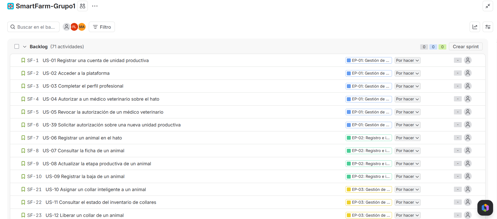

*Figura 8. Elaboración de creación propia por datos recolectados, startup SmartFarm.*

URL del board de Jira con el Product Backlog: https://upc-team-experimentos.atlassian.net/jira/software/projects/SF/boards/35/backlog?visitedUserSeg=true&atlOrigin=eyJpIjoiNDUwMmQ3OWMzNmI2NGRlYWFiNWUxYWZlNjNhOTg0MGIiLCJwIjoiaiJ9
# Capítulo IV: Product Architecture Design

Este capítulo especifica la arquitectura propuesta para **ICHU**, la solución SmartFarm de monitoreo bovino. Las decisiones son de diseño para los siguientes avances; no se presentan como componentes ya implementados. La trazabilidad usa las entrevistas del capítulo II y las historias ICHU-US-01 a ICHU-US-22 del capítulo III. El MVP cubre inventario, dispositivos, telemetría, geocercas, alertas, atención en campo, operación offline e historial clínico.

## 4.1. Design Concepts, ViewPoints & ER Diagrams

Se detallan principios, estilos, límites, vistas y modelo de datos que guían el diseño. Los diagramas representan una arquitectura propuesta y se acompañan de criterios textuales para interpretar sus decisiones.

### 4.1.1. Principles Statements

| Principio | Aplicación | Verificación |
|---|---|---|
| Trazabilidad | Lectura, alerta, asignación, observación e indicación conservan enlaces causales, autor y fechas. | Reconstruir un caso desde la señal hasta el seguimiento clínico. |
| Continuidad | Dispositivo y móvil conservan datos pendientes y reintentan al recuperar red. | Una interrupción no pierde registros ni crea duplicados. |
| Acceso mínimo | El servidor verifica rol, estancia y recurso; dispositivos y personas usan credenciales separadas. | Denegar accesos entre estancias. |
| Responsabilidad única | Inventario, telemetría, alertas y salud tienen dueño lógico y contratos. | Ningún módulo escribe tablas privadas de otro. |
| Evidencia, no diagnóstico automático | La alerta ayuda al triaje; la decisión clínica corresponde al veterinario. | Interfaz distingue lectura, anomalía, observación y diagnóstico. |
| Evolución observable | Contratos versionados, identificadores de correlación y métricas de retraso/error. | Seguir una lectura desde el ingreso hasta el aviso. |

### 4.1.2. Approaches Statements: Architectural Styles & Patterns

Se propone una arquitectura **modular orientada a eventos** para telemetría y una **API HTTP** para consultas y comandos humanos. La carga de lecturas es diferente a la de altas de bovinos o diagnósticos; separar responsabilidades evita que una ráfaga de sensores bloquee la atención. En el MVP los módulos pueden compartir despliegue; su separación física se decidirá según carga y operación medidas.

El dispositivo registra temperatura, actividad y posición cuando dispone de los sensores correspondientes. Conserva lecturas durante una interrupción y las transmite por pasarela LoRaWAN o red celular. Un adaptador autentica y normaliza el mensaje. Telemetría valida, deduplica y persiste. El evento de lectura aceptada actualiza el último estado y activa reglas; la API sirve las vistas web y móvil. El móvil mantiene una cola local de comandos y la sincroniza al recuperar conexión.

La entrega de campo se considera **al menos una vez**. Identificadores estables hacen idempotentes los reintentos. Los cambios de estado de una alerta son transaccionales; el dashboard y las notificaciones pueden actualizarse de forma eventual y muestran la fecha del último dato.

### 4.1.3. Context Diagram

El límite de ICHU incluye clientes web/móvil, API, identidad, inventario, telemetría, alertas, salud y almacenamiento. Fuera del límite se ubican usuarios, dispositivos/pasarela, proveedor push/SMS y futuros sistemas clínicos externos.

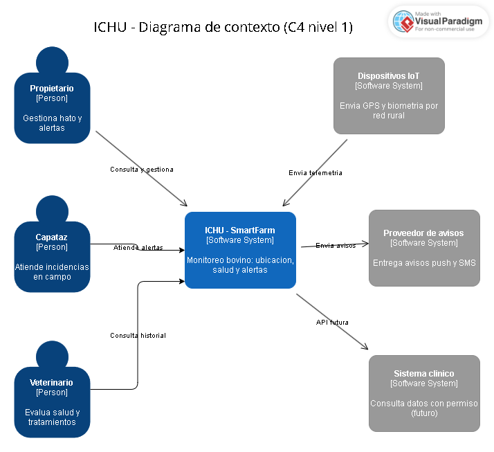

*Figura 4.1. Diagrama de contexto de ICHU (C4, nivel 1). Elaboración propia en Visual Paradigm Online. La conexión con un sistema clínico externo representa una integración futura, no una función implementada en el MVP.*

| Actor externo | Envía a ICHU | Recibe de ICHU | Historias |
|---|---|---|---|
| Propietario/administrador | Altas, geocercas, asignaciones y reglas | Dashboard, mapa, alertas y reportes | ICHU-US-01 a 07, 20 a 22 |
| Capataz | Observaciones y confirmaciones, incluso offline | Incidencias, ubicación conocida y sincronización | ICHU-US-08 a 13, 17 |
| Veterinario | Diagnóstico, indicación y seguimiento | Series, historial y alertas por lote | ICHU-US-14 a 19 |
| Dispositivo/pasarela | Lectura, ID, hora y calidad de señal | Acuse técnico si el canal lo permite | ICHU-US-03, 05, 14, 20 |
| Proveedor push/SMS | Acuse o error de entrega | Solicitud de aviso referida a una alerta | ICHU-US-09, 22 |
| Sistema clínico externo | Solicitud autenticada | Datos permitidos y auditados | ICHU-US-19 |

Flujo de contexto: **dispositivo → pasarela/adaptador → telemetría → reglas → alerta → aviso → atención → historial**. Cada consulta muestra cuándo se capturó o actualizó el dato. La figura resume las relaciones externas; los componentes internos del flujo se detallan en las vistas de 4.1.4.

### 4.1.4. Approach Driven ViewPoints Diagrams

La **vista funcional de contenedores** (figura 4.2) descompone el límite de ICHU mostrado en la figura 4.1. Es un diseño propuesto: los nombres de tecnologías indican el tipo de interfaz o almacenamiento, no un proveedor ni un despliegue ya decidido. Los clientes web y móvil acceden a la API por HTTPS; el móvil conserva comandos pendientes y los sincroniza con identificadores idempotentes. La pasarela transmite lecturas al proceso de ingesta, que autentica, normaliza y deduplica. La ingesta guarda la lectura y el evento pendiente en una misma transacción; un despachador de *outbox* publica después el evento aceptado en la cola durable. La API consume el evento para aplicar reglas y actualizar alertas; consulta y modifica los datos relacionales, solicita avisos al proveedor externo y conserva referencias a archivos de evidencia. El servidor comprueba rol y pertenencia a estancia en cada operación.

*Figura 4.2. Vista de contenedores de ICHU (C4, nivel 2). Elaboración propia en Visual Paradigm. La flecha de base relacional a cola representa el despachador de outbox; los módulos indicados dentro de la API comparten un contenedor lógico en el MVP. [Abrir diagrama editable](https://online.visual-paradigm.com/w/sooshvme/diagrams/#diagram:workspace=sooshvme&proj=0&id=9&import=draw.io&type=BlockDiagram) · [Archivo fuente editable](images/CHAPTER04/container-view-vp.drawio).*

La **vista de flujo de datos** (figura 4.3) ordena la lectura en dos trayectos visuales: pasos 1–5 de izquierda a derecha y 6–10 de derecha a izquierda. La alerta registra qué lectura y versión de regla la originaron; la notificación y la intervención humana son posteriores. La franja inferior distingue los comandos capturados offline en el móvil de la telemetría enviada por el sensor.

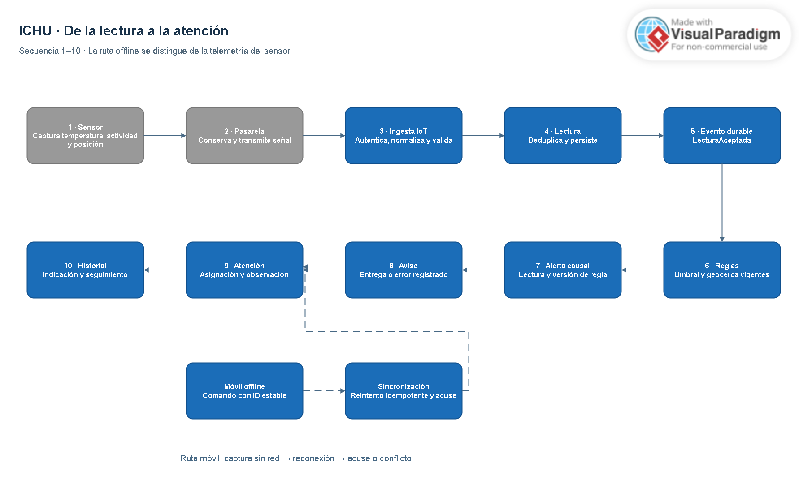

*Figura 4.3. Flujo de datos de una alerta en ICHU. Elaboración propia en Visual Paradigm. [Abrir diagrama editable](https://online.visual-paradigm.com/w/sooshvme/diagrams/#diagram:workspace=sooshvme&proj=0&id=10&import=draw.io&type=BlockDiagram) · [Archivo fuente editable](images/CHAPTER04/data-flow-view-vp.drawio).*

La **vista de despliegue** (figura 4.4) separa campo, conectividad, plataforma y servicios externos. Se muestran procesos y almacenes lógicos, sin fijar aún una nube. Ante un corte de enlace, el dispositivo o el móvil conserva elementos pendientes y reintenta; la alerta persistida no depende de que el proveedor de avisos esté disponible.

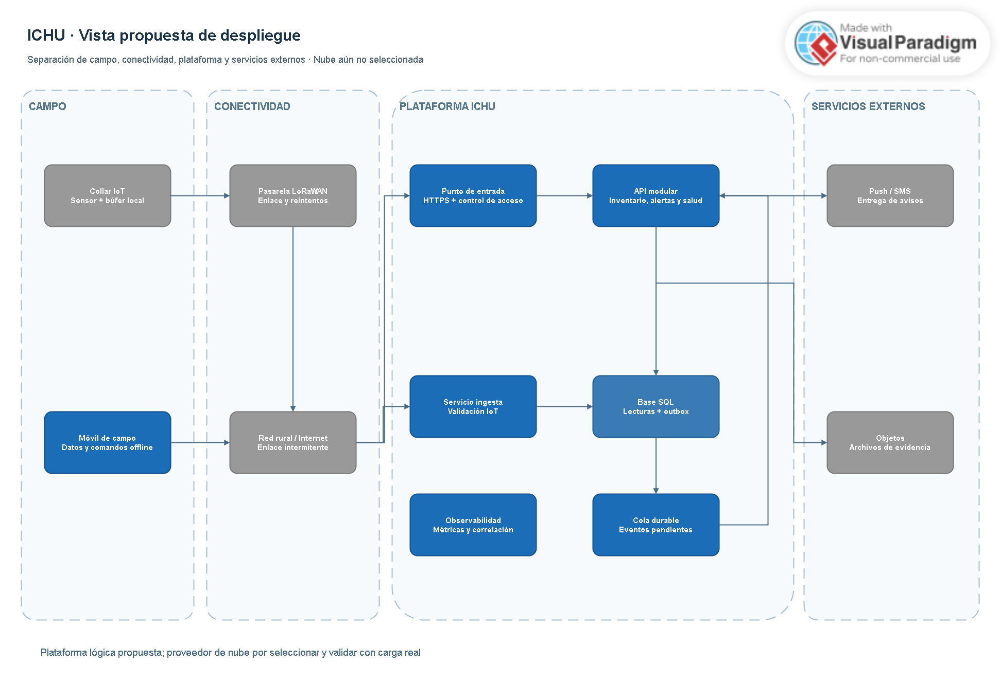

*Figura 4.4. Vista de despliegue propuesta de ICHU. Elaboración propia en Visual Paradigm. [Abrir diagrama editable](https://online.visual-paradigm.com/w/sooshvme/diagrams/#diagram:workspace=sooshvme&proj=0&id=11&import=draw.io&type=BlockDiagram) · [Archivo fuente editable](images/CHAPTER04/deployment-view-vp.drawio).*

La **vista de seguridad** (figura 4.5) separa dos rutas de confianza: personas con sesión y roles, y dispositivos con credenciales propias. Una sesión válida no concede acceso indiscriminado: la API comprueba rol, estancia, recurso y acción. La ingesta IoT comprueba credencial, formato, secuencia y asociación vigente antes de aceptar una lectura. Ambos recorridos generan trazas de auditoría sin exponer secretos.

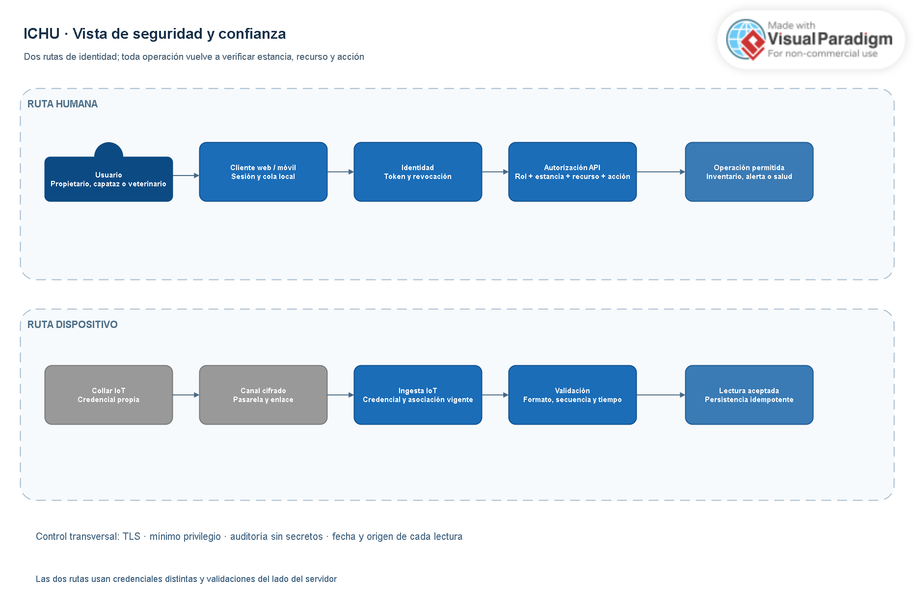

*Figura 4.5. Vista de seguridad de ICHU. Elaboración propia en Visual Paradigm. [Abrir diagrama editable](https://online.visual-paradigm.com/w/sooshvme/diagrams/#diagram:workspace=sooshvme&proj=0&id=12&import=draw.io&type=BlockDiagram) · [Archivo fuente editable](images/CHAPTER04/security-view-vp.drawio).*

| Vista | Elementos y relaciones representados | Pregunta |
|---|---|---|
| Funcional/contenedores (figura 4.2) | Actores, web, móvil, API modular, ingesta IoT, base SQL, cola durable, pasarela, proveedor de avisos y almacén de evidencias. Identidad, inventario, salud, geocercas y alertas son responsabilidades de la API. | ¿Quién responde por cada capacidad? |
| Flujo de datos (figura 4.3) | Captura, enlace rural, autenticación IoT, deduplicación, persistencia, evento durable, regla, alerta causal, aviso, atención e historial; ruta offline diferenciada. | ¿Cómo llega una señal a una alerta? |
| Despliegue (figura 4.4) | Dispositivo, móvil, redes, punto de entrada, API, ingesta, cola, base, observabilidad y servicios externos. | ¿Dónde se ejecuta y qué falla con la red? |
| Seguridad (figura 4.5) | Sesión humana, credencial IoT, autorización por rol/estancia/recurso, validación de lecturas y controles de auditoría y cifrado. | ¿Quién puede consultar o cambiar un dato? |

La secuencia de una alerta crítica es lectura aceptada → regla vigente → alerta con causa → solicitud de aviso → asignación → observación → indicación. La secuencia offline es comando local con ID estable → reconexión → autorización → aplicación idempotente → confirmación o conflicto. Las cuatro figuras son perspectivas complementarias del mismo diseño propuesto y no evidencia de implementación o pruebas ejecutadas.

### 4.1.5. Relational/Non Relational Database Diagram

Se propone una base relacional para integridad de asociaciones, permisos y estados. La telemetría se organiza por animal y tiempo, mediante particiones o almacenamiento especializado si el volumen medido lo requiere. Los archivos de evidencia se guardan en almacenamiento de objetos y la base conserva su referencia. No se fija un proveedor de nube antes de evaluar el despliegue.

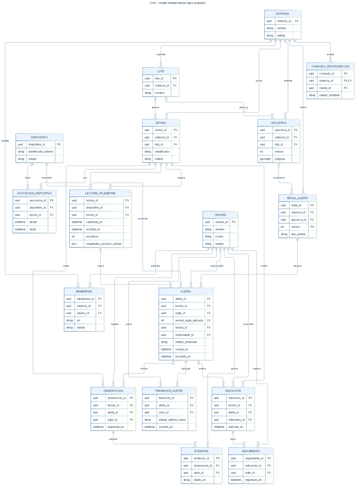

*Figura 4.6. Diagrama entidad–relación lógico de ICHU. Elaboración propia. Las patas de cuervo indican multiplicidad y el círculo indica participación opcional. [Versión vectorial](images/CHAPTER04/erd-ichu.svg) · [Fuente editable Mermaid](images/CHAPTER04/erd-ichu.mmd).*

| Entidad lógica | Relaciones y reglas |
|---|---|
| Estancia, Usuario, Membresía | Membresía une usuario y estancia con rol. Toda consulta se filtra por estancia. |
| Lote, Bovino | Lote pertenece a estancia; bovino pertenece a estancia y a un lote opcional. Baja lógica para conservar historial. |
| Dispositivo, Asociación | Asociación une dispositivo y bovino por vigencia; se impiden vínculos activos incompatibles. |
| LecturaTelemetría | Referencia dispositivo y bovino válido al capturar; guarda horas de captura/recepción, magnitudes, posición y calidad. Clave de deduplicación por dispositivo y secuencia. |
| Geocerca, ReglaAlerta | Vinculadas a estancia/lote. Cada versión de regla es inmutable y se identifica por `(regla_id, version)`; la alerta conserva la versión aplicada. |
| Alerta, TransiciónAlerta | Alerta referencia bovino, versión de regla y lectura causal; registra creación, responsable actual y última escalada, cuando exista. Transición guarda estados anterior/nuevo, actor y hora. |
| Observación, Evidencia | Observación referencia bovino y opcionalmente alerta; evidencia conserva autor y localizador de archivo. |
| Indicación, Seguimiento | Referencian bovino, veterinario y alerta cuando corresponde; agregan historia sin sobrescribir registros previos. |
| ComandoSincronización | Clave única por estancia, cliente y comando; conserva respuesta para reintentos. |

**Reglas de integridad.** `Bovino.estancia_id` debe coincidir con la estancia del lote, cuando hay lote. Una lectura solo puede asociarse al bovino cuya asociación con el dispositivo estaba vigente en `capturada_en`; registra por separado `capturada_en` y `recibida_en`, y la clave `(dispositivo_id, secuencia)` evita duplicados. `Alerta.lectura_id`, `Alerta.responsable_id`, `Alerta.escalada_en`, `Observación.alerta_id` e `Indicación.alerta_id` pueden ser nulos según el caso; `Alerta.creada_en` es obligatoria. La referencia compuesta `(Alerta.regla_id, Alerta.version_regla_aplicada)` apunta a una fila inmutable de `ReglaAlerta(regla_id, version)` para reconstruir la regla que originó la alerta. `ComandoSincronización` tiene clave primaria compuesta `(estancia_id, cliente_id, comando_id)` y almacena el resultado de los reintentos. Los identificadores de responsable, autor y veterinario referencian `Usuario` y requieren una membresía vigente con el rol adecuado; el diagrama muestra esas referencias, pero la autorización se verifica además en la API.

Índices prioritarios: alertas por estancia/estado/severidad, lecturas por bovino/tiempo y deduplicación por dispositivo/secuencia. Retención y protección de evidencias se validarán antes de producción. El almacén de objetos no se representa como base no relacional: solo guarda archivos y devuelve un localizador persistido en `Evidencia.objeto_uri`. Tampoco se inventa una segunda base de datos sin una necesidad medida.

### 4.1.6. Design Patterns

| Patrón | Aplicación |
|---|---|
| Adaptador | Traduce LoRaWAN/celular a un contrato interno sin mezclar transporte con reglas clínicas. |
| Repositorio | Aísla persistencia de bovinos, alertas e indicaciones para probar el dominio. |
| Outbox | Persiste un cambio y el evento pendiente en la misma transacción local. |
| Idempotencia | Devuelve el mismo resultado al repetir una lectura o comando con ID estable. |
| Máquina de estados | Restringe alerta: nueva, reconocida, asignada, en atención y cerrada. |
| Estrategia de reglas | Evalúa umbrales y geocercas por tipo y versión. |
| Proyección de lectura | Prepara último estado y conteos sin alterar lecturas originales. |

### 4.1.7. Tactics

Las tácticas hacen verificables los atributos de calidad. Las cifras de 4.2.3 son **metas propuestas**, no resultados medidos.

| Atributo | Táctica | Prueba prevista |
|---|---|---|
| Disponibilidad | Cola durable, reintentos progresivos y aislamiento de mensajes fallidos. | Detener evaluador y comprobar reprocesamiento sin pérdida. |
| Rendimiento | Proyección de último estado, índices y evaluación asíncrona. | Medir alerta y consulta bajo carga representativa. |
| Offline | Cola local persistente, acuse por comando e IDs idempotentes. | Capturar sin red, reiniciar y sincronizar sin duplicados. |
| Seguridad | Cifrado en tránsito, credencial IoT separada, roles por estancia y auditoría. | Acceso cruzado y revocación de permisos. |
| Modificabilidad | Contratos versionados y módulos por responsabilidad. | Cambiar una regla sin modificar entrada IoT o móvil. |
| Observabilidad | Correlación y métricas de edad de lectura, cola, errores y avisos. | Seguir una lectura desde el dispositivo hasta la alerta. |

## 4.2. Architectural Drivers

Los *architectural drivers* son los requisitos y condiciones que influyen de manera significativa en el diseño de SmartFarm. Se identifican a partir de las historias de usuario, las necesidades del sector ganadero y las condiciones de conectividad en las zonas de operación. Estos drivers orientarán las decisiones de diseño que se desarrollen en las iteraciones ADD de la sección 4.3.

### 4.2.1. Design Purpose

El propósito del diseño arquitectónico de SmartFarm es definir una solución que permita monitorear bovinos mediante dispositivos IoT y transformar los datos de ubicación, temperatura y actividad en información útil para propietarios, operarios de campo y médicos veterinarios.

La arquitectura debe respaldar el ciclo completo de atención de una incidencia: recibir la telemetría, asociarla con el bovino correspondiente, detectar una condición que requiera atención, generar una alerta, registrar la intervención y conservar el historial. Asimismo, debe permitir que el operario consulte información descargada previamente y registre observaciones cuando se encuentre en una zona sin conexión.

Para cumplir este propósito, el diseño debe establecer responsabilidades claras para los dispositivos IoT, el procesamiento en el borde (*edge*), los servicios centrales y las aplicaciones web y móvil. Esta organización facilitará la trazabilidad de los datos y permitirá identificar qué funciones pueden continuar operando durante una interrupción de la conexión a internet.

### 4.2.2. Primary Functionality (Primary User Stories)

Las siguientes historias de usuario se consideran prioritarias para el diseño arquitectónico porque determinan la organización de los datos, los servicios y la comunicación entre los componentes del sistema. Sus identificadores corresponden a las historias y al Product Backlog del capítulo III.

| Funcionalidad principal | Historias de usuario | Implicancia arquitectónica |
|---|---|---|
| Gestión de bovinos, lotes y dispositivos | ICHU-US-07, ICHU-US-20 | Mantener la relación entre cada bovino, su lote y el dispositivo asociado; evitar asociaciones activas duplicadas. |
| Recepción y consulta de telemetría | ICHU-US-03, ICHU-US-05, ICHU-US-14 | Procesar lecturas de ubicación, temperatura y actividad, y conservar la fecha y hora originales de cada captura. |
| Detección y atención de alertas | ICHU-US-02, ICHU-US-04, ICHU-US-08, ICHU-US-09 | Evaluar geocercas y condiciones de riesgo; generar alertas y registrar su asignación, atención y estado. |
| Operación en campo sin conexión | ICHU-US-10, ICHU-US-11, ICHU-US-12, ICHU-US-13 | Consultar información almacenada en el dispositivo móvil, guardar incidencias pendientes y sincronizarlas al recuperar la conexión. |
| Seguimiento clínico | ICHU-US-15, ICHU-US-16, ICHU-US-17 | Relacionar observaciones, diagnósticos, indicaciones y evolución clínica con el historial del bovino, sin eliminar registros anteriores. |
| Visualización del estado de la estancia | ICHU-US-01 | Presentar el inventario, los indicadores principales y las alertas activas en una vista para el propietario o administrador. |

Estas funcionalidades conforman el ciclo principal de monitoreo del MVP. Los reportes avanzados, las reglas configurables y las integraciones externas podrán incorporarse de acuerdo con las prioridades establecidas en el Product Backlog.

### 4.2.3. Quality Attribute Scenarios

Los escenarios de atributos de calidad describen situaciones concretas que deberán verificarse durante la implementación. Las medidas presentadas son metas iniciales de diseño y deberán validarse mediante pruebas con los dispositivos, la red y la infraestructura seleccionados.

| ID | Atributo de calidad e historias asociadas | Fuente, estímulo y entorno | Artefacto y respuesta esperada | Medida de respuesta propuesta |
|---|---|---|---|---|
| QA-01 | **Funcionamiento sin conexión:** ICHU-US-10, ICHU-US-12, ICHU-US-13 | Un capataz consulta la última ubicación conocida y registra una incidencia mientras su teléfono no tiene conexión a internet. | La aplicación móvil muestra la información almacenada y su antigüedad. Además, guarda la incidencia localmente y la sincroniza cuando se restablece la conexión. | La incidencia permanece disponible después de cerrar y volver a abrir la aplicación. Su estado indica si está pendiente, sincronizada o requiere revisión. |
| QA-02 | **Integridad de los datos:** ICHU-US-12, ICHU-US-13, ICHU-US-15, ICHU-US-16 | La conexión se interrumpe durante el envío de una incidencia y la aplicación vuelve a intentarlo. | El servicio de sincronización identifica el registro para evitar duplicaciones. El historial conserva tanto la hora original de captura como la hora de recepción. | La incidencia aparece una sola vez en el historial, incluso después de varios intentos de envío. |
| QA-03 | **Rendimiento de las alertas:** ICHU-US-02, ICHU-US-04, ICHU-US-08, ICHU-US-09 | El sistema central recibe una lectura válida que indica que un bovino salió de una geocerca activa, mientras los servicios se encuentran operativos. | El procesamiento de telemetría evalúa la regla, registra una alerta y la pone a disposición de los usuarios autorizados. | Como meta inicial, la alerta queda registrada en menos de 30 segundos desde la recepción de la lectura en el sistema central. |
| QA-04 | **Seguridad:** ICHU-US-02, ICHU-US-16, ICHU-US-19 | Un usuario intenta consultar datos de una estancia a la que no pertenece o registrar una indicación clínica sin el permiso necesario. | La API verifica la identidad del usuario, la estancia y su rol antes de permitir la consulta o modificación. El intento rechazado queda registrado. | Una solicitud no autorizada no devuelve datos de la estancia ni modifica su historial. |
| QA-05 | **Observabilidad:** ICHU-US-20 | Un dispositivo deja de transmitir durante un periodo superior al esperado. | El sistema conserva la fecha de su última transmisión y permite distinguir los datos recientes de los desactualizados. | La ficha del bovino muestra la hora de la última transmisión y el estado del dispositivo según el umbral configurado. |
| QA-06 | **Modificabilidad:** ICHU-US-04, ICHU-US-21 | Un administrador autorizado modifica una geocerca o un criterio de severidad. | El módulo de reglas utiliza la nueva configuración para evaluar las lecturas posteriores y conserva el motivo de las alertas ya generadas. | La modificación no cambia las alertas históricas y puede comprobarse mediante pruebas de las reglas actualizadas. |

En QA-03, el tiempo se mide desde que la lectura **llega al sistema central**. La conectividad rural puede retrasar la transmisión desde el dispositivo, por lo que ese retraso debe evaluarse por separado del tiempo de procesamiento de la alerta.

### 4.2.4. Constraints

| ID | Restricción | Efecto en el diseño |
|---|---|---|
| CON-01 | Los bovinos serán monitoreados mediante dispositivos IoT capaces de proporcionar datos de ubicación y variables biométricas o de actividad, según las capacidades del prototipo. | La recepción de telemetría debe validar cada lectura y asociarla con un dispositivo, un bovino y una fecha y hora de captura. |
| CON-02 | La solución se utilizará en zonas rurales donde la conexión a internet puede ser intermitente. | Las funciones móviles de consulta y registro deben incluir almacenamiento local y sincronización posterior. |
| CON-03 | El capítulo I establece que el prototipo del dispositivo se diseñará o simulará con herramientas autorizadas, como Cirkit Designer o Wokwi, y se comunicará con el Edge API. | Los datos enviados y las pruebas de integración deben poder verificarse con el prototipo o simulador disponible. |
| CON-04 | SmartFarm tiene usuarios con responsabilidades diferentes: propietarios o administradores, operarios de campo y médicos veterinarios. | El sistema debe controlar el acceso a la información y a las acciones según el rol del usuario y la estancia autorizada. |
| CON-05 | Las observaciones de campo y las actuaciones clínicas deben conservar su trazabilidad. | Los registros deben preservar la fecha de captura, el autor y el historial de eventos, sin sobrescribir la información anterior. |
| CON-06 | El alcance inicial del producto debe seguir las historias clasificadas como **Must** en el Product Backlog. | El diseño debe priorizar la identificación de bovinos, la telemetría, las alertas, la atención de incidencias y el seguimiento clínico. |

Estas restricciones se derivan de los requisitos actuales del informe. La elección de un proveedor de nube, una base de datos o una tecnología específica de mensajería deberá justificarse cuando se desarrollen las decisiones de diseño.

### 4.2.5. Architectural Concerns

| ID | Preocupación arquitectónica | Aspecto que debe resolver el diseño |
|---|---|---|
| ARC-01 | **Lecturas tardías o incompletas:** un dispositivo puede transmitir datos después de recuperar la conexión o enviar una lectura inválida. | Definir la validación de lecturas, el tratamiento de datos recibidos fuera de orden y la diferencia entre la hora de captura y la hora de recepción. |
| ARC-02 | **Continuidad del trabajo en campo:** el operario necesita consultar información y registrar incidencias sin conexión. | Definir qué datos se almacenan en el teléfono, cómo se protegen y cómo se gestionan los errores de sincronización. |
| ARC-03 | **Confiabilidad de las alertas:** una lectura aislada o duplicada podría producir una alerta incorrecta. | Definir las reglas de evaluación, la prevención de duplicados y el registro del motivo de cada alerta. |
| ARC-04 | **Protección de la información:** los usuarios no deben acceder a datos de otras estancias o realizar acciones fuera de sus permisos. | Definir controles de acceso por estancia y rol, junto con el registro de las consultas y modificaciones sensibles. |
| ARC-05 | **Coherencia del historial:** las observaciones, alertas y decisiones veterinarias deben asociarse con el bovino correcto. | Definir identificadores y relaciones que permitan conservar los eventos en su secuencia temporal, incluso si se sincronizan posteriormente. |
| ARC-06 | **Estado de los dispositivos:** la ausencia de lecturas recientes puede confundirse con la ausencia de problemas en el animal. | Mostrar la última transmisión y la antigüedad de los datos, diferenciando el estado del dispositivo del estado del bovino. |

Estas preocupaciones deberán considerarse en las iteraciones ADD, especialmente al diseñar la estructura general del sistema, la sincronización de datos, el procesamiento de alertas y la seguridad.

## 4.3 ADD Iterations
### 4.3.1 Iteration 1: Establishing Overall Architectural Structure and Container Decomposition  
#### 4.3.2.2 Architectural Design Backlog 1

El backlog inicial de diseño arquitectónico reúne las historias de usuario primarias, restricciones de proyecto y preocupaciones clave que condicionan la estructura global de ICHU:
•	Historias de Usuario Primarias (Primary User Stories): 
•	US-01: Registrar cuenta de unidad productiva ganadera.
•	US-06: Registrar un animal dentro del hato ganadero.
•	US-13: Consultar telemetría biométrica y de ubicación reciente de un animal.
•	US-16: Recibir alerta automática por anomalía de salud (temperatura/actividad).
•	TS-01: Capturar biometría y ubicación GPS en la banda/collar inteligente.
•	TS-04: Recibir telemetría en la pasarela de borde (Portable Edge Gateway).
•	TS-07: Validar y persistir telemetría en la API RESTful central de la nube.
•	Restricciones de Arquitectura (Constraints): 
•	CON-01: Operación en zonas ganaderas rurales con conectividad celular intermitente o nula (Sierras de Apurímac, Cusco y Puno).
•	CON-02: Despliegue distribuido físicamente entre dispositivos en predio (Borde) y servicios centralizados (Nube).
•	CON-03: Equipo de desarrollo reducido (6 integrantes) con un ciclo de entrega acotado.
•	Preocupaciones Arquitectónicas (Architectural Concerns): 
•	CRN-01: Aplicar el enfoque Domain-Driven Design (DDD) para delimitar las fronteras de dominio mediante Contextos Acotados (Bounded Contexts).

#### 4.3.3.3 Establish Iteration Goal by Selecting Drivers
El objetivo de la Iteración 1 es establecer la estructura arquitectónica de alto nivel y la descomposición en contenedores del sistema ICHU para garantizar la comunicación fluida entre clientes móviles/web, 
dispositivos IoT de campo y el backend central.
Drivers seleccionados: US-01, US-06, US-16, TS-01, TS-04, CON-01, CON-02, CON-03.
 C4 falta
#### 4.3.4.3 Choose One or More Elements of the System to Refine
Se selecciona el sistema completo ICHU Software System como elemento global a descomponer en contenedores y subsistemas.

#### 4.3.5.5 Choose One or More Design Concepts That Satisfy the Selected Drivers
• Estilo Arquitectónico General: Arquitectura distribuida basada en Edge Computing + Cloud Computing, organizada en capas para separar la adquisición y procesamiento local de telemetría de los servicios centralizados en la nube.

• Patrón de Backend Central: Arquitectura de Microservicios. El backend estará compuesto por servicios independientes organizados de acuerdo con las principales capacidades del dominio de ICHU. Cada microservicio tendrá una responsabilidad específica y podrá evolucionar, desplegarse y escalarse de manera independiente. La comunicación entre los servicios se realizará mediante APIs REST sobre HTTPS y mecanismos de mensajería cuando sea necesario.

• Patrón de Clientes: Aplicación móvil multiplataforma con enfoque Offline-First y Aplicación Web Administrativa. La aplicación móvil permitirá a los operarios y veterinarios consultar y registrar información incluso ante una conectividad limitada, sincronizando posteriormente los datos con los servicios de la nube.

• Patrón de comunicación Edge–Cloud: Sincronización asíncrona de datos entre el Portable Edge Gateway y los servicios de la nube. El Edge Gateway almacenará temporalmente la telemetría cuando no exista conectividad y realizará la sincronización cuando se restablezca la comunicación.

• Persistencia: Cada microservicio será responsable de la persistencia de los datos correspondientes a su contexto de dominio, siguiendo el principio de Database per Service para reducir el acoplamiento entre servicios.

#### 4.3.6.6 Instantiate Architectural Elements, Allocate Responsibilities, and Define Interfaces

Se instancian los siguientes contenedores principales dentro de la arquitectura de ICHU:
•	1. Cattle Band Embedded Application (ESP32 / C++): Captura continua de temperatura corporal, acelerometría de actividad y posición GPS. Transmite datos localmente mediante Bluetooth Low Energy (BLE) o Wi-Fi local.
•	2. Portable Edge Gateway (Python / Flask / SQLite): Servicio desplegado en la pasarela portátil del predio; almacena lecturas locales, evalúa reglas críticas sin conexión y sincroniza lotes hacia la nube cuando detecta conectividad.
•	3. ICHU Modular Monolith (ASP.NET Core / .NET 8): Backend central en la nube que alberga los servicios de negocio agrupados en módulos independientes expuestos mediante RESTful API sobre HTTPS/JSON.
•	4. Mobile Application (Flutter / Dart): Aplicación móvil para operarios y veterinarios que permite visualización de mapas, registro de ganado y gestión de alertas locales/remotas.
•	5. Web Application (Angular / TypeScript): Panel web administrativo para la gestión integral de hatos, configuración de geocercas, analítica avanzada y reportes ejecutivos.
•	6. ICHU Cloud Database (PostgreSQL 16): Base de datos relacional central con esquemas aislados por cada contexto acotado.

| Driver                            | Decisión arquitectónica                         | Justificación                                                                                         |
| --------------------------------- | ----------------------------------------------- | ----------------------------------------------------------------------------------------------------- |
| CON-01: Conectividad intermitente | Edge Computing + almacenamiento local           | Permite continuar capturando y procesando datos sin conexión                                          |
| CON-02: Distribución física       | Edge + Cloud                                    | Separa procesamiento local de servicios centralizados                                                 |
| CON-03: Equipo de desarrollo      | Microservicios con límites de dominio definidos | Permite distribuir responsabilidades entre los integrantes y evolucionar servicios independientemente |
| TS-01: Captura de telemetría      | Cattle Band + Edge Gateway                      | Permite capturar y recibir datos localmente                                                           |
| TS-04: Recepción de telemetría    | Edge Gateway                                    | Centraliza la recepción de datos de los dispositivos                                                  |
| TS-07: Persistencia en Cloud      | Microservicio de Telemetría                     | Valida y persiste los datos recibidos desde Edge                                                      |
| US-16: Alertas                    | Health/Alert Microservices                      | Permite procesar anomalías y generar alertas                                                          |

#### 4.3.7.7 Sketch Views (C4 & UML) and Record Design Decisions
• C4 System Context Diagram: Define las fronteras entre los actores (Administrador, Operario, Veterinario), el sistema ICHU y los servicios externos (Firebase, Pasarela de Pagos, Google Maps).
• C4 Container Diagram: Detalla los 9 contenedores del sistema y sus protocolos de comunicación (REST/HTTPS, BLE, Wi-Fi local, TCP/IP).

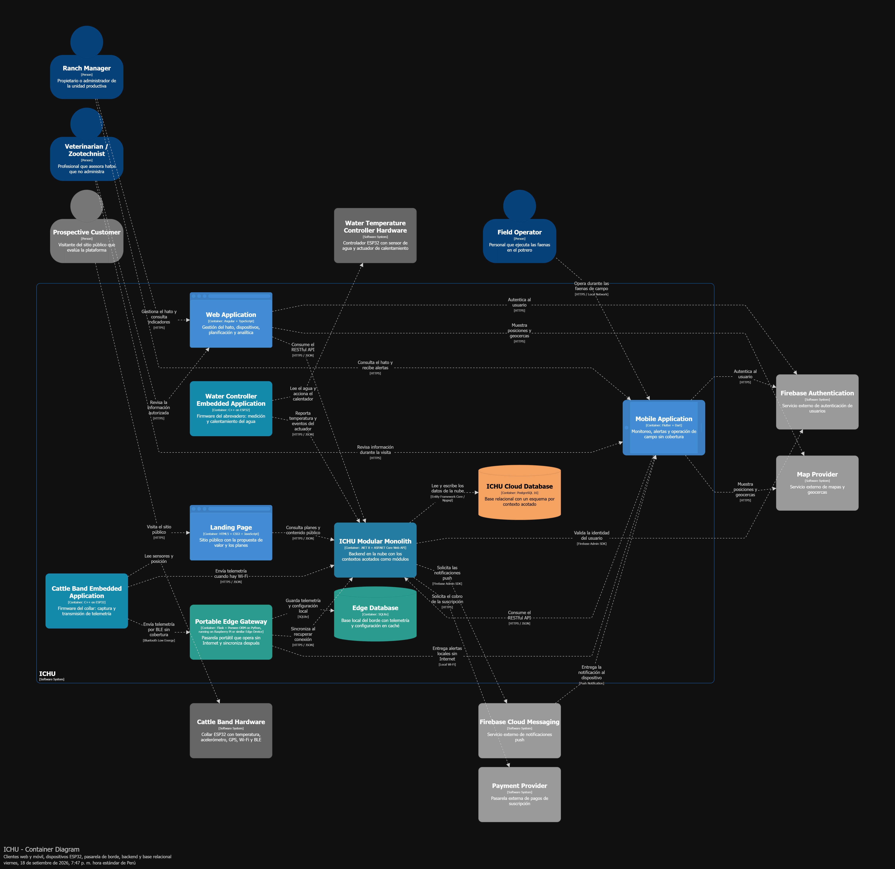
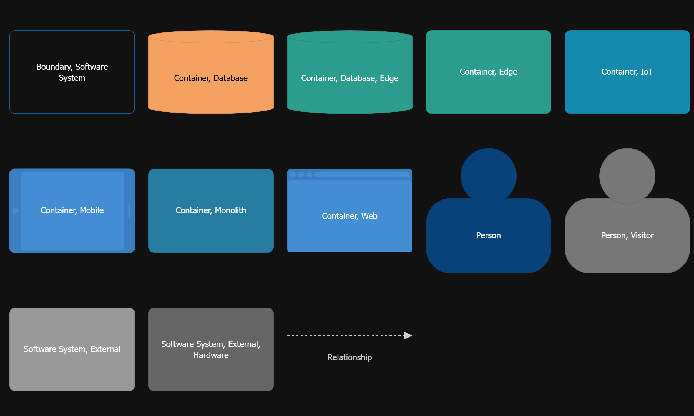

#### 4.3.8.8 Analysis of Current Design and Review Iteration Goal (Kanban Board)
Análisis de Cobertura: La descomposición en contenedores satisface las restricciones de conectividad rural (CON-01) y la capacidad operativa del equipo (CON-03) mediante el uso de la pasarela de borde y el backend modular.

Estado en Tablero Kanban:

•	[DONE]: Definición de Contenedores C4, Selección de Stack (.NET 8, Flutter, Angular, Python, PostgreSQL).  
•	[IN PROGRESS]: Diseño de canales de sincronización asíncrona entre el Borde y la Nube.  
•	[TO DO]: Refinamiento de atributos de calidad de latencia y disponibilidad en el Borde.
# Conclusiones

## Conclusiones y recomendaciones

### 1. Resultado frente al Problem Statement

El Problem Statement de ICHU plantea que la gestión extensiva del ganado depende de inspecciones visuales, identificación física y registros dispersos en cuadernos o hojas de cálculo. Esa situación dificulta conocer la evolución de cada animal, detectar anomalías a tiempo y actuar cuando la conectividad es irregular. La solución propuesta combina collares inteligentes, una API RESTful central, servicios de borde y aplicaciones web y móvil para centralizar la información, generar alertas y mantener la continuidad de las faenas.

La investigación realizada en el Capítulo II brinda evidencia preliminar a favor de este problema. Se realizaron seis entrevistas, tres a representantes del segmento de medianos y grandes ganaderos y tres a zootecnistas y médicos veterinarios. En el cuestionario del primer segmento, el 50 % indicó utilizar hojas de cálculo y el 50 % cuadernos o registros manuales; el 100 % calificó como muy útil una plataforma que centralice historial, ubicación y alertas. Además, el 100 % reportó conectividad regular en las zonas de pastoreo, pérdidas del 5 % al 10 % del valor del hato y preferencia por una suscripción anual con tarifa fija.

En el segundo segmento, el 66.7 % calificó los registros manuales como moderadamente confiables y el 100 % indicó que necesita conocer continuamente variables que no puede medir de forma manual, como rumia, actividad, temperatura y frecuencias cardíaca y respiratoria. Estos resultados sostienen la relevancia de una historia clínica digital, telemetría continua, alertas configurables, acceso móvil y operación sin conexión. Sin embargo, esta evidencia valida principalmente la existencia y relevancia del problema; todavía no demuestra que el producto implementado logre los resultados de negocio previstos.

### 2. Assumptions frente al comportamiento observado

Los hallazgos respaldan de manera inicial algunos supuestos del Lean UX Process. La preferencia por el pago anual con tarifa fija, la necesidad de una ficha centralizada por animal, la operación en zonas con conectividad intermitente y la demanda de alertas sanitarias y reproductivas son consistentes con las respuestas y entrevistas documentadas. También se confirma que el veterinario necesita combinar trabajo de campo y oficina, por lo que la solución debe mantener la información sincronizada entre las aplicaciones móvil y web.

Todavía no se pueden confirmar los supuestos que requieren resultados longitudinales o pruebas técnicas. Permanecen abiertos la reducción del 15 % de la mortalidad, las 150 suscripciones activas durante el primer año, la renovación superior al 92 %, la tasa de fallas inferior al 2 %, la reducción del CAC, la autonomía de tres años del collar, la precisión de los sensores, el tiempo de entrega de las notificaciones y la tasa de sincronización offline. Cada uno debe validarse mediante un piloto instrumentado, pruebas de laboratorio y campo, métricas de uso y entrevistas posteriores.

### 3. Hypothesis Statements y criterios de éxito

Las cuatro hipótesis definidas en el Capítulo I mantienen trazabilidad con las características priorizadas en los Capítulos II, III y IV:

| Hipótesis | Característica relacionada | Estado de la evidencia en AV1 |
|---|---|---|
| Biometric and GPS Tracking | Collar inteligente de bajo consumo con temperatura, actividad y posición | El problema y la necesidad fueron respaldados por entrevistas; la precisión, autonomía y utilidad aún no fueron probadas con un prototipo funcional. |
| Real-Time Alerts | Motor de alertas móviles y por mensaje de texto | La demanda de alertas fue recurrente en ambos segmentos; aún no se midieron tiempo de entrega, falsos positivos ni reducción de mortalidad. |
| Analytics Dashboard | Panel de indicadores, tendencias e historial biométrico | Se identificó la necesidad de reportes comparativos y datos continuos; aún no existe validación de tareas sobre un panel implementado. |
| Offline Operation | Almacenamiento local y sincronización al recuperar la señal | La conectividad irregular fue confirmada; aún faltan pruebas de campo sobre registros offline, conflictos y sincronizaciones exitosas. |

Por tanto, los criterios de éxito iniciales - uso frecuente de la aplicación, respuesta oportuna ante alertas críticas y reducción de pérdidas del ganado - deben considerarse objetivos de validación y no resultados alcanzados. AV1 entrega la especificación del problema, los requisitos y el diseño; no contiene todavía evidencia suficiente para declarar aceptadas o rechazadas las hipótesis.

### 4. Recomendaciones y roadmap

Para la siguiente etapa se recomienda:

1. Consolidar la evidencia documental disponible del informe: capturas de EventStorming, Journey Maps, Impact Map, Product Backlog y actividad colaborativa, junto con los enlaces públicos correspondientes.
2. Desarrollar el primer incremento siguiendo el alcance comprometido del Product Backlog: Landing Page con internacionalización y accesibilidad, acceso a la plataforma y ficha inicial del animal.
3. Implementar después el flujo de telemetría de extremo a extremo, incluyendo collar, Edge API, API central, alertas y sincronización offline con control de duplicados y conflictos.
4. Continuar con analítica del hato, planificación sanitaria, atención veterinaria, suscripciones y el controlador del abrevadero, manteniendo la trazabilidad con los Business Goals.
5. Ejecutar un piloto con unidades productivas de los dos segmentos. Antes de iniciar, definir la línea base de mortalidad, tiempo de respuesta, registros completos, frecuencia de uso, disponibilidad de dispositivos y resultados de sincronización.
6. Mantener como roadmap posterior las integraciones con laboratorios, nutrición y meteorología, el seguimiento clínico avanzado y el mantenimiento ampliado del inventario.

La arquitectura modular, los siete Bounded Contexts y el Product Backlog de 71 historias proporcionan una base adecuada para evolucionar ICHU sin perder trazabilidad. La siguiente iteración debe convertir los supuestos de alto riesgo en experimentos medibles y actualizar las decisiones del dominio con la evidencia obtenida.

## Video About-the-Team

### Propósito y contenido requerido

El video presenta la startup, el problema investigado, los artefactos de requisitos y diseño, la organización del trabajo colaborativo y las conclusiones del equipo.

### Pauta de secuencias

| Secuencia | Inicio sugerido | Contenido |
|---|---:|---|
| Presentación del equipo | 00:00:00 | Startup, producto ICHU, integrantes y roles |
| Proceso de investigación | 00:01:00 | Entrevistas, cuestionarios, Needfinding y hallazgos |
| Requisitos y diseño | 00:03:00 | User Stories, Impact Mapping, Bounded Contexts y arquitectura |
| Trabajo colaborativo | 00:05:00 | GitFlow, revisión de artefactos y organización del repositorio |
| Testimonios individuales | 00:07:00 | Actividades, Student Outcome y competencias de cada integrante |
| Cierre y próximos pasos | 00:13:00 | Roadmap, validaciones y aprendizajes del equipo |

# Bibliografía

Referencias utilizadas en el informe, conservando la numeración empleada por las citas del Capítulo I y aplicando el formato APA 7.ª edición:

[1] Instituto Nacional de Estadística e Informática. (2023). *Encuesta Nacional Agropecuaria 2023*. INEI. https://proyectos.inei.gob.pe/iinei/srienaho/Descarga/DocumentosMetodologicos/2023-62/05_PUBLICACION_ENA_2023.pdf

[2] Ministerio de Desarrollo Agrario y Riego. (s. f.). *Sistema Integrado de Estadística Agraria (SIEA)*. MIDAGRI. https://siea.midagri.gob.pe/

[3] Organismo Supervisor de Inversión Privada en Telecomunicaciones. (s. f.). *Estadísticas y reportes de servicios de telecomunicaciones*. OSIPTEL. https://repositorio.osiptel.gob.pe/handle/20.500.12630/4

[4] Servicio Nacional de Sanidad Agraria. (s. f.). *Campañas de vacunación y prevención sanitaria para la ganadería*. SENASA. https://www.senasa.gob.pe/

[5] Brown, S. (2023). *The C4 model for visualising software architecture*. https://c4model.com/

[6] Evans, E. (2003). *Domain-driven design: Tackling complexity in the heart of software*. Addison-Wesley.

[7] Gothelf, J., & Seiden, J. (2021). *Lean UX: Creating great products with agile teams* (3.ª ed.). O'Reilly Media.

# Anexos

## Anexo A. Organización del entregable

Este documento reúne las conclusiones y recomendaciones del proyecto, la pauta del Video About-the-Team, la bibliografía consultada y las evidencias externas que complementan los capítulos del informe.

- Las conclusiones relacionan el problema, los hallazgos de investigación, las hipótesis y el roadmap.
- La bibliografía reúne las fuentes utilizadas para fundamentar el análisis y el diseño.
- Los anexos organizan los enlaces de entrevistas, herramientas colaborativas, encuestas, repositorio y fuentes de diagramas.

## Anexo B. Evidencia documental

**Solution Profile y Lean UX Process** 
https://github.com/SmartFarm-8733/Report-SmartFarm/blob/feature/conclusions/chapter01.md

**Requirements Elicitation & Analysis** 
https://github.com/SmartFarm-8733/Report-SmartFarm/blob/feature/conclusions/chapter02.md

**Requirements Specification** 
https://github.com/SmartFarm-8733/Report-SmartFarm/blob/feature/conclusions/chapter03.md

**Solution Software Design** 
https://github.com/SmartFarm-8733/Report-SmartFarm/blob/feature/conclusions/chapter04.md

**Student Outcome y colaboración** 
https://github.com/SmartFarm-8733/Report-SmartFarm/blob/feature/conclusions/README.md

## Anexo C. Videos y entrevistas

Este anexo reúne las evidencias audiovisuales proporcionadas por el equipo. Los enlaces se conservan como recursos externos y se muestran completos para facilitar su consulta.

**Entrevistas completas** 
Carpeta con los videos completos de las entrevistas de los dos segmentos objetivo. 
https://drive.google.com/drive/folders/1Lx-SoAs_OQUHSQWLl1PhLo1HGMW5-NvT?usp=sharing

**Entrevistas editadas** 
Video consolidado de las entrevistas para la evidencia del informe. 
https://upcedupe-my.sharepoint.com/:v:/g/personal/u202323243_upc_edu_pe/IQCWBM7VmG-wQpKSMg4lQ3R4ARyUf9668Ua8FlogmvsDBS0?nav=eyJyZWZlcnJhbEluZm8iOnsicmVmZXJyYWxBcHAiOiJPbmVEcml2ZUZvckJ1c2luZXNzIiwicmVmZXJyYWxBcHBQbGF0Zm9ybSI6IldlYiIsInJlZmVycmFsVmlldyI6Ik15RmlsZXNMaW5rQ29weSJ9fQ&e=pKyJVK

**Video de exposición AV1 — Primera exposición** 
Exposición inicial del informe. 
https://upcedupe-my.sharepoint.com/:f:/g/personal/u202323243_upc_edu_pe/IgCUSf6VBMS2RpDCw5IECY7KAeH3mMYiKRCK6R4jruEgR7M?e=E6tBZt

## Anexo D. Herramientas colaborativas y artefactos de modelado

**Figma / FigJam** 
Big Picture EventStorming, Bounded Context Canvases y Domain Message Flows. 
https://www.figma.com/board/weAhLf9otmp9sh32i7ke4i/SmartFarm-%E2%80%94-2.4-Big-Picture-EventStorming.jam?node-id=0-1&t=4gtnxsvBNUxUdR76-1

**Miro** 
Design-Level EventStorming y Candidate Context Discovery. 
https://miro.com/welcomeonboard/ekNIeWVQcC9hcG1mM292c2E0RkcwblUxUSttUDFCSmpZMjBTQldxOENSNVdtbTNiWEZQSXRaQWg1UWk4bmpDYjVzNnNHanMrV3J5RDZZc2RaeXNBSDQ4ZWRzaFRaNi9qbXJsUlBtblZobDFOeS9aTGFyK1BJWDNUVGozSUVYSHhhWWluRVAxeXRuUUgwWDl3Mk1qRGVRPT0hdjE=?share_link_id=680912547552

**UXPressia** 
User Personas, User Journey Maps, Empathy Maps, As-Is e Impact Mapping. 
https://uxpressia.com/w/v8FzI/t/AIZ5N

## Anexo E. Encuestas y material de investigación

**Ganadero** 
Encuesta extensa del segmento de ganaderos. 
https://drive.google.com/file/d/1WZdTKVgyGmAlKlI4ZXnRhkK2MJL7fO8D/view?usp=sharing

**Zootecnista / veterinario** 
Encuesta extensa del segmento profesional. 
https://drive.google.com/file/d/15h2MLOWtvMBic0O97VnSMJxAeW9ZpUy2/view?usp=drive_link

Estas evidencias complementan los resúmenes, análisis de entrevistas, User Personas y mapas incluidos en el Capítulo II.

## Anexo F. Repositorio y organización del proyecto

**Repositorio del informe** 
Fuente versionada del Project Report y sus artefactos. 
https://github.com/SmartFarm-8733/Report-SmartFarm

**Organización** 
Organización pública de GitHub de SmartFarm-8733. 
https://github.com/SmartFarm-8733

**README del repositorio** 
Registro de versiones, colaboración, Student Outcome y navegación del informe. 
https://github.com/SmartFarm-8733/Report-SmartFarm/blob/feature/conclusions/README.md

**Informe completo** 
Capítulos I-IV, conclusiones, bibliografía y anexos. 
https://github.com/SmartFarm-8733/Report-SmartFarm/tree/feature/conclusions

## Anexo G. Fuentes de diagramas y artefactos versionados

**C4 Model — Workspace Structurizr DSL** 
https://github.com/SmartFarm-8733/Report-SmartFarm/blob/feature/conclusions/diagrams/structurizr/workspace-ichu-c4.dsl

**C4 Model — imágenes exportadas** 
System Landscape, Context, Container, Deployment y Components. 
https://github.com/SmartFarm-8733/Report-SmartFarm/tree/feature/conclusions/images/diagrams/c4

**UML y diseño de base de datos — fuentes PlantUML** 
Clases, context maps y bases de datos. 
https://github.com/SmartFarm-8733/Report-SmartFarm/tree/feature/conclusions/diagrams/puml

**UML y diseño de base de datos — imágenes renderizadas** 
Clases, context maps y esquemas. 
https://github.com/SmartFarm-8733/Report-SmartFarm/tree/feature/conclusions/images/diagrams

Los enlaces de este anexo apuntan a contenido versionado dentro del mismo repositorio. Los enlaces de Figma, Miro, UXPressia, Drive y SharePoint apuntan a los espacios externos donde se elaboraron o almacenan los artefactos originales.
